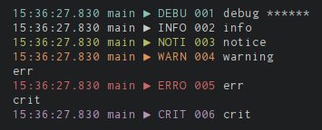

## Golang logging library

[](https://godoc.org/github.com/op/go-logging) [](https://travis-ci.org/op/go-logging)

Package logging implements a logging infrastructure for Go. Its output format
is customizable and supports different logging backends like syslog, file and
memory. Multiple backends can be utilized with different log levels per backend
and logger.

## Example

Let's have a look at an [example](examples/example.go) which demonstrates most
of the features found in this library.

[](examples/example.go)

```go
package main

import (
	"os"

	"github.com/op/go-logging"
)

var log = logging.MustGetLogger("example")

// Example format string. Everything except the message has a custom color
// which is dependent on the log level. Many fields have a custom output
// formatting too, eg. the time returns the hour down to the milli second.
var format = logging.MustStringFormatter(
	"%{color}%{time:15:04:05.000} %{shortfunc} ▶ %{level:.4s} %{id:03x}%{color:reset} %{message}",
)

// Password is just an example type implementing the Redactor interface. Any
// time this is logged, the Redacted() function will be called.
type Password string

func (p Password) Redacted() interface{} {
	return logging.Redact(string(p))
}

func main() {
	// For demo purposes, create two backend for os.Stderr.
	backend1 := logging.NewLogBackend(os.Stderr, "", 0)
	backend2 := logging.NewLogBackend(os.Stderr, "", 0)

	// For messages written to backend2 we want to add some additional
	// information to the output, including the used log level and the name of
	// the function.
	backend2Formatter := logging.NewBackendFormatter(backend2, format)

	// Only errors and more severe messages should be sent to backend1
	backend1Leveled := logging.AddModuleLevel(backend1)
	backend1Leveled.SetLevel(logging.ERROR, "")

	// Set the backends to be used.
	logging.SetBackend(backend1Leveled, backend2Formatter)

	log.Debug("debug %s", Password("secret"))
	log.Info("info")
	log.Notice("notice")
	log.Warning("warning")
	log.Error("err")
	log.Critical("crit")
}
```

## Installing

### Using *go get*

    $ go get github.com/op/go-logging

After this command *go-logging* is ready to use. Its source will be in:

    $GOROOT/src/pkg/github.com/op/go-logging

You can use `go get -u` to update the package.

## Documentation

For docs, see http://godoc.org/github.com/op/go-logging or run:

    $ godoc github.com/op/go-logging

## Additional resources

* [wslog](https://godoc.org/github.com/cryptix/go/logging/wslog) -- exposes log messages through a WebSocket.
