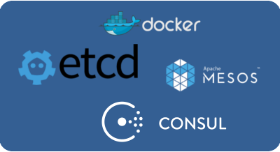

[](https://circleci.com/gh/EmileVauge/traefik)
[](https://github.com/EmileVauge/traefik)
[](https://github.com/EmileVauge/traefik)
[](https://github.com/EmileVauge/traefik/blob/master/LICENSE.md)

Træfɪk is a modern HTTP reverse proxy and load balancer made to deploy microservices with ease.
It supports several backends (Docker, Mesos/Marathon, Consul, Etcd, Rest API, file...) to manage its configuration automatically and dynamically (hot-reload).



# Features

* No dependency hell, single binary made with go
* Simple json Rest API
* Simple TOML file configuration
* Multiple backends supported: Docker, Mesos/Marathon, Consul, Etcd, and more to come
* Watchers for backends, can listen change in backends to apply a new configuration automatically
* Hot-reloading of configuration. No need to restart the process
* Graceful shutdown http connections during hot-reloads
* Rest Metrics
* Tiny docker image included
* SSL backends support
* SSL frontend support

# Plumbing

* [Oxy](https://github.com/mailgun/oxy/): an awsome proxy library made by Mailgun guys
* [Gorilla mux](https://github.com/gorilla/mux): famous request router
* [Negroni](https://github.com/codegangsta/negroni): web middlewares made simple
* [Graceful](https://github.com/tylerb/graceful): graceful shutdown of http.Handler servers

# Quick start

* The simple way: grab the latest binary from [](https://github.com/emilevauge/traefik/releases) and just run it with the sample configuration file:

```
./traefik traefik.toml
```

* Use the tiny Docker image:

```
docker run -d -p 8080:8080 -p 80:80 -v $PWD/traefik.toml:/traefik.toml emilevauge/traefik
```

# Configuration


# Contributing

## Building

You need either [Docker](https://github.com/docker/docker) and
``make``, or `go` and `godep` in order to build traefik.

### Using Docker and Makefile

You need to run the ``binary`` target. This will create binaries for
linux and darwin platforms in the `dist` folder.

```bash
$ make binary
docker build -t "traefik-dev:your-feature-branch" -f build.Dockerfile .
# […]
docker run --rm -it -e OS_ARCH_ARG -e OS_PLATFORM_ARG -e TESTFLAGS -v "/home/vincent/src/github/vdemeester/traefik/dist:/go/src/github.com/emilevauge/traefik/dist" "traefik-dev:your-feature-branch" ./script/make.sh generate binary
---> Making bundle: generate (in .)
removed 'gen.go'

---> Making bundle: binary (in .)
Number of parallel builds: 8

-->       linux/arm: github.com/emilevauge/traefik
-->    darwin/amd64: github.com/emilevauge/traefik
-->      darwin/386: github.com/emilevauge/traefik
-->       linux/386: github.com/emilevauge/traefik
-->     linux/amd64: github.com/emilevauge/traefik

$ ls dist/
traefik*  traefik_darwin-386*  traefik_darwin-amd64*  traefik_linux-386*  traefik_linux-amd64*  traefik_linux-arm*
```

### Using `godep`

The idea behind `godep` is the following :

- when checkout(ing) a project, **run `godep restore`** to install
  (`go get …`) the dependencies in the `GOPATH`.
- if you need another dependency, `go get` it, import and use it in
  the source, and **run `godep save ./...` to save it in
  `Godeps/Godeps.json` and vendoring it in `Godeps/_workspace/src`.

```bash
$ godep restore
# Simple go build
$ godep go build
# Using gox to build multiple platform
$ GOPATH=`godep path`:$GOPATH gox "linux darwin" "386 amd64 arm" \
    -output="dist/traefik_{{.OS}}-{{.Arch}}"
# run other commands like tests
$ godep go test ./...
ok      _/home/vincent/src/github/vdemeester/traefik    0.004s
```

## Tests

You can run unit tests using the `test-unit` target and the
integration test using the `test-integration` target.

```bash
$ make test-unit
docker build -t "traefik-dev:your-feature-branch" -f build.Dockerfile .
# […]
docker run --rm -it -e OS_ARCH_ARG -e OS_PLATFORM_ARG -e TESTFLAGS -v "/home/vincent/src/github/vdemeester/traefik/dist:/go/src/github.com/emilevauge/traefik/dist" "traefik-dev:your-feature-branch" ./script/make.sh generate test-unit
---> Making bundle: generate (in .)
removed 'gen.go'

---> Making bundle: test-unit (in .)
+ go test -cover -coverprofile=cover.out .
ok      github.com/emilevauge/traefik   0.005s  coverage: 4.1% of statements

Test success
```


