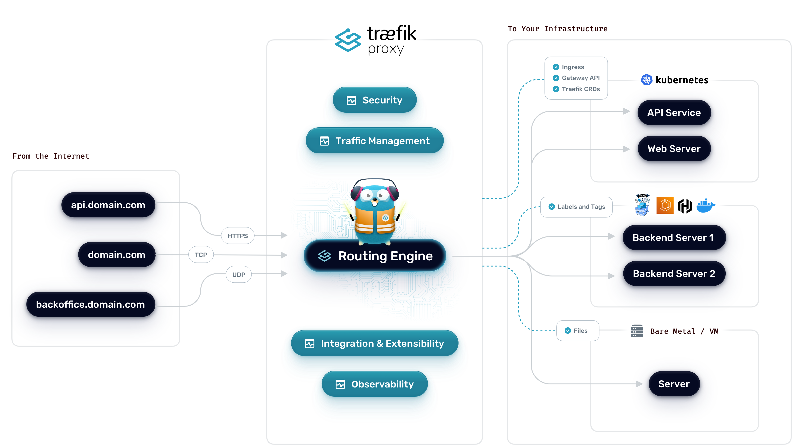

<p align="center">

</p>

[](https://semaphoreci.com/containous/traefik)
[](https://doc.traefik.io/traefik)
[](https://goreportcard.com/report/traefik/traefik)
[](https://github.com/traefik/traefik/blob/master/LICENSE.md)
[](https://community.traefik.io/)
[](https://twitter.com/intent/follow?screen_name=traefik)


Traefik (pronounced _traffic_) is a modern HTTP reverse proxy and load balancer that makes deploying microservices easy.
Traefik integrates with your existing infrastructure components ([Docker](https://www.docker.com/), [Swarm mode](https://docs.docker.com/engine/swarm/), [Kubernetes](https://kubernetes.io), [Marathon](https://mesosphere.github.io/marathon/), [Consul](https://www.consul.io/), [Etcd](https://coreos.com/etcd/), [Rancher](https://rancher.com), [Amazon ECS](https://aws.amazon.com/ecs), ...) and configures itself automatically and dynamically.
Pointing Traefik at your orchestrator should be the _only_ configuration step you need.

---

. **[Overview](#overview)** .
**[Features](#features)** .
**[Supported backends](#supported-backends)** .
**[Quickstart](#quickstart)** .
**[Web UI](#web-ui)** .
**[Documentation](#documentation)** .

. **[Support](#support)** .
**[Release cycle](#release-cycle)** .
**[Contributing](#contributing)** .
**[Maintainers](#maintainers)** .
**[Credits](#credits)** .

---

:warning: Please be aware that the old configurations for Traefik v1.x are NOT compatible with the v2.x config as of now. If you're running v2, please ensure you are using a [v2 configuration](https://doc.traefik.io/traefik/).

## Overview

Imagine that you have deployed a bunch of microservices with the help of an orchestrator (like Swarm or Kubernetes) or a service registry (like etcd or consul).
Now you want users to access these microservices, and you need a reverse proxy.

Traditional reverse-proxies require that you configure _each_ route that will connect paths and subdomains to _each_ microservice. 
In an environment where you add, remove, kill, upgrade, or scale your services _many_ times a day, the task of keeping the routes up to date becomes tedious. 

**This is when Traefik can help you!**

Traefik listens to your service registry/orchestrator API and instantly generates the routes so your microservices are connected to the outside world -- without further intervention from your part. 

**Run Traefik and let it do the work for you!** 
_(But if you'd rather configure some of your routes manually, Traefik supports that too!)_



## Features

- Continuously updates its configuration (No restarts!)
- Supports multiple load balancing algorithms
- Provides HTTPS to your microservices by leveraging [Let's Encrypt](https://letsencrypt.org)  (wildcard certificates support)
- Circuit breakers, retry
- See the magic through its clean web UI
- Websocket, HTTP/2, GRPC ready
- Provides metrics (Rest, Prometheus, Datadog, Statsd, InfluxDB)
- Keeps access logs (JSON, CLF)
- Fast
- Exposes a Rest API
- Packaged as a single binary file (made with :heart: with go) and available as an [official](https://hub.docker.com/r/_/traefik/) docker image


## Supported Backends

- [Docker](https://doc.traefik.io/traefik/providers/docker/) / [Swarm mode](https://doc.traefik.io/traefik/providers/docker/)
- [Kubernetes](https://doc.traefik.io/traefik/providers/kubernetes-crd/)
- [Marathon](https://doc.traefik.io/traefik/providers/marathon/)
- [Rancher](https://doc.traefik.io/traefik/providers/rancher/) (Metadata)
- [File](https://doc.traefik.io/traefik/providers/file/)

## Quickstart

To get your hands on Traefik, you can use the [5-Minute Quickstart](https://doc.traefik.io/traefik/getting-started/quick-start/) in our documentation (you will need Docker).

## Web UI

You can access the simple HTML frontend of Traefik.


## Documentation

You can find the complete documentation of Traefik v2 at [https://doc.traefik.io/traefik/](https://doc.traefik.io/traefik/).

If you are using Traefik v1, you can find the complete documentation at [https://doc.traefik.io/traefik/v1.7/](https://doc.traefik.io/traefik/v1.7/).

A collection of contributions around Traefik can be found at [https://awesome.traefik.io](https://awesome.traefik.io).

## Support

To get community support, you can:
- join the Traefik community forum: [](https://community.traefik.io/)

If you need commercial support, please contact [Traefik.io](https://traefik.io) by mail: <mailto:support@traefik.io>.

## Download

- Grab the latest binary from the [releases](https://github.com/traefik/traefik/releases) page and run it with the [sample configuration file](https://raw.githubusercontent.com/traefik/traefik/master/traefik.sample.toml):

```shell
./traefik --configFile=traefik.toml
```

- Or use the official tiny Docker image and run it with the [sample configuration file](https://raw.githubusercontent.com/traefik/traefik/master/traefik.sample.toml):

```shell
docker run -d -p 8080:8080 -p 80:80 -v $PWD/traefik.toml:/etc/traefik/traefik.toml traefik
```

- Or get the sources:

```shell
git clone https://github.com/traefik/traefik
```

## Introductory Videos

You can find high level and deep dive videos on [videos.traefik.io](https://videos.traefik.io).

## Maintainers

We are strongly promoting a philosophy of openness and sharing, and firmly standing against the elitist closed approach. Being part of the core team should be accessible to anyone who is motivated and want to be part of that journey!
This [document](docs/content/contributing/maintainers-guidelines.md) describes how to be part of the core team as well as various responsibilities and guidelines for Traefik maintainers.
You can also find more information on our process to review pull requests and manage issues [in this document](docs/content/contributing/maintainers.md).


## Contributing

If you'd like to contribute to the project, refer to the [contributing documentation](CONTRIBUTING.md).

Please note that this project is released with a [Contributor Code of Conduct](CODE_OF_CONDUCT.md).
By participating in this project, you agree to abide by its terms.

## Release Cycle

- We usually release 3/4 new versions (e.g. 1.1.0, 1.2.0, 1.3.0) per year.
- Release Candidates are available before the release (e.g. 1.1.0-rc1, 1.1.0-rc2, 1.1.0-rc3, 1.1.0-rc4, before 1.1.0).
- Bug-fixes (e.g. 1.1.1, 1.1.2, 1.2.1, 1.2.3) are released as needed (no additional features are delivered in those versions, bug-fixes only).

Each version is supported until the next one is released (e.g. 1.1.x will be supported until 1.2.0 is out).

We use [Semantic Versioning](https://semver.org/).

## Mailing Lists

- General announcements, new releases: mail at news+subscribe@traefik.io or on [the online viewer](https://groups.google.com/a/traefik.io/forum/#!forum/news).
- Security announcements: mail at security+subscribe@traefik.io or on [the online viewer](https://groups.google.com/a/traefik.io/forum/#!forum/security).

## Credits

Kudos to [Peka](http://peka.byethost11.com/photoblog/) for his awesome work on the gopher's logo!.

The gopher's logo of Traefik is licensed under the Creative Commons 3.0 Attributions license.

The gopher's logo of Traefik was inspired by the gopher stickers made by [Takuya Ueda](https://twitter.com/tenntenn).
The original Go gopher was designed by [Renee French](https://reneefrench.blogspot.com/).
