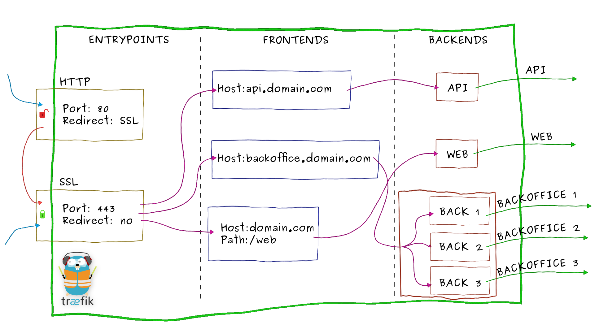

# Basics

## Concepts

Let's take our example from the [overview](https://docs.traefik.io/#overview) again:


> Imagine that you have deployed a bunch of microservices on your infrastructure. You probably used a service registry (like etcd or consul) and/or an orchestrator (swarm, Mesos/Marathon) to manage all these services.
> If you want your users to access some of your microservices from the Internet, you will have to use a reverse proxy and configure it using virtual hosts or prefix paths:

> - domain `api.domain.com` will point the microservice `api` in your private network
> - path `domain.com/web` will point the microservice `web` in your private network
> - domain `backoffice.domain.com` will point the microservices `backoffice` in your private network, load-balancing between your multiple instances

> 

Let's zoom on Træfik and have an overview of its internal architecture:




- Incoming requests end on [entrypoints](#entrypoints), as the name suggests, they are the network entry points into Træfik (listening port, SSL, traffic redirection...).
- Traffic is then forwarded to a matching [frontend](#frontends). A frontend defines routes from [entrypoints](#entrypoints) to [backends](#backends).
Routes are created using requests fields (`Host`, `Path`, `Headers`...) and can match or not a request.
- The [frontend](#frontends) will then send the request to a [backend](#backends). A backend can be composed by one or more [servers](#servers), and by a load-balancing strategy.
- Finally, the [server](#servers) will forward the request to the corresponding microservice in the private network.

### Entrypoints

Entrypoints are the network entry points into Træfik.
They can be defined using:

- a port (80, 443...)
- SSL (Certificates, Keys, authentication with a client certificate signed by a trusted CA...)
- redirection to another entrypoint (redirect `HTTP` to `HTTPS`)

Here is an example of entrypoints definition:

```toml
[entryPoints]
  [entryPoints.http]
  address = ":80"
    [entryPoints.http.redirect]
    entryPoint = "https"
  [entryPoints.https]
  address = ":443"
    [entryPoints.https.tls]
      [[entryPoints.https.tls.certificates]]
      certFile = "tests/traefik.crt"
      keyFile = "tests/traefik.key"
```

- Two entrypoints are defined `http` and `https`.
- `http` listens on port `80` and `https` on port `443`.
- We enable SSL on `https` by giving a certificate and a key.
- We also redirect all the traffic from entrypoint `http` to `https`.

And here is another example with client certificate authentication:

```toml
[entryPoints]
  [entryPoints.https]
  address = ":443"
  [entryPoints.https.tls]
  clientCAFiles = ["tests/clientca1.crt", "tests/clientca2.crt"]
    [[entryPoints.https.tls.certificates]]
    certFile = "tests/traefik.crt"
    keyFile = "tests/traefik.key"
```

- We enable SSL on `https` by giving a certificate and a key.
- One or several files containing Certificate Authorities in PEM format are added.
- It is possible to have multiple CA:s in the same file or keep them in separate files.

### Frontends

A frontend consists of a set of rules that determine how incoming requests are forwarded from an entrypoint to a backend.

Rules may be classified in one of two groups: Modifiers and matchers.

#### Modifiers

Modifier rules only modify the request. They do not have any impact on routing decisions being made.

Following is the list of existing modifier rules:

- `AddPrefix: /products`: Add path prefix to the existing request path prior to forwarding the request to the backend.
- `ReplacePath: /serverless-path`: Replaces the path and adds the old path to the `X-Replaced-Path` header. Useful for mapping to AWS Lambda or Google Cloud Functions.

#### Matchers

Matcher rules determine if a particular request should be forwarded to a backend.

Separate multiple rule values by `,` (comma) in order to enable ANY semantics (i.e., forward a request if any rule matches). Does not work for `Headers` and `HeadersRegexp`.

Separate multiple rule values by `;` (semicolon) in order to enable ALL semantics (i.e., forward a request if all rules match).

You can optionally enable `passHostHeader` to forward client `Host` header to the backend. You can also optionally enable `passTLSCert` to forward TLS Client certificates to the backend.

Following is the list of existing matcher rules along with examples:

- `Headers: Content-Type, application/json`: Match HTTP header. It accepts a comma-separated key/value pair where both key and value must be literals.
- `HeadersRegexp: Content-Type, application/(text|json)`: Match HTTP header. It accepts a comma-separated key/value pair where the key must be a literal and the value may be a literal or a regular expression.
- `Host: traefik.io, www.traefik.io`: Match request host. It accepts a sequence of literal hosts.
- `HostRegexp: traefik.io, {subdomain:[a-z]+}.traefik.io`: Match request host. It accepts a sequence of literal and regular expression hosts.
- `Method: GET, POST, PUT`: Match request HTTP method. It accepts a sequence of HTTP methods.
- `Path: /products/, /articles/{category}/{id:[0-9]+}`: Match exact request path. It accepts a sequence of literal and regular expression paths.
- `PathStrip: /products/`: Match exact path and strip off the path prior to forwarding the request to the backend. It accepts a sequence of literal paths.
- `PathStripRegex: /articles/{category}/{id:[0-9]+}`: Match exact path and strip off the path prior to forwarding the request to the backend. It accepts a sequence of literal and regular expression paths.
- `PathPrefix: /products/, /articles/{category}/{id:[0-9]+}`: Match request prefix path. It accepts a sequence of literal and regular expression prefix paths.
- `PathPrefixStrip: /products/`: Match request prefix path and strip off the path prefix prior to forwarding the request to the backend. It accepts a sequence of literal prefix paths. Starting with Traefik 1.3, the stripped prefix path will be available in the `X-Forwarded-Prefix` header.
- `PathPrefixStripRegex: /articles/{category}/{id:[0-9]+}`: Match request prefix path and strip off the path prefix prior to forwarding the request to the backend. It accepts a sequence of literal and regular expression prefix paths. Starting with Traefik 1.3, the stripped prefix path will be available in the `X-Forwarded-Prefix` header.
- `Query: foo=bar, bar=baz`: Match Query String parameters. It accepts a sequence of key=value pairs.

In order to use regular expressions with Host and Path matchers, you must declare an arbitrarily named variable followed by the colon-separated regular expression, all enclosed in curly braces. Any pattern supported by [Go's regexp package](https://golang.org/pkg/regexp/) may be used. Example: `/posts/{id:[0-9]+}`.

(Note that the variable has no special meaning; however, it is required by the gorilla/mux dependency which embeds the regular expression and defines the syntax.)

##### Path Matcher Usage Guidelines

This section explains when to use the various path matchers.

Use `Path` if your backend listens on the exact path only. For instance, `Path: /products` would match `/products` but not `/products/shoes`.

Use a `*Prefix*` matcher if your backend listens on a particular base path but also serves requests on sub-paths. For instance, `PathPrefix: /products` would match `/products` but also `/products/shoes` and `/products/shirts`. Since the path is forwarded as-is, your backend is expected to listen on `/products`.

Use a `*Strip` matcher if your backend listens on the root path (`/`) but should be routeable on a specific prefix. For instance, `PathPrefixStrip: /products` would match `/products` but also `/products/shoes` and `/products/shirts`. Since the path is stripped prior to forwarding, your backend is expected to listen on `/`.
If your backend is serving assets (e.g., images or Javascript files), chances are it must return properly constructed relative URLs. Continuing on the example, the backend should return `/products/shoes/image.png` (and not `/images.png` which Traefik would likely not be able to associate with the same backend). The `X-Forwarded-Prefix` header (available since Traefik 1.3) can be queried to build such URLs dynamically.

Instead of distinguishing your backends by path only, you can add a Host matcher to the mix. That way, namespacing of your backends happens on the basis of hosts in addition to paths.

#### Examples

Here is an example of frontends definition:

```toml
[frontends]
  [frontends.frontend1]
  backend = "backend2"
    [frontends.frontend1.routes.test_1]
    rule = "Host:test.localhost,test2.localhost"
  [frontends.frontend2]
  backend = "backend1"
  passHostHeader = true
  passTLSCert = true
  priority = 10
  entrypoints = ["https"] # overrides defaultEntryPoints
    [frontends.frontend2.routes.test_1]
    rule = "HostRegexp:localhost,{subdomain:[a-z]+}.localhost"
  [frontends.frontend3]
  backend = "backend2"
    [frontends.frontend3.routes.test_1]
    rule = "Host:test3.localhost;Path:/test"
```

- Three frontends are defined: `frontend1`, `frontend2` and `frontend3`
- `frontend1` will forward the traffic to the `backend2` if the rule `Host:test.localhost,test2.localhost` is matched
- `frontend2` will forward the traffic to the `backend1` if the rule `Host:localhost,{subdomain:[a-z]+}.localhost` is matched (forwarding client `Host` header to the backend)
- `frontend3` will forward the traffic to the `backend2` if the rules `Host:test3.localhost` **AND** `Path:/test` are matched

#### Combining multiple rules

As seen in the previous example, you can combine multiple rules.
In TOML file, you can use multiple routes:

```toml
  [frontends.frontend3]
  backend = "backend2"
    [frontends.frontend3.routes.test_1]
    rule = "Host:test3.localhost"
    [frontends.frontend3.routes.test_2]
    rule = "Path:/test"
```

Here `frontend3` will forward the traffic to the `backend2` if the rules `Host:test3.localhost` **AND** `Path:/test` are matched.
You can also use the notation using a `;` separator, same result:

```toml
  [frontends.frontend3]
  backend = "backend2"
    [frontends.frontend3.routes.test_1]
    rule = "Host:test3.localhost;Path:/test"
```

Finally, you can create a rule to bind multiple domains or Path to a frontend, using the `,` separator:

```toml
 [frontends.frontend2]
    [frontends.frontend2.routes.test_1]
    rule = "Host:test1.localhost,test2.localhost"
  [frontends.frontend3]
  backend = "backend2"
    [frontends.frontend3.routes.test_1]
    rule = "Path:/test1,/test2"
```

#### Rules Order

When combining `Modifier` rules with `Matcher` rules, it is important to remember that `Modifier` rules **ALWAYS** apply after the `Matcher` rules.  
The following rules are both `Matchers` and `Modifiers`, so the `Matcher` portion of the rule will apply first, and the `Modifier` will apply later.

- `PathStrip`
- `PathStripRegex`
- `PathPrefixStrip`
- `PathPrefixStripRegex`

`Modifiers` will be applied in a pre-determined order regardless of their order in the `rule` configuration section.

1. `PathStrip`
2. `PathPrefixStrip`
3. `PathStripRegex`
4. `PathPrefixStripRegex`
5. `AddPrefix`
6. `ReplacePath`

#### Priorities

By default, routes will be sorted (in descending order) using rules length (to avoid path overlap):
`PathPrefix:/12345` will be matched before `PathPrefix:/1234` that will be matched before `PathPrefix:/1`.

You can customize priority by frontend:

```toml
  [frontends]
    [frontends.frontend1]
    backend = "backend1"
    priority = 10
    passHostHeader = true
      [frontends.frontend1.routes.test_1]
      rule = "PathPrefix:/to"
    [frontends.frontend2]
    priority = 5
    backend = "backend2"
    passHostHeader = true
      [frontends.frontend2.routes.test_1]
      rule = "PathPrefix:/toto"
```

Here, `frontend1` will be matched before `frontend2` (`10 > 5`).

#### Custom headers

Custom headers can be configured through the frontends, to add headers to either requests or responses that match the frontend's rules. This allows for setting headers such as `X-Script-Name` to be added to the request, or custom headers to be added to the response:

```toml
[frontends]
  [frontends.frontend1]
  backend = "backend1"
    [frontends.frontend1.headers.customresponseheaders]
    X-Custom-Response-Header = "True"
    [frontends.frontend1.headers.customrequestheaders]
    X-Script-Name = "test"
    [frontends.frontend1.routes.test_1]
    rule = "PathPrefixStrip:/cheese"
```

In this example, all matches to the path `/cheese` will have the `X-Script-Name` header added to the proxied request, and the `X-Custom-Response-Header` added to the response.

#### Security headers

Security related headers (HSTS headers, SSL redirection, Browser XSS filter, etc) can be added and configured per frontend in a similar manner to the custom headers above. This functionality allows for some easy security features to quickly be set. An example of some of the security headers:

```toml
[frontends]
  [frontends.frontend1]
  backend = "backend1"
    [frontends.frontend1.headers]
    FrameDeny = true
    [frontends.frontend1.routes.test_1]
    rule = "PathPrefixStrip:/cheddar"
  [frontends.frontend2]
  backend = "backend2"
    [frontends.frontend2.headers]
    SSLRedirect = true
    [frontends.frontend2.routes.test_1]
    rule = "PathPrefixStrip:/stilton"
```

In this example, traffic routed through the first frontend will have the `X-Frame-Options` header set to `DENY`, and the second will only allow HTTPS request through, otherwise will return a 301 HTTPS redirect.

### Backends

A backend is responsible to load-balance the traffic coming from one or more frontends to a set of http servers.
Various methods of load-balancing are supported:

- `wrr`: Weighted Round Robin
- `drr`: Dynamic Round Robin: increases weights on servers that perform better than others. It also rolls back to original weights if the servers have changed.

A circuit breaker can also be applied to a backend, preventing high loads on failing servers.
Initial state is Standby. CB observes the statistics and does not modify the request.
In case the condition matches, CB enters Tripped state, where it responds with predefined code or redirects to another frontend.
Once Tripped timer expires, CB enters Recovering state and resets all stats.
In case the condition does not match and recovery timer expires, CB enters Standby state.

It can be configured using:

- Methods: `LatencyAtQuantileMS`, `NetworkErrorRatio`, `ResponseCodeRatio`
- Operators:  `AND`, `OR`, `EQ`, `NEQ`, `LT`, `LE`, `GT`, `GE`

For example:

- `NetworkErrorRatio() > 0.5`: watch error ratio over 10 second sliding window for a frontend
- `LatencyAtQuantileMS(50.0) > 50`:  watch latency at quantile in milliseconds.
- `ResponseCodeRatio(500, 600, 0, 600) > 0.5`: ratio of response codes in range [500-600) to  [0-600)

To proactively prevent backends from being overwhelmed with high load, a maximum connection limit can
also be applied to each backend.

Maximum connections can be configured by specifying an integer value for `maxconn.amount` and
`maxconn.extractorfunc` which is a strategy used to determine how to categorize requests in order to
evaluate the maximum connections.

For example:
```toml
[backends]
  [backends.backend1]
    [backends.backend1.maxconn]
       amount = 10
       extractorfunc = "request.host"
```

- `backend1` will return `HTTP code 429 Too Many Requests` if there are already 10 requests in progress for the same Host header.
- Another possible value for `extractorfunc` is `client.ip` which will categorize requests based on client source ip.
- Lastly `extractorfunc` can take the value of `request.header.ANY_HEADER` which will categorize requests based on `ANY_HEADER` that you provide.

Sticky sessions are supported with both load balancers. When sticky sessions are enabled, a cookie called `_TRAEFIK_BACKEND` is set on the initial
request. On subsequent requests, the client will be directed to the backend stored in the cookie if it is still healthy. If not, a new backend
will be assigned.

For example:
```toml
[backends]
  [backends.backend1]
    [backends.backend1.loadbalancer]
      sticky = true
```

A health check can be configured in order to remove a backend from LB rotation
as long as it keeps returning HTTP status codes other than 200 OK to HTTP GET
requests periodically carried out by Traefik. The check is defined by a path
appended to the backend URL and an interval (given in a format understood by [time.ParseDuration](https://golang.org/pkg/time/#ParseDuration)) specifying how
often the health check should be executed (the default being 30 seconds).
Each backend must respond to the health check within 5 seconds.
By default, the port of the backend server is used, however, this may be overridden.  

A recovering backend returning 200 OK responses again is being returned to the
LB rotation pool.

For example:
```toml
[backends]
  [backends.backend1]
    [backends.backend1.healthcheck]
      path = "/health"
      interval = "10s"
```

To use a different port for the healthcheck:
```toml
[backends]
  [backends.backend1]
    [backends.backend1.healthcheck]
      path = "/health"
      interval = "10s"
      port = 8080
```

### Servers

Servers are simply defined using a `URL`. You can also apply a custom `weight` to each server (this will be used by load-balancing).

Here is an example of backends and servers definition:

```toml
[backends]
  [backends.backend1]
    [backends.backend1.circuitbreaker]
      expression = "NetworkErrorRatio() > 0.5"
    [backends.backend1.servers.server1]
    url = "http://172.17.0.2:80"
    weight = 10
    [backends.backend1.servers.server2]
    url = "http://172.17.0.3:80"
    weight = 1
  [backends.backend2]
    [backends.backend2.LoadBalancer]
      method = "drr"
    [backends.backend2.servers.server1]
    url = "http://172.17.0.4:80"
    weight = 1
    [backends.backend2.servers.server2]
    url = "http://172.17.0.5:80"
    weight = 2
```

- Two backends are defined: `backend1` and `backend2`
- `backend1` will forward the traffic to two servers: `http://172.17.0.2:80"` with weight `10` and `http://172.17.0.3:80` with weight `1` using default `wrr` load-balancing strategy.
- `backend2` will forward the traffic to two servers: `http://172.17.0.4:80"` with weight `1` and `http://172.17.0.5:80` with weight `2` using `drr` load-balancing strategy.
- a circuit breaker is added on `backend1` using the expression `NetworkErrorRatio() > 0.5`: watch error ratio over 10 second sliding window

### Custom Error pages

Custom error pages can be returned, in lieu of the default, according to frontend-configured ranges of HTTP Status codes.
In the example below, if a 503 status is returned from the frontend "website", the custom error page at http://2.3.4.5/503.html is returned with the actual status code set in the HTTP header.
Note, the 503.html page itself is not hosted on traefik, but some other infrastructure.   

```toml
[frontends]
  [frontends.website]
  backend = "website"
  [errors]
    [error.network]
    status = ["500-599"]
    backend = "error"
    query = "/{status}.html"
  [frontends.website.routes.website]
  rule = "Host: website.mydomain.com"

[backends]
  [backends.website]
    [backends.website.servers.website]
    url = "https://1.2.3.4"
  [backends.error]
    [backends.error.servers.error]
    url = "http://2.3.4.5"
```

In the above example, the error page rendered was based on the status code.
Instead, the query parameter can also be set to some generic error page like so: `query = "/500s.html"`

Now the 500s.html error page is returned for the configured code range.
The configured status code ranges are inclusive; that is, in the above example, the 500s.html page will be returned for status codes 500 through, and including, 599.

## Configuration

Træfik's configuration has two parts:

- The [static Træfik configuration](/basics#static-trfk-configuration) which is loaded only at the beginning.
- The [dynamic Træfik configuration](/basics#dynamic-trfk-configuration) which can be hot-reloaded (no need to restart the process).


### Static Træfik configuration

The static configuration is the global configuration which is setting up connections to configuration backends and entrypoints.

Træfik can be configured using many configuration sources with the following precedence order.
Each item takes precedence over the item below it:

- [Key-value store](/basics/#key-value-stores)
- [Arguments](/basics/#arguments)
- [Configuration file](/basics/#configuration-file)
- Default

It means that arguments override configuration file, and key-value store overrides arguments.

Note that the provider-enabling argument parameters (e.g., `--docker`) set all default values for the specific provider. It must not be used if a configuration source with less precedence wants to set a non-default provider value.

#### Configuration file

By default, Træfik will try to find a `traefik.toml` in the following places:

- `/etc/traefik/`
- `$HOME/.traefik/`
- `.` *the working directory*

You can override this by setting a `configFile` argument:

```bash
$ traefik --configFile=foo/bar/myconfigfile.toml
```

Please refer to the [global configuration](/toml/#global-configuration) section to get documentation on it.

#### Arguments

Each argument (and command) is described in the help section:

```bash
$ traefik --help
```

Note that all default values will be displayed as well.

#### Key-value stores

Træfik supports several Key-value stores:

- [Consul](https://consul.io)
- [etcd](https://coreos.com/etcd/)
- [ZooKeeper](https://zookeeper.apache.org/)
- [boltdb](https://github.com/boltdb/bolt)

Please refer to the [User Guide Key-value store configuration](/user-guide/kv-config/) section to get documentation on it.

### Dynamic Træfik configuration

The dynamic configuration concerns :

- [Frontends](/basics/#frontends)
- [Backends](/basics/#backends)
- [Servers](/basics/#servers)

Træfik can hot-reload those rules which could be provided by [multiple configuration backends](/toml/#configuration-backends).

We only need to enable `watch` option to make Træfik watch configuration backend changes and generate its configuration automatically.
Routes to services will be created and updated instantly at any changes.

Please refer to the [configuration backends](/toml/#configuration-backends) section to get documentation on it.

## Commands

Usage: `traefik [command] [--flag=flag_argument]`

List of Træfik available commands with description :                                                             

- `version` : Print version 
- `storeconfig` : Store the static traefik configuration into a Key-value stores. Please refer to the [Store Træfik configuration](/user-guide/kv-config/#store-trfk-configuration) section to get documentation on it.
- `bug`: The easiest way to submit a pre-filled issue.
- `healthcheck`: Calls traefik `/ping` to check health.

Each command may have related flags.
All those related flags will be displayed with :

```bash
$ traefik [command] --help
```

Note that each command is described at the beginning of the help section:

```bash
$ traefik --help
```

### Command: bug

Here is the easiest way to submit a pre-filled issue on [Træfik GitHub](https://github.com/containous/traefik).

```bash
$ traefik bug
```

See https://www.youtube.com/watch?v=Lyz62L8m93I.

### Command: healthcheck

This command allows to check the health of Traefik. Its exit status is `0` if Traefik is healthy and `1` if it is unhealthy.
This can be used with Docker [HEALTHCHECK](https://docs.docker.com/engine/reference/builder/#healthcheck) instruction or any other health check orchestration mechanism.

Note: the `web` provider must be enabled to allow `/ping` calls by the `healthcheck` command.

```bash
$ traefik healthcheck
OK: http://:8082/ping
```

## Log Rotation

Traefik will close and reopen its log files, assuming they're configured, on receipt of a USR1 signal.  This allows the logs
to be rotated and processed by an external program, such as `logrotate`.

Note that this does not work on Windows due to the lack of USR signals.

