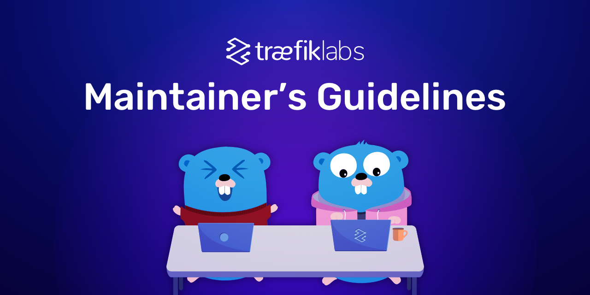

# Maintainer's Guidelines

Note: the document is a work in progress.

Welcome to the Traefik Community.
This document describes how to be part of the core team
together with various responsibilities
and guidelines for Traefik maintainers.
We are strongly promoting a philosophy of openness and sharing,
and firmly standing against the elitist closed approach.
Being part of the core team should be accessible to anyone motivated
and wants to be part of that journey!

## Onboarding Process

If you consider joining our community, please drop us a line using Twitter or leave a note in the issue.
We will schedule a quick call to meet you and learn more about your motivation.
During the call, the team will discuss the process of becoming a maintainer.
We will be happy to answer any questions and explain all your doubts.

## Maintainer's Requirements

Note: you do not have to meet all the listed requirements,
but must have achieved several.

- Enabled [2FA](https://docs.github.com/en/authentication/securing-your-account-with-two-factor-authentication-2fa/configuring-two-factor-authentication) on your GitHub account
- The contributor has opened and successfully run medium to large PR’s in the past 6 months.
- The contributor has participated in multiple code reviews of other PR’s,
  including those of other maintainers and contributors.
- The contributor showed a consistent pattern of helpful, non-threatening, and friendly behavior towards other community members in the past.
- The contributor is active on Traefik Community forums
  or other technical forums/boards such as K8S slack, Reddit, StackOverflow, hacker news.
- Have read and accepted the contributor guidelines.

## Maintainer's Responsibilities and Privileges

There are lots of areas where you can contribute to the project,
but we can suggest you start with activities such as:

- PR reviewing.
    - According to our guidelines we require you have at least 3 reviewers,
      thus you can review a PR and leave the relevant comment if it is necessary.
- Participating in a daily [issue triage](https://github.com/traefik/contributors-guide/blob/master/issue_triage.md).
    - The process helps to understand and prioritize the reported issue according to its importance and severity.
      This is crucial to learn how our users implement Traefik.
      Each of the issues that are labeled as bug/possible bug/confirmed requires a reproducible use case. 
      You can help in creating a reproducible use case if it has not been added to the issue
      or use the sample code provided by the reporter.
      Typically, a simple Docker Compose should be enough to reproduce the issue.
- Code contribution.
- Documentation contribution.
    - Technical documentation is one of the most important components of the product.
      The ability to set up a testing environment in a few minutes,
      using the official documentation,
      is a game changer.
- You will be listed on our Maintainers GitHub page
  and on our website in the section [maintainers](maintainers.md).
- We will be promoting you on social channels (mostly on Twitter).

## Governance

- Roadmap meetings on a regular basis where all maintainers are welcome.

## Communicating

- All of our maintainers are added to the Traefik Maintainers Discord server that belongs to Traefik labs.
  Having the team in one place helps us to communicate effectively.
  You can reach Traefik core developers directly,
  which offers the possibility to discuss issues, pull requests, enhancements more efficiently
  and get the feedback almost immediately.
  Fewer blockers mean more fun and engaging work.

- On a daily basis, we publish a report that includes all the activities performed during the day.
  You are updated in regard to the workload that has been processed including:
  working on the new features and enhancements,
  activities related to the reported issues and PR’s,
  other important project-related announcements.

- At 2:15pm CET every Monday and Thursday we review all the created issues that have been reported,
  assign them the appropriate *[labels](maintainers.md#labels)*
  and prioritize them based on the severity of the problem.
  The process is called *[issue triaging](https://github.com/traefik/contributors-guide/blob/master/issue_triage.md)*.
  Each of the maintainers is welcome to join the meeting.
  For that purpose, we use the Traefik Maintainers Discord server
  where you are invited once you have become an official maintainer.

## Maintainers Activity

In order to keep the core team efficient and dynamic,
maintainers' activity and involvement will be reviewed on a regular basis.

- Has the maintainer engaged with the team and the community by meeting two or more of these benchmarks in the past six months?
    - Has the maintainer participated in at least two or three maintainer meetings?
    - Substantial review of at least one or two PRs from either contributors or maintainers.
    - Opened at least one or two bug fixes or feature request PRs
      that were eventually merged (or on a trajectory for merge).
    - Substantial participation in the Help Wanted program (answered questions, helped identify issues, applied guidelines from the Help Wanted guide to open issues).
    - Substantial participation with the community in general.

- Has the maintainer shown a consistent pattern of helpful,
  non-threatening,
  and friendly behavior towards other people on the maintainer team and with our community?

## Additional Comments for (not only) Maintainers

- Be able to put yourself in users’ shoes.
- Be open-minded and respectful with other maintainers and other community members.
- Keep the communication public -
  if anyone tries to communicate with you directly,
  ask politely to move the conversation to a public communication channel.
- Stay away from defensive comments.
- Please try to express your thoughts clearly enough
  and note that some of us are not native English speakers.
  Try to rephrase your sentences, avoiding mental shortcuts;
  none of us is able to predict your thoughts.
- There are a lot of use cases of using Traefik
  and even more issues that are difficult to reproduce.
  If the issue can’t be replicated due to a lack of reproducible case (a simple Docker Compose should be enough) -
  set your time limits while working on the issue
  and express clearly that you were not able to replicate it.
  You can come back later to that case.
- Be proactive.
- Emoji are fine,
  but if you express yourself clearly enough they are not necessary.
  They will not replace good communication.
- Embrace mentorship.
- Keep in mind that we all have the same intent to improve the project.
