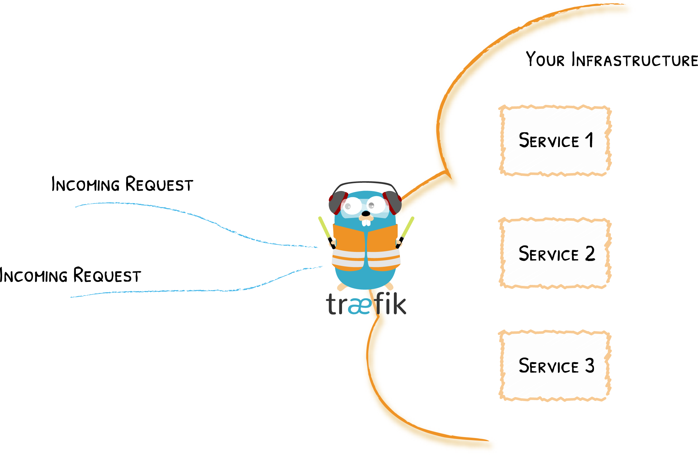
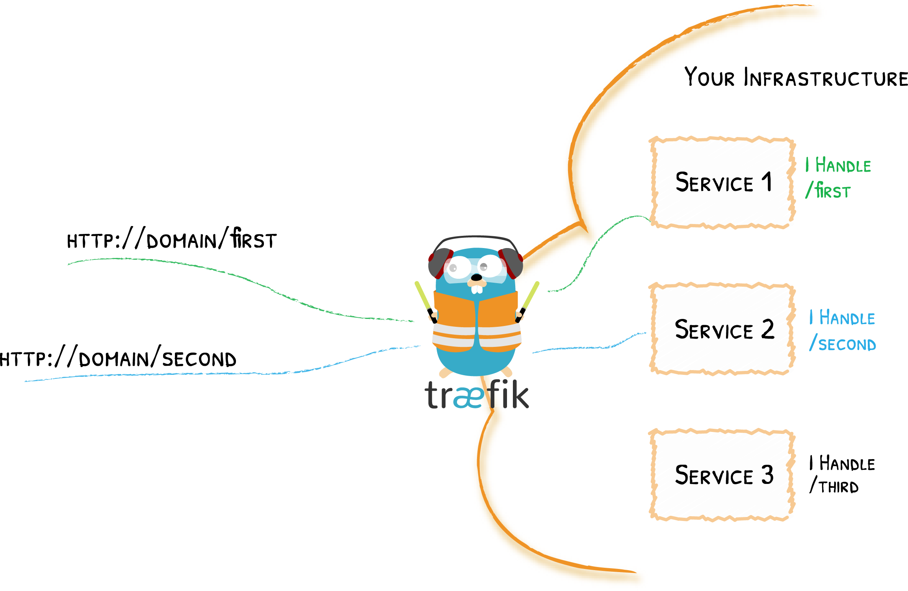

# Concepts

Everything You Need to Know
{: .subtitle }

## Edge Router

Traefik is an _Edge Router_, it means that it's the door to your platform, and that it intercepts and routes every incoming request:
it knows all the logic and every rule that determine which services handle which requests (based on the [path](../routing/routers/index.md#rule), the [host](../routing/routers/index.md#rule), [headers](../routing/routers/index.md#rule), [and so on](../routing/routers/index.md#rule) ...).

## Auto Service Discovery

Where traditionally edge routers (or reverse proxies) need a configuration file that contains every possible route to your services, Traefik gets them from the services themselves.

Deploying your services, you attach information that tells Traefik the characteristics of the requests the services can handle.

It means that when a service is deployed, Traefik detects it immediately and updates the routing rules in real time.
The opposite is true: when you remove a service from your infrastructure, the route will disappear accordingly.

You no longer need to create and synchronize configuration files cluttered with IP addresses or other rules.

!!! info "Many different rules"

    In the example above, we used the request [path](../routing/routers/index.md#rule) to determine which service was in charge, but of course you can use many other different [rules](../routing/routers/index.md#rule).

!!! info "Updating the requests"

    In the [middleware](../middlewares/overview.md) section, you can learn about how to update the requests before forwarding them to the services.

!!! question "How does Traefik discover the services?"

    Traefik is able to use your cluster API to discover the services and read the attached information. In Traefik, these connectors are called [providers](../providers/overview.md) because they _provide_ the configuration to Traefik. To learn more about them, read the [provider overview](../providers/overview.md) section.
