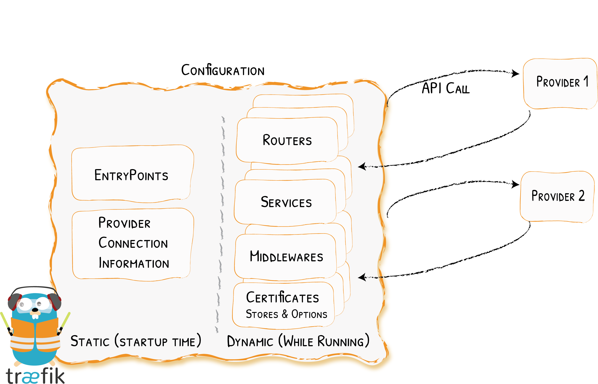

# Configuration Introduction

How the Magic Happens
{: .subtitle }



Configuration in Traefik can refer to two different things:

- The fully dynamic routing configuration (referred to as the _dynamic configuration_)
- The startup configuration (referred to as the _static configuration_)

Elements in the _static configuration_ set up connections to [providers](../providers/overview.md) and define the [entrypoints](../routing/entrypoints.md) Traefik will listen to (these elements don't change often).

The _dynamic configuration_ contains everything that defines how the requests are handled by your system.
This configuration can change and is seamlessly hot-reloaded, without any request interruption or connection loss.    

!!! warning "Incompatible Configuration"
    Please be aware that the old configurations for Traefik v1.x are NOT compatible with the v2.x config as of now.
    If you are running v2, please ensure you are using a v2 configuration.

## The Dynamic Configuration 

Traefik gets its _dynamic configuration_ from [providers](../providers/overview.md): whether an orchestrator, a service registry, or a plain old configuration file.

Since this configuration is specific to your infrastructure choices, we invite you to refer to the [dedicated section of this documentation](../routing/overview.md).

!!! info ""

    In the [Quick Start example](../getting-started/quick-start.md), the dynamic configuration comes from docker in the form of labels attached to your containers.
    
!!! info "HTTPS Certificates also belong to the dynamic configuration."
    
    You can add / update / remove them without restarting your Traefik instance. 
 
## The Static Configuration

There are three different, **mutually exclusive** (e.g. you can use only one at the same time), ways to define static configuration options in Traefik:

1. In a configuration file
1. In the command-line arguments
1. As environment variables

These ways are evaluated in the order listed above.

If no value was provided for a given option, a default value applies.
Moreover, if an option has sub-options, and any of these sub-options is not specified, a default value will apply as well.
    
For example, the `--providers.docker` option is enough by itself to enable the docker provider, even though sub-options like `--providers.docker.endpoint` exist.
Once positioned, this option sets (and resets) all the default values of the sub-options of `--providers.docker`.
    
### Configuration File

At startup, Traefik searches for a file named `traefik.toml` (or `traefik.yml` or `traefik.yaml`) in:

- `/etc/traefik/`
- `$XDG_CONFIG_HOME/`
- `$HOME/.config/`
- `.` (_the working directory_).

You can override this using the `configFile` argument.

```bash
traefik --configFile=foo/bar/myconfigfile.toml
```

### Arguments

To get the list of all available arguments:

```bash
traefik --help

# or

docker run traefik[:version] --help
# ex: docker run traefik:2.1 --help
```

All available arguments can also be found [here](../reference/static-configuration/cli.md).

### Environment Variables

All available environment variables can be found [here](../reference/static-configuration/env.md)

## Available Configuration Options

All the configuration options are documented in their related section.

You can browse the available features in the menu, the [providers](../providers/overview.md), or the [routing section](../routing/overview.md) to see them in action.
