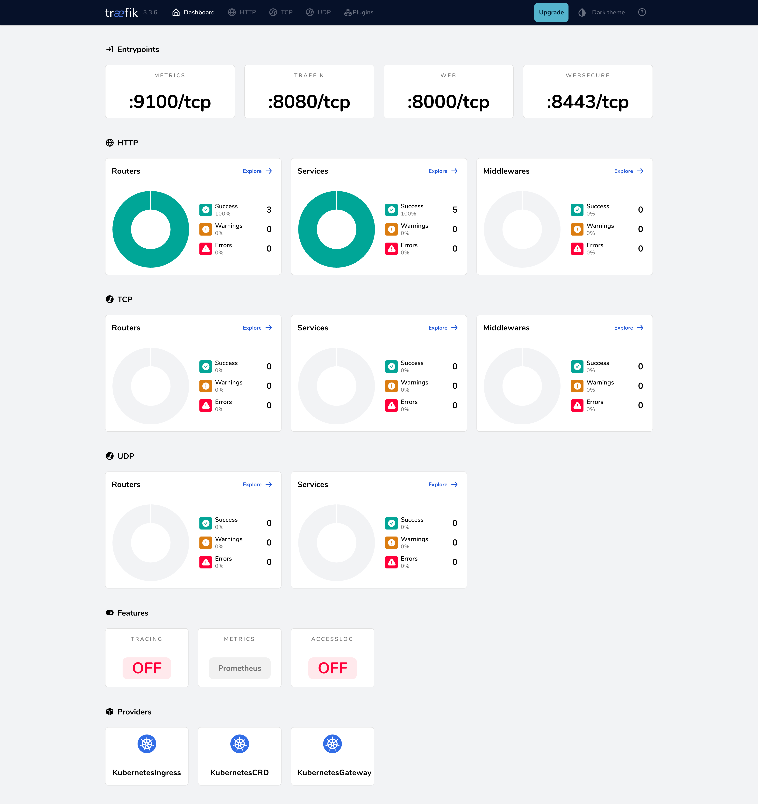
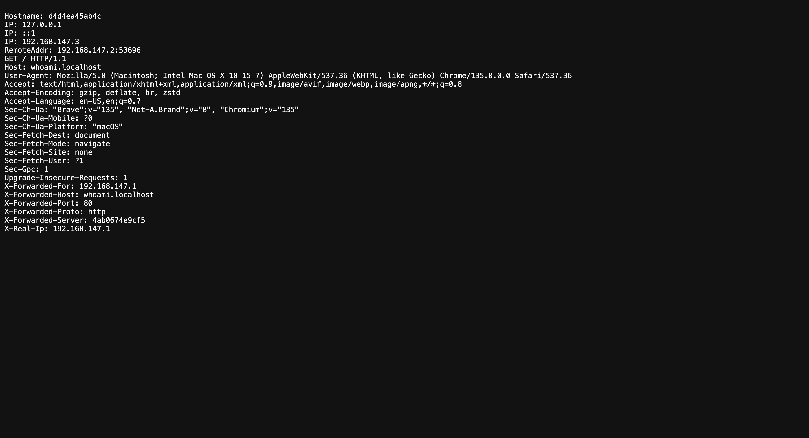

# Getting Started with Docker and Traefik

Docker is a first-class citizen in Traefik, offering native support for Docker containers and services. 
Whether you're using Docker Compose or running containers directly, Traefik provides a seamless experience for managing your Docker traffic.

This guide shows you how to:

- Install Traefik using Docker
- Expose the Traefik dashboard
- Deploy a sample application
- Configure basic routing

## Prerequisites

- Docker 
- Docker Compose (optional)

## Install Traefik

### Using Docker Compose

Create a Docker Compose file. 
This configuration:

- Exposes ports 80 and 8080. 
- Enables the Docker provider
- Configures the dashboard with basic settings. Port 8080 serves the dashboard because we enabled `--api.insecure=true` (development use only)
- Mounts the Docker socket for container discovery

```yaml
# docker-compose.yml
services:
  traefik:
    image: traefik:v3.5
    command:
      - "--api.insecure=true"
      - "--providers.docker=true"
      - "--entrypoints.web.address=:80"
    ports:
      - "80:80"
      - "8080:8080"
    volumes:
      - /var/run/docker.sock:/var/run/docker.sock
```

Start Traefik:

```bash
docker-compose up -d
```

### Using Docker CLI

Alternatively, you can run Traefik directly with Docker. 
This command:

- Exposes ports 80 and 8080 for web traffic and dashboard access
- Mounts the configuration file and Docker socket
- Uses the same configuration as the Docker Compose example

Create a configuration file:

```yaml
# traefik.yml
api:
  insecure: true
entryPoints:
  web:
    address: ":80"
providers:
  docker: {}
```

Start Traefik:

```bash
docker run -d \
  -p 80:80 \
  -p 8080:8080 \
  -v $PWD/traefik.yml:/etc/traefik/traefik.yml \
  -v /var/run/docker.sock:/var/run/docker.sock \
  traefik:v3.5
```

## Expose the Dashboard

Because we explicitly enabled insecure mode, the [dashboard](../reference/install-configuration/api-dashboard.md) is reachable on port 8080 without authentication. 
**Do not enable this flag in production**.

You can access the dashboard at:

[http://localhost:8080/dashboard/](http://localhost:8080/dashboard/)



## Deploy a Sample Application

Create a whoami service:

```yaml
# whoami.yml
services:
  whoami:
    image: traefik/whoami
    labels:
      - "traefik.http.routers.whoami.rule=Host(`whoami.localhost`)"
```

Apply the configuration:

```bash
docker-compose -f whoami.yml up -d
```

## Test Your Setup

You can use the following curl command to verify that the application is correctly exposed:

```bash
curl http://whoami.localhost

Hostname: 068c0a29a8b7
IP: 127.0.0.1
IP: ::1
IP: 192.168.147.3
RemoteAddr: 192.168.147.2:56006
GET / HTTP/1.1
Host: whoami.localhost
User-Agent: curl/8.7.1
Accept: */*
Accept-Encoding: gzip
X-Forwarded-For: 192.168.147.1
X-Forwarded-Host: whoami.localhost
X-Forwarded-Port: 80
X-Forwarded-Proto: http
X-Forwarded-Server: 9232cdd4fd6c
X-Real-Ip: 192.168.147.1
```

You can also open [http://whoami.localhost](http://whoami.localhost) in a browser to test the application:



If you navigate to the **HTTP Routers** section of the Traefik dashboard, you can see that the `whoami.localhost` route is managed by the Traefik Docker provider:


That's it! You've successfully deployed Traefik and configured routing in Docker.

## Next Steps

- [Configure TLS](../reference/routing-configuration/http/tls/overview.md)
- [Set up Middlewares](../reference/routing-configuration/http/middlewares/overview.md)
- [Enable Metrics](../reference/install-configuration/observability/metrics.md)
- [Learn more about Docker provider](../reference/install-configuration/providers/docker.md)

{!traefik-for-business-applications.md!}
