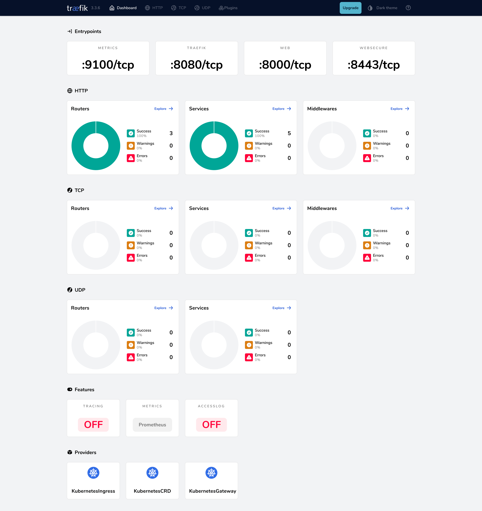
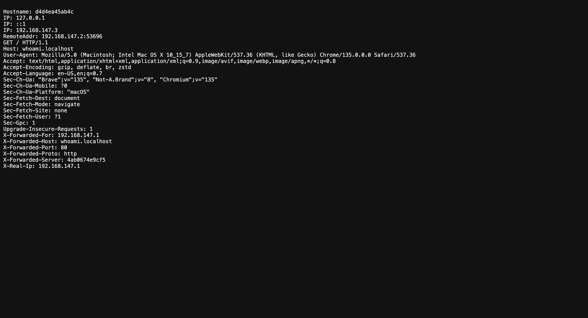
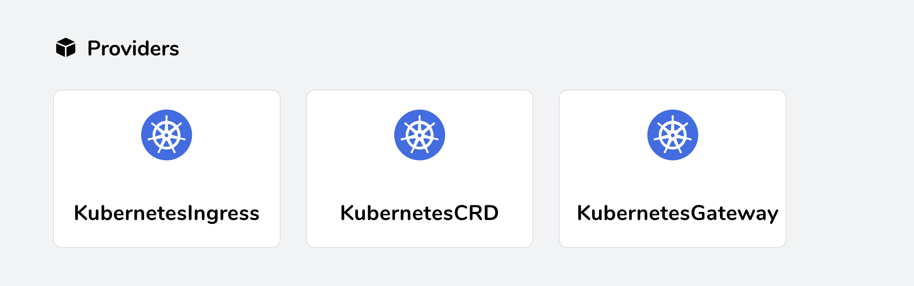
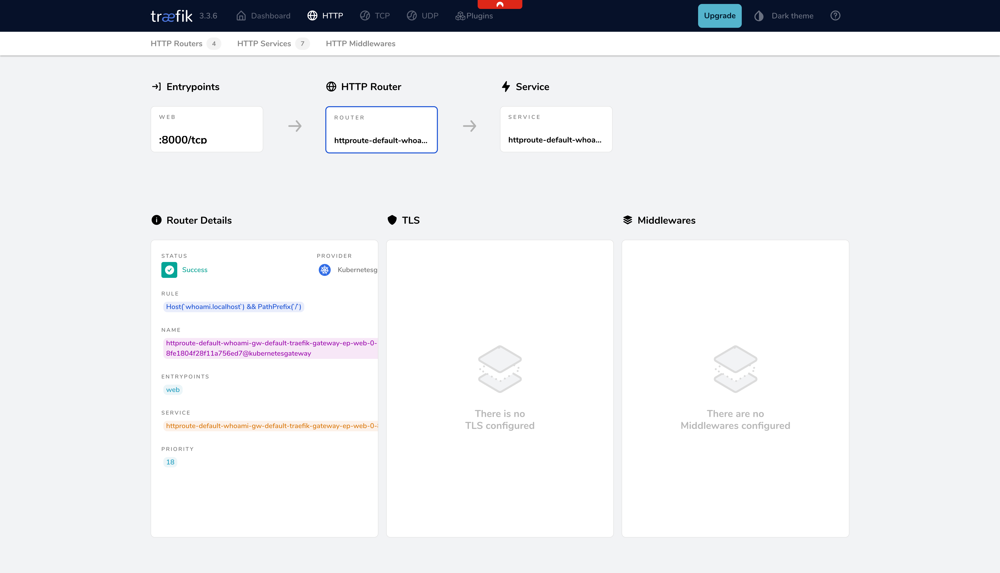

# Getting Started with Kubernetes and Traefik

Kubernetes is a first-class citizen in Traefik, offering native support for Kubernetes resources and the latest Kubernetes standards. 
Whether you're using Traefik's [IngressRoute CRD](../reference/routing-configuration/kubernetes/crd/http/ingressroute.md), [Ingress](../reference/routing-configuration/kubernetes/ingress.md) or the [Kubernetes Gateway API](../reference/routing-configuration/kubernetes/gateway-api.md), 
Traefik provides a seamless experience for managing your Kubernetes traffic.

This guide shows you how to:

- Create a Kubernetes cluster using k3d
- Install Traefik using Helm
- Expose the Traefik dashboard
- Deploy a sample application
- Configure basic routing with IngressRoute and Gateway API

## Prerequisites

- Kubernetes
- Helm 3
- kubectl
- k3d (for local cluster creation)

## Create a Kubernetes Cluster

### Using k3d

Create a cluster with the following command. This command:

- Creates a k3d cluster named "traefik"
- Maps ports 80, 443, and 8000 to the loadbalancer for accessing services
- Disables the built-in Traefik ingress controller to avoid conflicts

```bash
k3d cluster create traefik \
  --port 80:80@loadbalancer \
  --port 443:443@loadbalancer \
  --port 8000:8000@loadbalancer \
  --k3s-arg "--disable=traefik@server:0"
```

Configure kubectl:

```bash
kubectl cluster-info --context k3d-traefik
```

## Install Traefik

### Using Helm Values File

Add the Traefik Helm repository:

```bash
helm repo add traefik https://traefik.github.io/charts
helm repo update
```

Create a values file. This configuration:

- Maps ports 80 and 443 to the web and websecure [entrypoints](../reference/install-configuration/entrypoints.md)
- Enables the [dashboard](../reference/install-configuration/api-dashboard.md) with a specific hostname rule
- Enables the [Kubernetes Gateway API provider](../reference/routing-configuration/kubernetes/gateway-api.md)
- Allows the Gateway to expose [HTTPRoutes](https://gateway-api.sigs.k8s.io/api-types/httproute/) from all namespaces

```yaml
# values.yaml
ingressRoute:
  dashboard:
    enabled: true
    matchRule: Host(`dashboard.localhost`)
    entryPoints:
      - web
providers:
  kubernetesGateway:
    enabled: true
gateway:
  namespacePolicy: All
```

!!! info
    The [KubernetesCRD](../reference/install-configuration/providers/kubernetes/kubernetes-crd.md) provider is enabled by default when using the Helm chart so we don't need to set it in the values file.

Install Traefik:

```bash
helm install traefik traefik/traefik -f values.yaml --wait
```

### Using Helm CLI Arguments

Alternatively, you can install Traefik using CLI arguments. This command:

- Maps ports `30000` and `30001` to the web and websecure entrypoints
- Enables the dashboard with a specific hostname rule
- Enables the [Kubernetes Gateway API provider](../reference/routing-configuration/kubernetes/gateway-api.md)
- Allows the Gateway to expose HTTPRoutes from all namespaces

```bash
helm install traefik traefik/traefik --wait \
  --set ingressRoute.dashboard.enabled=true \
  --set ingressRoute.dashboard.matchRule='Host(`dashboard.localhost`)' \
  --set ingressRoute.dashboard.entryPoints={web} \
  --set providers.kubernetesGateway.enabled=true \
  --set gateway.namespacePolicy=All
```

!!! info
    The [KubernetesCRD](../reference/install-configuration/providers/kubernetes/kubernetes-crd.md) provider is enabled by default when using the Helm chart so we don't need to set it in the CLI arguments.

When Traefik is installed with the Gateway API provider enabled, it automatically creates a default GatewayClass named **traefik**:

```bash
kubectl describe GatewayClass traefik
```

## Expose the Dashboard

The dashboard is exposed with an [IngressRoute](../reference/routing-configuration/kubernetes/crd/http/ingressroute.md) provided by the Chart, as we defined in the helm values during installation. 

Access it at:

[http://dashboard.localhost/dashboard/](http://dashboard.localhost/dashboard/)



## Deploy a Sample Application

Create a deployment:

```yaml
# whoami.yaml
apiVersion: apps/v1
kind: Deployment
metadata:
  name: whoami
spec:
  replicas: 2
  selector:
    matchLabels:
      app: whoami
  template:
    metadata:
      labels:
        app: whoami
    spec:
      containers:
        - name: whoami
          image: traefik/whoami
          ports:
            - containerPort: 80
```

Create a service:

```yaml
# whoami-service.yaml
apiVersion: v1
kind: Service
metadata:
  name: whoami
spec:
  ports:
    - port: 80
  selector:
    app: whoami
```

Apply the manifests:

```bash
kubectl apply -f whoami.yaml
kubectl apply -f whoami-service.yaml
```

## Exposing the Application Using an IngressRoute (CRD)

Create an IngressRoute:

```yaml
# whoami-ingressroute.yaml
apiVersion: traefik.io/v1alpha1
kind: IngressRoute
metadata:
  name: whoami
spec:
  entryPoints:
    - web
  routes:
    - match: Host(`whoami.localhost`)
      kind: Rule
      services:
        - name: whoami
          port: 80
```

Apply the manifest:

```bash
kubectl apply -f whoami-ingressroute.yaml
```

### Test Your Setup

You can use the following curl command to verify that the application is correctly exposed:

```bash
curl http://whoami.localhost

Hostname: whoami-76c9859cfc-6v8hh
IP: 127.0.0.1
IP: ::1
IP: 10.42.0.11
IP: fe80::20ad:eeff:fe44:a63
RemoteAddr: 10.42.0.9:38280
GET / HTTP/1.1
Host: whoami.localhost
User-Agent: curl/8.7.1
Accept: */*
Accept-Encoding: gzip
X-Forwarded-For: 127.0.0.1
X-Forwarded-Host: whoami.localhost
X-Forwarded-Port: 80
X-Forwarded-Proto: http
X-Forwarded-Server: traefik-598946cd7-zds59
X-Real-Ip: 127.0.0.1
```

You can also visit [http://whoami.localhost](http://whoami.localhost) in a browser to verify that the application is exposed correctly:



## Exposing the Application Using the Gateway API

Traefik supports the Kubernetes Gateway API specification, which provides a more standardized way to configure ingress in Kubernetes.
When we installed Traefik earlier, we enabled the Gateway API provider. 
You can verify this in the providers section of the Traefik dashboard.



To use the Gateway API:

Install the Gateway API CRDs in your cluster:

```bash
kubectl apply -f https://github.com/kubernetes-sigs/gateway-api/releases/download/v1.2.1/standard-install.yaml
```

Create an HTTPRoute. This configuration:

- Creates an HTTPRoute named "whoami"
- Attaches it to the default Gateway that Traefik created during installation
- Configures routing for the hostname "whoami-gatewayapi.localhost"
- Routes all traffic to the whoami service on port 80

```yaml
# httproute.yaml
apiVersion: gateway.networking.k8s.io/v1
kind: HTTPRoute
metadata:
  name: whoami
spec:
  parentRefs:
    - name: traefik-gateway
  hostnames:
    - "whoami-gatewayapi.localhost"
  rules:
    - matches:
        - path:
            type: PathPrefix
            value: /
      backendRefs:
        - name: whoami
          port: 80
```

Apply the manifest:

```bash
kubectl apply -f httproute.yaml
```

### Test Your Setup

You can use the following curl command to verify that the application is correctly exposed:

```bash
curl http://whoami-gatewayapi.localhost

Hostname: whoami-76c9859cfc-6v8hh
IP: 127.0.0.1
IP: ::1
IP: 10.42.0.11
IP: fe80::20ad:eeff:fe44:a63
RemoteAddr: 10.42.0.9:38280
GET / HTTP/1.1
Host: whoami.localhost
User-Agent: curl/8.7.1
Accept: */*
Accept-Encoding: gzip
X-Forwarded-For: 127.0.0.1
X-Forwarded-Host: whoami.localhost
X-Forwarded-Port: 80
X-Forwarded-Proto: http
X-Forwarded-Server: traefik-598946cd7-zds59
X-Real-Ip: 127.0.0.1
```

You can now visit [http://whoami.localhost](http://whoami.localhost) in your browser to verify that the application is exposed correctly:


If you navigate to the **HTTP Routes** section of the traefik dashboard, you can see that the `whoami.localhost` route is managed by the Traefik Kubernetes Gateway API provider:



That's it! You've successfully deployed Traefik and configured routing in a Kubernetes cluster.

## Next Steps

- [Configure TLS](../reference/routing-configuration/http/tls/overview.md)
- [Set up Middlewares](../reference/routing-configuration/http/middlewares/overview.md)
- [Enable Metrics](../reference/install-configuration/observability/metrics.md)
- [Learn more about Kubernetes CRD provider](../reference/install-configuration/providers/kubernetes/kubernetes-crd.md)
- [Learn more about Kubernetes Gateway API provider](../reference/install-configuration/providers/kubernetes/kubernetes-gateway.md)

{!traefik-for-business-applications.md!}
