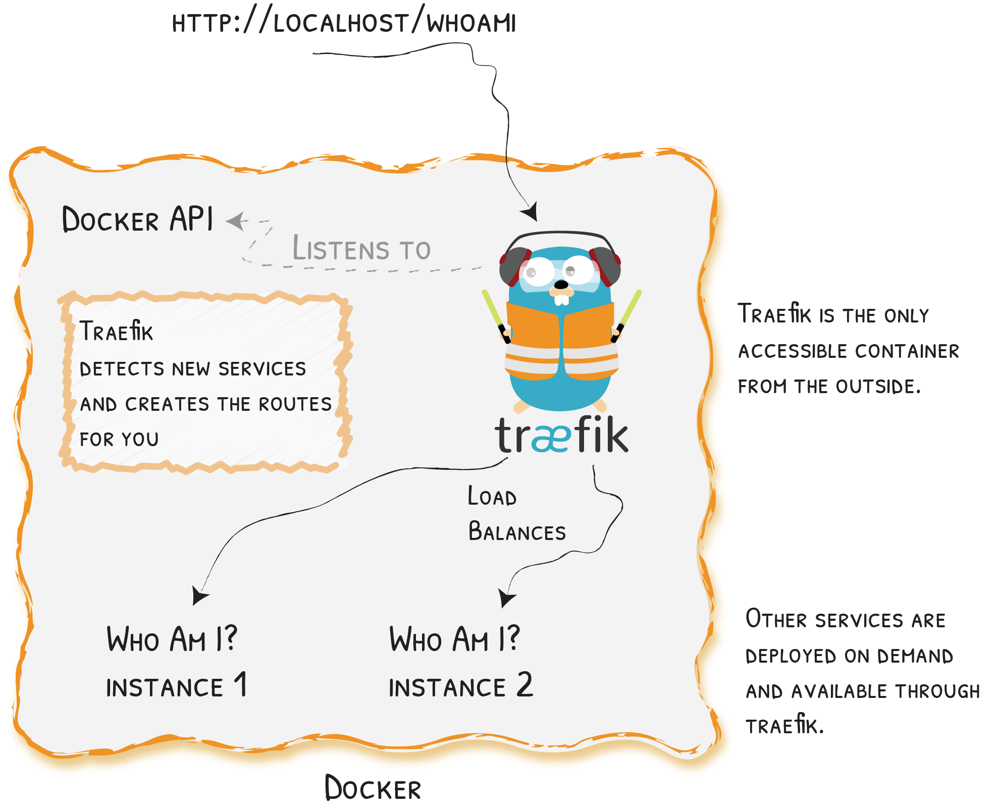

# Quick Start

A Simple Use Case Using Docker
{: .subtitle }



## Launch Traefik With the Docker Provider

Create a `docker-compose.yml` file where you will define a `reverse-proxy` service that uses the official Traefik image:

```yaml
version: '3'

services:
  reverse-proxy:
    # The official v2 Traefik docker image
    image: traefik:v2.3
    # Enables the web UI and tells Traefik to listen to docker
    command: --api.insecure=true --providers.docker
    ports:
      # The HTTP port
      - "80:80"
      # The Web UI (enabled by --api.insecure=true)
      - "8080:8080"
    volumes:
      # So that Traefik can listen to the Docker events
      - /var/run/docker.sock:/var/run/docker.sock
```

**That's it. Now you can launch Traefik!**

Start your `reverse-proxy` with the following command:

```shell
docker-compose up -d reverse-proxy
```

You can open a browser and go to [http://localhost:8080/api/rawdata](http://localhost:8080/api/rawdata) to see Traefik's API rawdata (we'll go back there once we have launched a service in step 2).

## Traefik Detects New Services and Creates the Route for You

Now that we have a Traefik instance up and running, we will deploy new services.

Edit your `docker-compose.yml` file and add the following at the end of your file.

```yaml
# ...
  whoami:
    # A container that exposes an API to show its IP address
    image: traefik/whoami
    labels:
      - "traefik.http.routers.whoami.rule=Host(`whoami.docker.localhost`)"
```

The above defines `whoami`: a simple web service that outputs information about the machine it is deployed on (its IP address, host, and so on).

Start the `whoami` service with the following command:

```shell
docker-compose up -d whoami
```

Go back to your browser ([http://localhost:8080/api/rawdata](http://localhost:8080/api/rawdata)) and see that Traefik has automatically detected the new container and updated its own configuration.

When Traefik detects new services, it creates the corresponding routes so you can call them ... _let's see!_  (Here, we're using curl)

```shell
curl -H Host:whoami.docker.localhost http://127.0.0.1
```

_Shows the following output:_

```yaml
Hostname: a656c8ddca6c
IP: 172.27.0.3
#...
```

## More Instances? Traefik Load Balances Them

Run more instances of your `whoami` service with the following command:

```shell
docker-compose up -d --scale whoami=2
```

Go back to your browser ([http://localhost:8080/api/rawdata](http://localhost:8080/api/rawdata)) and see that Traefik has automatically detected the new instance of the container.

Finally, see that Traefik load-balances between the two instances of your service by running the following command twice:

```shell
curl -H Host:whoami.docker.localhost http://127.0.0.1
```

The output will show alternatively one of the followings:

```yaml
Hostname: a656c8ddca6c
IP: 172.27.0.3
#...
```

```yaml
Hostname: s458f154e1f1
IP: 172.27.0.4
# ...
```

!!! question "Where to Go Next?"
    Now that you have a basic understanding of how Traefik can automatically create the routes to your services and load balance them, it is time to dive into [the documentation](/) and let Traefik work for you!
