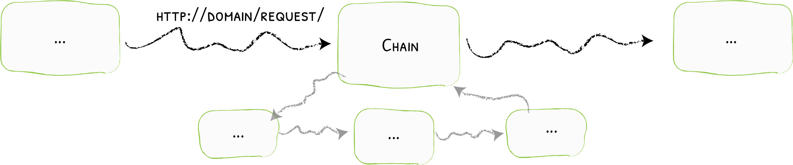

# Chain

When One Isn't Enough
{: .subtitle }



The Chain middleware enables you to define reusable combinations of other pieces of middleware. 
It makes reusing the same groups easier.

## Configuration Example

Example "A Chain for WhiteList, BasicAuth, and HTTPS"

```yaml tab="Docker"
labels:
- "traefik.http.routers.router1.service=service1"
- "traefik.http.routers.router1.middlewares=secured"
- "traefik.http.routers.router1.rule=Host(`mydomain`)"
- "traefik.http.middlewares.secured.chain.middlewares=https-only,known-ips,auth-users"
- "traefik.http.middlewares.auth-users.basicauth.users=test:$apr1$H6uskkkW$IgXLP6ewTrSuBkTrqE8wj/"
- "traefik.http.middlewares.https-only.schemeredirect.scheme=https"
- "traefik.http.middlewares.known-ips.ipwhitelist.sourceRange=192.168.1.7,127.0.0.1/32"
- "http.services.service1.loadbalancer.server.port=80"
```

```yaml tab="Kubernetes"
apiVersion: traefik.containo.us/v1alpha1
kind: IngressRoute
metadata:
  name: test
  namespace: default

spec:
  entryPoints:
    - web

  routes:
    - match: Host(`mydomain`)
      kind: Rule
      services:
        - name: whoami
          port: 80
      middlewares:
        - name: secured
---
apiVersion: traefik.containo.us/v1alpha1
kind: Middleware
metadata:
  name: secured
spec:
  chain:
    middlewares:
    - https-only
    - known-ips
    - auth-users
---
apiVersion: traefik.containo.us/v1alpha1
kind: Middleware
metadata:
  name: auth-users
spec:
  basicAuth:
    users:
    - test:$apr1$H6uskkkW$IgXLP6ewTrSuBkTrqE8wj/
---
apiVersion: traefik.containo.us/v1alpha1
kind: Middleware
metadata:
  name: https-only
spec:
  schemeRedirect:
    scheme: https
---
apiVersion: traefik.containo.us/v1alpha1
kind: Middleware
metadata:
  name: known-ips
spec:
  ipWhiteList:
    sourceRange:
    - 192.168.1.7
    - 127.0.0.1/32
```

```json tab="Marathon"
"labels": {
  "traefik.http.routers.router1.service": "service1",
  "traefik.http.routers.router1.middlewares": "secured",
  "traefik.http.routers.router1.rule": "Host(`mydomain`)",
  "traefik.http.middlewares.secured.chain.middlewares": "https-only,known-ips,auth-users",
  "traefik.http.middlewares.auth-users.basicauth.users": "test:$apr1$H6uskkkW$IgXLP6ewTrSuBkTrqE8wj/",
  "traefik.http.middlewares.https-only.schemeredirect.scheme": "https",
  "traefik.http.middlewares.known-ips.ipwhitelist.sourceRange": "192.168.1.7,127.0.0.1/32",
  "http.services.service1.loadbalancer.server.port": "80"
}
```

```yaml tab="Rancher"
labels:
- "traefik.http.routers.router1.service=service1"
- "traefik.http.routers.router1.middlewares=secured"
- "traefik.http.routers.router1.rule=Host(`mydomain`)"
- "traefik.http.middlewares.secured.chain.middlewares=https-only,known-ips,auth-users"
- "traefik.http.middlewares.auth-users.basicauth.users=test:$apr1$H6uskkkW$IgXLP6ewTrSuBkTrqE8wj/"
- "traefik.http.middlewares.https-only.schemeredirect.scheme=https"
- "traefik.http.middlewares.known-ips.ipwhitelist.sourceRange=192.168.1.7,127.0.0.1/32"
- "http.services.service1.loadbalancer.server.port=80"
```

```toml tab="File"
# ...    
[http.routers]
    [http.routers.router1]
        service = "service1"
        middlewares = ["secured"]
        rule = "Host(`mydomain`)"

[http.middlewares]
    [http.middlewares.secured.Chain]
        middlewares = ["https-only", "known-ips", "auth-users"]

    [http.middlewares.auth-users.BasicAuth]
        users = ["test:$apr1$H6uskkkW$IgXLP6ewTrSuBkTrqE8wj/"]

    [http.middlewares.https-only.SchemeRedirect]
        scheme = "https"

    [http.middlewares.known-ips.ipWhiteList]
        sourceRange = ["192.168.1.7", "127.0.0.1/32"]

[http.services]
  [http.services.service1]
    [http.services.service1.LoadBalancer]
      [[http.services.service1.LoadBalancer.Servers]]
        URL = "http://127.0.0.1:80"
        Weight = 1
```
