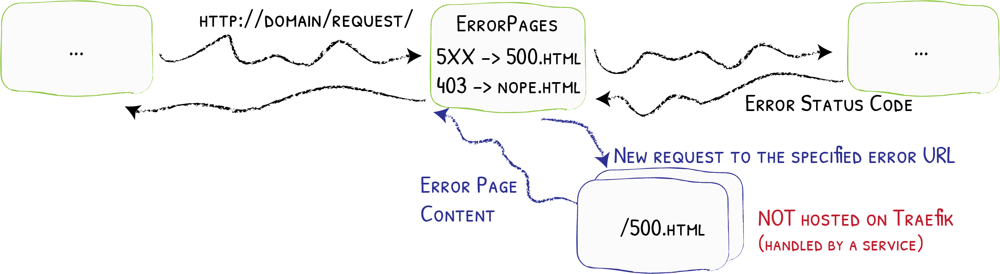

# ErrorPage

It Has Never Been Easier to Say That Something Went Wrong
{: .subtitle }



The ErrorPage middleware returns a custom page in lieu of the default, according to configured ranges of HTTP Status codes.

!!! important
    The error page itself is _not_ hosted by Traefik.

## Configuration Examples

```yaml tab="Docker"
# Dynamic Custom Error Page for 5XX Status Code
labels:
  - "traefik.http.middlewares.test-errorpage.errors.status=500-599"
  - "traefik.http.middlewares.test-errorpage.errors.service=serviceError"
  - "traefik.http.middlewares.test-errorpage.errors.query=/{status}.html"
```

```yaml tab="Kubernetes"
apiVersion: traefik.containo.us/v1alpha1
kind: Middleware
metadata:
  name: test-errorpage
spec:
  errors:
    status:
      - 500-599
    query: /{status}.html
    service:
      name: whoami
      port: 80
```

```yaml tab="Consul Catalog"
# Dynamic Custom Error Page for 5XX Status Code
- "traefik.http.middlewares.test-errorpage.errors.status=500-599"
- "traefik.http.middlewares.test-errorpage.errors.service=serviceError"
- "traefik.http.middlewares.test-errorpage.errors.query=/{status}.html"
```

```json tab="Marathon"
"labels": {
  "traefik.http.middlewares.test-errorpage.errors.status": "500-599",
  "traefik.http.middlewares.test-errorpage.errors.service": "serviceError",
  "traefik.http.middlewares.test-errorpage.errors.query": "/{status}.html"
}
```

```yaml tab="Rancher"
# Dynamic Custom Error Page for 5XX Status Code
labels:
  - "traefik.http.middlewares.test-errorpage.errors.status=500-599"
  - "traefik.http.middlewares.test-errorpage.errors.service=serviceError"
  - "traefik.http.middlewares.test-errorpage.errors.query=/{status}.html"
```

```toml tab="File (TOML)"
# Custom Error Page for 5XX
[http.middlewares]
  [http.middlewares.test-errorpage.errors]
    status = ["500-599"]
    service = "serviceError"
    query = "/{status}.html"

[http.services]
  # ... definition of error-handler-service and my-service
```

```yaml tab="File (YAML)"
# Custom Error Page for 5XX
http:
  middlewares:
    test-errorpage:
      errors:
        status:
          - "500-599"
        service: serviceError
        query: "/{status}.html"

[http.services]
  # ... definition of error-handler-service and my-service
```

!!! note "" 
    In this example, the error page URL is based on the status code (`query=/{status}.html`).

## Configuration Options

### `status`

The `status` that will trigger the error page.

The status code ranges are inclusive (`500-599` will trigger with every code between `500` and `599`, `500` and `599` included).
 
!!! note "" 

    You can define either a status code like `500` or ranges with a syntax like `500-599`.

### `service`

The service that will serve the new requested error page.

!!! note "" 
    In kubernetes, you need to reference a kubernetes service instead of a traefik service.

### `query`

The URL for the error page (hosted by `service`). You can use `{status}` in the query, that will be replaced by the received status code.
