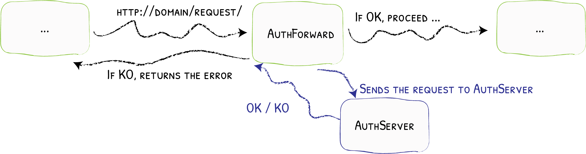

# ForwardAuth

Using an External Service to Check for Credentials
{: .subtitle }



The ForwardAuth middleware delegate the authentication to an external service.
If the service response code is 2XX, access is granted and the original request is performed.
Otherwise, the response from the authentication server is returned.

## Configuration Examples

```yaml tab="Docker"
# Forward authentication to example.com
labels:
  - "traefik.http.middlewares.test-auth.forwardauth.address=https://example.com/auth"
```

```yaml tab="Kubernetes"
# Forward authentication to example.com
apiVersion: traefik.containo.us/v1alpha1
kind: Middleware
metadata:
  name: test-auth
spec:
  forwardAuth:
    address: https://example.com/auth
```

```yaml tab="Consul Catalog"
# Forward authentication to example.com
- "traefik.http.middlewares.test-auth.forwardauth.address=https://example.com/auth"
```

```json tab="Marathon"
"labels": {
  "traefik.http.middlewares.test-auth.forwardauth.address": "https://example.com/auth"
}
```

```yaml tab="Rancher"
# Forward authentication to example.com
labels:
  - "traefik.http.middlewares.test-auth.forwardauth.address=https://example.com/auth"
```

```toml tab="File (TOML)"
# Forward authentication to example.com
[http.middlewares]
  [http.middlewares.test-auth.forwardAuth]
    address = "https://example.com/auth"
```

```yaml tab="File (YAML)"
# Forward authentication to example.com
http:
  middlewares:
    test-auth:
      forwardAuth:
        address: "https://example.com/auth"
```

## Configuration Options

### `address`

The `address` option defines the authentication server address.

```yaml tab="Docker"
labels:
  - "traefik.http.middlewares.test-auth.forwardauth.address=https://example.com/auth"
```

```yaml tab="Kubernetes"
apiVersion: traefik.containo.us/v1alpha1
kind: Middleware
metadata:
  name: test-auth
spec:
  forwardAuth:
    address: https://example.com/auth 
```

```yaml tab="Consul Catalog"
- "traefik.http.middlewares.test-auth.forwardauth.address=https://example.com/auth"
```

```json tab="Marathon"
"labels": {
  "traefik.http.middlewares.test-auth.forwardauth.address": "https://example.com/auth"
}
```

```yaml tab="Rancher"
labels:
  - "traefik.http.middlewares.test-auth.forwardauth.address=https://example.com/auth"
```

```toml tab="File (TOML)"
[http.middlewares]
  [http.middlewares.test-auth.forwardAuth]
    address = "https://example.com/auth"
```

```yaml tab="File (YAML)"
http:
  middlewares:
    test-auth:
      forwardAuth:
        address: "https://example.com/auth"
```

### `trustForwardHeader`

Set the `trustForwardHeader` option to `true` to trust all the existing `X-Forwarded-*` headers.

```yaml tab="Docker"
labels:
  - "traefik.http.middlewares.test-auth.forwardauth.trustForwardHeader=true"
```

```yaml tab="Kubernetes"
apiVersion: traefik.containo.us/v1alpha1
kind: Middleware
metadata:
  name: test-auth
spec:
  forwardAuth:
    address: https://example.com/auth
    trustForwardHeader: true
```

```yaml tab="Consul Catalog"
- "traefik.http.middlewares.test-auth.forwardauth.trustForwardHeader=true"
```

```json tab="Marathon"
"labels": {
  "traefik.http.middlewares.test-auth.forwardauth.trustForwardHeader": "true"
}
```

```yaml tab="Rancher"
labels:
  - "traefik.http.middlewares.test-auth.forwardauth.trustForwardHeader=true"
```

```toml tab="File (TOML)"
[http.middlewares]
  [http.middlewares.test-auth.forwardAuth]
    address = "https://example.com/auth"
    trustForwardHeader = true
```

```yaml tab="File (YAML)"
http:
  middlewares:
    test-auth:
      forwardAuth:
        address: "https://example.com/auth"
        trustForwardHeader: true
```

### `authResponseHeaders`

The `authResponseHeaders` option is the list of the headers to copy from the authentication server to the request.

```yaml tab="Docker"
labels:
  - "traefik.http.middlewares.test-auth.forwardauth.authResponseHeaders=X-Auth-User, X-Secret"
```

```yaml tab="Kubernetes"
apiVersion: traefik.containo.us/v1alpha1
kind: Middleware
metadata:
  name: test-auth
spec:
  forwardAuth:
    address: https://example.com/auth
    authResponseHeaders:
      - X-Auth-User
      - X-Secret
```

```yaml tab="Consul Catalog"
- "traefik.http.middlewares.test-auth.forwardauth.authResponseHeaders=X-Auth-User, X-Secret"
```

```json tab="Marathon"
"labels": {
  "traefik.http.middlewares.test-auth.forwardauth.authResponseHeaders": "X-Auth-User,X-Secret"
}
```

```yaml tab="Rancher"
labels:
  - "traefik.http.middlewares.test-auth.forwardauth.authResponseHeaders=X-Auth-User, X-Secret"
```

```toml tab="File (TOML)"
[http.middlewares]
  [http.middlewares.test-auth.forwardAuth]
    address = "https://example.com/auth"
    authResponseHeaders = ["X-Auth-User", "X-Secret"]
```

```yaml tab="File (YAML)"
http:
  middlewares:
    test-auth:
      forwardAuth:
        address: "https://example.com/auth"
        authResponseHeaders:
          - "X-Auth-User"
          - "X-Secret"
```

### `tls`

The `tls` option is the TLS configuration from Traefik to the authentication server.

#### `tls.ca`

Certificate Authority used for the secured connection to the authentication server.

```yaml tab="Docker"
labels:
  - "traefik.http.middlewares.test-auth.forwardauth.tls.ca=path/to/local.crt"
```

```yaml tab="Kubernetes"
apiVersion: traefik.containo.us/v1alpha1
kind: Middleware
metadata:
  name: test-auth
spec:
  forwardAuth:
    address: https://example.com/auth
    tls:
      caSecret: mycasercret

---
apiVersion: v1
kind: Secret
metadata:
  name: mycasercret
  namespace: default

data:
  ca: LS0tLS1CRUdJTiBDRVJUSUZJQ0FURS0tLS0tCi0tLS0tRU5EIENFUlRJRklDQVRFLS0tLS0=
```

```yaml tab="Consul Catalog"
- "traefik.http.middlewares.test-auth.forwardauth.tls.ca=path/to/local.crt"
```

```json tab="Marathon"
"labels": {
  "traefik.http.middlewares.test-auth.forwardauth.tls.ca": "path/to/local.crt"
}
```

```yaml tab="Rancher"
labels:
  - "traefik.http.middlewares.test-auth.forwardauth.tls.ca=path/to/local.crt"
```

```toml tab="File (TOML)"
[http.middlewares]
  [http.middlewares.test-auth.forwardAuth]
    address = "https://example.com/auth"
    [http.middlewares.test-auth.forwardAuth.tls]
      ca = "path/to/local.crt"
```

```yaml tab="File (YAML)"
http:
  middlewares:
    test-auth:
      forwardAuth:
        address: "https://example.com/auth"
        tls:
          ca: "path/to/local.crt"
```

#### `tls.caOptional`

Policy used for the secured connection with TLS Client Authentication to the authentication server.
Requires `tls.ca` to be defined.

- `true`: VerifyClientCertIfGiven
- `false`: RequireAndVerifyClientCert
- if `tls.ca` is undefined NoClientCert

```yaml tab="Docker"
labels:
  - "traefik.http.middlewares.test-auth.forwardauth.tls.caOptional=true"
```

```yaml tab="Kubernetes"
apiVersion: traefik.containo.us/v1alpha1
kind: Middleware
metadata:
  name: test-auth
spec:
  forwardAuth:
    address: https://example.com/auth
    tls:
      caOptional: true
```

```yaml tab="Consul Catalog"
- "traefik.http.middlewares.test-auth.forwardauth.tls.caOptional=true"
```

```json tab="Marathon"
"labels": {
  "traefik.http.middlewares.test-auth.forwardauth.tls.caOptional": "true"
}
```

```yaml tab="Rancher"
labels:
  - "traefik.http.middlewares.test-auth.forwardauth.tls.caOptional=true"
```

```toml tab="File (TOML)"
[http.middlewares]
  [http.middlewares.test-auth.forwardAuth]
    address = "https://example.com/auth"
    [http.middlewares.test-auth.forwardAuth.tls]
      caOptional = true
```

```yaml tab="File (YAML)"
http:
  middlewares:
    test-auth:
      forwardAuth:
        address: "https://example.com/auth"
        tls:
          caOptional: true
```

#### `tls.cert`

Public certificate used for the secured connection to the authentication server.

```yaml tab="Docker"
labels:
  - "traefik.http.middlewares.test-auth.forwardauth.tls.cert=path/to/foo.cert"
  - "traefik.http.middlewares.test-auth.forwardauth.tls.key=path/to/foo.key"
```

```yaml tab="Kubernetes"
apiVersion: traefik.containo.us/v1alpha1
kind: Middleware
metadata:
  name: test-auth
spec:
  forwardAuth:
    address: https://example.com/auth
    tls:
      certSecret: mytlscert

---
apiVersion: v1
kind: Secret
metadata:
  name: mytlscert
  namespace: default

data:
  tls.crt: LS0tLS1CRUdJTiBDRVJUSUZJQ0FURS0tLS0tCi0tLS0tRU5EIENFUlRJRklDQVRFLS0tLS0=
  tls.key: LS0tLS1CRUdJTiBQUklWQVRFIEtFWS0tLS0tCi0tLS0tRU5EIFBSSVZBVEUgS0VZLS0tLS0=
```

```yaml tab="Consul Catalog"
- "traefik.http.middlewares.test-auth.forwardauth.tls.cert=path/to/foo.cert"
- "traefik.http.middlewares.test-auth.forwardauth.tls.key=path/to/foo.key"
```

```json tab="Marathon"
"labels": {
  "traefik.http.middlewares.test-auth.forwardauth.tls.cert": "path/to/foo.cert",
  "traefik.http.middlewares.test-auth.forwardauth.tls.key": "path/to/foo.key"
}
```

```yaml tab="Rancher"
labels:
  - "traefik.http.middlewares.test-auth.forwardauth.tls.cert=path/to/foo.cert"
  - "traefik.http.middlewares.test-auth.forwardauth.tls.key=path/to/foo.key"
```

```toml tab="File (TOML)"
[http.middlewares]
  [http.middlewares.test-auth.forwardAuth]
    address = "https://example.com/auth"
    [http.middlewares.test-auth.forwardAuth.tls]
      cert = "path/to/foo.cert"
      key = "path/to/foo.key"
```

```yaml tab="File (YAML)"
http:
  middlewares:
    test-auth:
      forwardAuth:
        address: "https://example.com/auth"
        tls:
          cert: "path/to/foo.cert"
          key: "path/to/foo.key"
```

!!! info
    For security reasons, the field doesn't exist for Kubernetes IngressRoute, and one should use the `secret` field instead.

#### `tls.key`

Private certificate used for the secure connection to the authentication server.

```yaml tab="Docker"
labels:
  - "traefik.http.middlewares.test-auth.forwardauth.tls.cert=path/to/foo.cert"
  - "traefik.http.middlewares.test-auth.forwardauth.tls.key=path/to/foo.key"
```

```yaml tab="Kubernetes"
apiVersion: traefik.containo.us/v1alpha1
kind: Middleware
metadata:
  name: test-auth
spec:
  forwardAuth:
    address: https://example.com/auth
    tls:
      certSecret: mytlscert

---
apiVersion: v1
kind: Secret
metadata:
  name: mytlscert
  namespace: default

data:
  tls.crt: LS0tLS1CRUdJTiBDRVJUSUZJQ0FURS0tLS0tCi0tLS0tRU5EIENFUlRJRklDQVRFLS0tLS0=
  tls.key: LS0tLS1CRUdJTiBQUklWQVRFIEtFWS0tLS0tCi0tLS0tRU5EIFBSSVZBVEUgS0VZLS0tLS0=
```

```yaml tab="Consul Catalog"
- "traefik.http.middlewares.test-auth.forwardauth.tls.cert=path/to/foo.cert"
- "traefik.http.middlewares.test-auth.forwardauth.tls.key=path/to/foo.key"
```

```json tab="Marathon"
"labels": {
  "traefik.http.middlewares.test-auth.forwardauth.tls.cert": "path/to/foo.cert",
  "traefik.http.middlewares.test-auth.forwardauth.tls.key": "path/to/foo.key"
}
```

```yaml tab="Rancher"
labels:
  - "traefik.http.middlewares.test-auth.forwardauth.tls.cert=path/to/foo.cert"
  - "traefik.http.middlewares.test-auth.forwardauth.tls.key=path/to/foo.key"
```

```toml tab="File (TOML)"
[http.middlewares]
  [http.middlewares.test-auth.forwardAuth]
    address = "https://example.com/auth"
    [http.middlewares.test-auth.forwardAuth.tls]
      cert = "path/to/foo.cert"
      key = "path/to/foo.key"
```

```yaml tab="File (YAML)"
http:
  middlewares:
    test-auth:
      forwardAuth:
        address: "https://example.com/auth"
        tls:
          cert: "path/to/foo.cert"
          key: "path/to/foo.key"
```

!!! info
    For security reasons, the field doesn't exist for Kubernetes IngressRoute, and one should use the `secret` field instead.

#### `tls.insecureSkipVerify`

If `insecureSkipVerify` is `true`, TLS for the connection to authentication server accepts any certificate presented by the server and any host name in that certificate.

```yaml tab="Docker"
labels:
  - "traefik.http.middlewares.test-auth.forwardauth.tls.insecureSkipVerify=true"
```

```yaml tab="Kubernetes"
apiVersion: traefik.containo.us/v1alpha1
kind: Middleware
metadata:
  name: test-auth
spec:
  forwardAuth:
    address: https://example.com/auth
    tls:
      insecureSkipVerify: true
```

```yaml tab="Consul Catalog"
- "traefik.http.middlewares.test-auth.forwardauth.tls.InsecureSkipVerify=true"
```

```json tab="Marathon"
"labels": {
  "traefik.http.middlewares.test-auth.forwardauth.tls.insecureSkipVerify": "true"
}
```

```yaml tab="Rancher"
labels:
  - "traefik.http.middlewares.test-auth.forwardauth.tls.InsecureSkipVerify=true"
```

```toml tab="File (TOML)"
[http.middlewares]
  [http.middlewares.test-auth.forwardAuth]
    address = "https://example.com/auth"
    [http.middlewares.test-auth.forwardAuth.tls]
      insecureSkipVerify: true
```

```yaml tab="File (YAML)"
http:
  middlewares:
    test-auth:
      forwardAuth:
        address: "https://example.com/auth"
        tls:
          insecureSkipVerify: true
```
