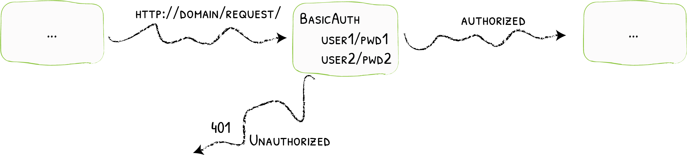

# BasicAuth

Adding Basic Authentication
{: .subtitle }



The BasicAuth middleware grants access to services to authorized users only.

## Configuration Examples

```yaml tab="Docker & Swarm"
# Declaring the user list
#
# Note: when used in docker-compose.yml all dollar signs in the hash need to be doubled for escaping.
# To create user:password pair, it's possible to use this command:
# echo $(htpasswd -nB user) | sed -e s/\\$/\\$\\$/g
#
# Also note that dollar signs should NOT be doubled when they are not being evaluated (e.g. Ansible docker_container module).
labels:
  - "traefik.http.middlewares.test-auth.basicauth.users=test:$$apr1$$H6uskkkW$$IgXLP6ewTrSuBkTrqE8wj/,test2:$$apr1$$d9hr9HBB$$4HxwgUir3HP4EsggP/QNo0"
```

```yaml tab="Kubernetes"
# Declaring the user list
apiVersion: traefik.io/v1alpha1
kind: Middleware
metadata:
  name: test-auth
spec:
  basicAuth:
    secret: secretName
```

```yaml tab="Consul Catalog"
- "traefik.http.middlewares.test-auth.basicauth.users=test:$apr1$H6uskkkW$IgXLP6ewTrSuBkTrqE8wj/,test2:$apr1$d9hr9HBB$4HxwgUir3HP4EsggP/QNo0"
```

```yaml tab="File (YAML)"
# Declaring the user list
http:
  middlewares:
    test-auth:
      basicAuth:
        users:
          - "test:$apr1$H6uskkkW$IgXLP6ewTrSuBkTrqE8wj/"
          - "test2:$apr1$d9hr9HBB$4HxwgUir3HP4EsggP/QNo0"
```

```toml tab="File (TOML)"
# Declaring the user list
[http.middlewares]
  [http.middlewares.test-auth.basicAuth]
  users = [
    "test:$apr1$H6uskkkW$IgXLP6ewTrSuBkTrqE8wj/",
    "test2:$apr1$d9hr9HBB$4HxwgUir3HP4EsggP/QNo0",
  ]
```

## Configuration Options

### General

Passwords must be hashed using MD5, SHA1, or BCrypt.

!!! tip

    Use `htpasswd` to generate the passwords.

### `users`

The `users` option is an array of authorized users. Each user must be declared using the `name:hashed-password` format.

!!! note ""

    - If both `users` and `usersFile` are provided, the two are merged. The contents of `usersFile` have precedence over the values in `users`.
    - For security reasons, the field `users` doesn't exist for Kubernetes IngressRoute, and one should use the `secret` field instead.

!!! note "Kubernetes kubernetes.io/basic-auth secret type"
    
    Kubernetes supports a special `kubernetes.io/basic-auth` secret type.
    This secret must contain two keys: `username` and `password`.
    Please note that these keys are not hashed or encrypted in any way, and therefore is less secure than other methods.
    You can find more information on the [Kubernetes Basic Authentication Secret Documentation](https://kubernetes.io/docs/concepts/configuration/secret/#basic-authentication-secret)

```yaml tab="Docker & Swarm"
# Declaring the user list
#
# Note: when used in docker-compose.yml all dollar signs in the hash need to be doubled for escaping.
# To create a user:password pair, the following command can be used:
# echo $(htpasswd -nb user password) | sed -e s/\\$/\\$\\$/g
#
# Also note that dollar signs should NOT be doubled when they not evaluated (e.g. Ansible docker_container module).
labels:
  - "traefik.http.middlewares.test-auth.basicauth.users=test:$$apr1$$H6uskkkW$$IgXLP6ewTrSuBkTrqE8wj/,test2:$$apr1$$d9hr9HBB$$4HxwgUir3HP4EsggP/QNo0"
```

```yaml tab="Kubernetes"
# Declaring the user list
apiVersion: traefik.io/v1alpha1
kind: Middleware
metadata:
  name: test-auth
spec:
  basicAuth:
    secret: authsecret

---
# Note: in a kubernetes secret the string (e.g. generated by htpasswd) must be base64-encoded first.
# To create an encoded user:password pair, the following command can be used:
# htpasswd -nb user password | openssl base64

apiVersion: v1
kind: Secret
metadata:
  name: authsecret
  namespace: default
data:
  users: |2
    dGVzdDokYXByMSRINnVza2trVyRJZ1hMUDZld1RyU3VCa1RycUU4d2ovCnRlc3QyOiRhcHIxJGQ5
    aHI5SEJCJDRIeHdnVWlyM0hQNEVzZ2dQL1FObzAK

---
# This is an alternate auth secret that demonstrates the basic-auth secret type.
# Note: the password is not hashed, and is merely base64 encoded.

apiVersion: v1
kind: Secret
metadata:
  name: authsecret2
  namespace: default
type: kubernetes.io/basic-auth
data:
  username: dXNlcg== # username: user
  password: cGFzc3dvcmQ= # password: password
```

```yaml tab="Consul Catalog"
# Declaring the user list
- "traefik.http.middlewares.test-auth.basicauth.users=test:$apr1$H6uskkkW$IgXLP6ewTrSuBkTrqE8wj/,test2:$apr1$d9hr9HBB$4HxwgUir3HP4EsggP/QNo0"
```

```yaml tab="File (YAML)"
# Declaring the user list
http:
  middlewares:
    test-auth:
      basicAuth:
        users:
          - "test:$apr1$H6uskkkW$IgXLP6ewTrSuBkTrqE8wj/"
          - "test2:$apr1$d9hr9HBB$4HxwgUir3HP4EsggP/QNo0"
```

```toml tab="File (TOML)"
# Declaring the user list
[http.middlewares]
  [http.middlewares.test-auth.basicAuth]
    users = [
      "test:$apr1$H6uskkkW$IgXLP6ewTrSuBkTrqE8wj/",
      "test2:$apr1$d9hr9HBB$4HxwgUir3HP4EsggP/QNo0",
    ]
```

### `usersFile`

The `usersFile` option is the path to an external file that contains the authorized users for the middleware.

The file content is a list of `name:hashed-password`.

!!! note ""

    - If both `users` and `usersFile` are provided, the two are merged. The contents of `usersFile` have precedence over the values in `users`.
    - Because it does not make much sense to refer to a file path on Kubernetes, the `usersFile` field doesn't exist for Kubernetes IngressRoute, and one should use the `secret` field instead.

```yaml tab="Docker & Swarm"
labels:
  - "traefik.http.middlewares.test-auth.basicauth.usersfile=/path/to/my/usersfile"
```

```yaml tab="Kubernetes"
apiVersion: traefik.io/v1alpha1
kind: Middleware
metadata:
  name: test-auth
spec:
  basicAuth:
    secret: authsecret

---
apiVersion: v1
kind: Secret
metadata:
  name: authsecret
  namespace: default

data:
  users: |2
    dGVzdDokYXByMSRINnVza2trVyRJZ1hMUDZld1RyU3VCa1RycUU4d2ovCnRlc3QyOiRhcHIxJGQ5
    aHI5SEJCJDRIeHdnVWlyM0hQNEVzZ2dQL1FObzAK
```

```yaml tab="Consul Catalog"
- "traefik.http.middlewares.test-auth.basicauth.usersfile=/path/to/my/usersfile"
```

```yaml tab="File (YAML)"
http:
  middlewares:
    test-auth:
      basicAuth:
        usersFile: "/path/to/my/usersfile"
```

```toml tab="File (TOML)"
[http.middlewares]
  [http.middlewares.test-auth.basicAuth]
    usersFile = "/path/to/my/usersfile"
```

??? example "A file containing test/test and test2/test2"

    ```txt
    test:$apr1$H6uskkkW$IgXLP6ewTrSuBkTrqE8wj/
    test2:$apr1$d9hr9HBB$4HxwgUir3HP4EsggP/QNo0
    ```

### `realm`

You can customize the realm for the authentication with the `realm` option. The default value is `traefik`.

```yaml tab="Docker & Swarm"
labels:
  - "traefik.http.middlewares.test-auth.basicauth.realm=MyRealm"
```

```yaml tab="Kubernetes"
apiVersion: traefik.io/v1alpha1
kind: Middleware
metadata:
  name: test-auth
spec:
  basicAuth:
    realm: MyRealm
```

```json tab="Consul Catalog"
- "traefik.http.middlewares.test-auth.basicauth.realm=MyRealm"
```

```yaml tab="File (YAML)"
http:
  middlewares:
    test-auth:
      basicAuth:
        realm: "MyRealm"
```

```toml tab="File (TOML)"
[http.middlewares]
  [http.middlewares.test-auth.basicAuth]
    realm = "MyRealm"
```

### `headerField`

You can define a header field to store the authenticated user using the `headerField`option.

```yaml tab="Docker & Swarm"
labels:
  - "traefik.http.middlewares.my-auth.basicauth.headerField=X-WebAuth-User"
```

```yaml tab="Kubernetes"
apiVersion: traefik.io/v1alpha1
kind: Middleware
metadata:
  name: my-auth
spec:
  basicAuth:
    # ...
    headerField: X-WebAuth-User
```

```json tab="Consul Catalog"
- "traefik.http.middlewares.my-auth.basicauth.headerField=X-WebAuth-User"
```

```yaml tab="File (YAML)"
http:
  middlewares:
    my-auth:
      basicAuth:
        # ...
        headerField: "X-WebAuth-User"
```

```toml tab="File (TOML)"
[http.middlewares.my-auth.basicAuth]
  # ...
  headerField = "X-WebAuth-User"
```

### `removeHeader`

Set the `removeHeader` option to `true` to remove the authorization header before forwarding the request to your service. (Default value is `false`.)

```yaml tab="Docker & Swarm"
labels:
  - "traefik.http.middlewares.test-auth.basicauth.removeheader=true"
```

```yaml tab="Kubernetes"
apiVersion: traefik.io/v1alpha1
kind: Middleware
metadata:
  name: test-auth
spec:
  basicAuth:
    removeHeader: true
```

```json tab="Consul Catalog"
- "traefik.http.middlewares.test-auth.basicauth.removeheader=true"
```

```yaml tab="File (YAML)"
http:
  middlewares:
    test-auth:
      basicAuth:
        removeHeader: true
```

```toml tab="File (TOML)"
[http.middlewares]
  [http.middlewares.test-auth.basicAuth]
    removeHeader = true
```

{!traefik-for-business-applications.md!}
