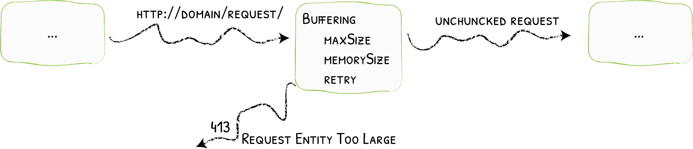

# Buffering

How to Read the Request before Forwarding It
{: .subtitle }



The Buffering middleware limits the size of requests that can be forwarded to services.

With Buffering, Traefik reads the entire request into memory (possibly buffering large requests into disk), and rejects requests that are over a specified size limit.

This can help services avoid large amounts of data (`multipart/form-data` for example), and can minimize the time spent sending data to a service.

## Configuration Examples

```yaml tab="Docker & Swarm"
# Sets the maximum request body to 2MB
labels:
  - "traefik.http.middlewares.limit.buffering.maxRequestBodyBytes=2000000"
```

```yaml tab="Kubernetes"
# Sets the maximum request body to 2MB
apiVersion: traefik.io/v1alpha1
kind: Middleware
metadata:
  name: limit
spec:
  buffering:
    maxRequestBodyBytes: 2000000
```

```yaml tab="Consul Catalog"
# Sets the maximum request body to 2MB
- "traefik.http.middlewares.limit.buffering.maxRequestBodyBytes=2000000"
```

```yaml tab="File (YAML)"
# Sets the maximum request body to 2MB
http:
  middlewares:
    limit:
      buffering:
        maxRequestBodyBytes: 2000000
```

```toml tab="File (TOML)"
# Sets the maximum request body to 2MB
[http.middlewares]
  [http.middlewares.limit.buffering]
    maxRequestBodyBytes = 2000000
```

## Configuration Options

### `maxRequestBodyBytes`

_Optional, Default=0_

The `maxRequestBodyBytes` option configures the maximum allowed body size for the request (in bytes).

If the request exceeds the allowed size, it is not forwarded to the service, and the client gets a `413` (Request Entity Too Large) response.

```yaml tab="Docker & Swarm"
labels:
  - "traefik.http.middlewares.limit.buffering.maxRequestBodyBytes=2000000"
```

```yaml tab="Kubernetes"
apiVersion: traefik.io/v1alpha1
kind: Middleware
metadata:
  name: limit
spec:
  buffering:
    maxRequestBodyBytes: 2000000
```

```yaml tab="Consul Catalog"
- "traefik.http.middlewares.limit.buffering.maxRequestBodyBytes=2000000"
```

```yaml tab="File (YAML)"
http:
  middlewares:
    limit:
      buffering:
        maxRequestBodyBytes: 2000000
```

```toml tab="File (TOML)"
[http.middlewares]
  [http.middlewares.limit.buffering]
    maxRequestBodyBytes = 2000000
```

### `memRequestBodyBytes`

_Optional, Default=1048576_

You can configure a threshold (in bytes) from which the request will be buffered on disk instead of in memory with the `memRequestBodyBytes` option.

```yaml tab="Docker & Swarm"
labels:
  - "traefik.http.middlewares.limit.buffering.memRequestBodyBytes=2000000"
```

```yaml tab="Kubernetes"
apiVersion: traefik.io/v1alpha1
kind: Middleware
metadata:
  name: limit
spec:
  buffering:
    memRequestBodyBytes: 2000000
```

```yaml tab="Consul Catalog"
- "traefik.http.middlewares.limit.buffering.memRequestBodyBytes=2000000"
```

```yaml tab="File (YAML)"
http:
  middlewares:
    limit:
      buffering:
        memRequestBodyBytes: 2000000
```

```toml tab="File (TOML)"
[http.middlewares]
  [http.middlewares.limit.buffering]
    memRequestBodyBytes = 2000000
```

### `maxResponseBodyBytes`

_Optional, Default=0_

The `maxResponseBodyBytes` option configures the maximum allowed response size from the service (in bytes).

If the response exceeds the allowed size, it is not forwarded to the client. The client gets a `500` (Internal Server Error) response instead.

```yaml tab="Docker & Swarm"
labels:
  - "traefik.http.middlewares.limit.buffering.maxResponseBodyBytes=2000000"
```

```yaml tab="Kubernetes"
apiVersion: traefik.io/v1alpha1
kind: Middleware
metadata:
  name: limit
spec:
  buffering:
    maxResponseBodyBytes: 2000000
```

```yaml tab="Consul Catalog"
- "traefik.http.middlewares.limit.buffering.maxResponseBodyBytes=2000000"
```

```yaml tab="File (YAML)"
http:
  middlewares:
    limit:
      buffering:
        maxResponseBodyBytes: 2000000
```

```toml tab="File (TOML)"
[http.middlewares]
  [http.middlewares.limit.buffering]
    maxResponseBodyBytes = 2000000
```

### `memResponseBodyBytes`

_Optional, Default=1048576_

You can configure a threshold (in bytes) from which the response will be buffered on disk instead of in memory with the `memResponseBodyBytes` option.

```yaml tab="Docker & Swarm"
labels:
  - "traefik.http.middlewares.limit.buffering.memResponseBodyBytes=2000000"
```

```yaml tab="Kubernetes"
apiVersion: traefik.io/v1alpha1
kind: Middleware
metadata:
  name: limit
spec:
  buffering:
    memResponseBodyBytes: 2000000
```

```yaml tab="Consul Catalog"
- "traefik.http.middlewares.limit.buffering.memResponseBodyBytes=2000000"
```

```yaml tab="File (YAML)"
http:
  middlewares:
    limit:
      buffering:
        memResponseBodyBytes: 2000000
```

```toml tab="File (TOML)"
[http.middlewares]
  [http.middlewares.limit.buffering]
    memResponseBodyBytes = 2000000
```

### `retryExpression`

_Optional, Default=""_

You can have the Buffering middleware replay the request using `retryExpression`.

??? example "Retries once in the case of a network error"

    ```yaml tab="Docker & Swarm"
    labels:
      - "traefik.http.middlewares.limit.buffering.retryExpression=IsNetworkError() && Attempts() < 2"
    ```

    ```yaml tab="Kubernetes"
    apiVersion: traefik.io/v1alpha1
    kind: Middleware
    metadata:
      name: limit
    spec:
      buffering:
        retryExpression: "IsNetworkError() && Attempts() < 2"
    ```

    ```yaml tab="Consul Catalog"
    - "traefik.http.middlewares.limit.buffering.retryExpression=IsNetworkError() && Attempts() < 2"
    ```

    ```yaml tab="File (YAML)"
    http:
      middlewares:
        limit:
          buffering:
            retryExpression: "IsNetworkError() && Attempts() < 2"
    ```

    ```toml tab="File (TOML)"
    [http.middlewares]
      [http.middlewares.limit.buffering]
        retryExpression = "IsNetworkError() && Attempts() < 2"
    ```

The retry expression is defined as a logical combination of the functions below with the operators AND (`&&`) and OR (`||`). At least one function is required:

- `Attempts()` number of attempts (the first one counts)
- `ResponseCode()` response code of the service
- `IsNetworkError()` whether the response code is related to networking error

### Content-Length

See [Best Practices: Content‑Length](../../security/content-length.md)
