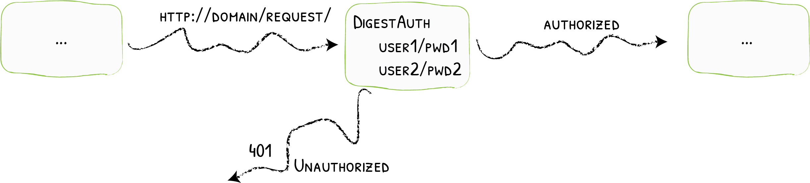

# DigestAuth

Adding Digest Authentication
{: .subtitle }



The DigestAuth middleware restricts access to your services to known users.

## Configuration Examples

```yaml tab="Docker"
# Declaring the user list
labels:
  - "traefik.http.middlewares.test-auth.digestauth.users=test:traefik:a2688e031edb4be6a3797f3882655c05,test2:traefik:518845800f9e2bfb1f1f740ec24f074e"
```

```yaml tab="Kubernetes"
# Declaring the user list
apiVersion: traefik.io/v1alpha1
kind: Middleware
metadata:
  name: test-auth
spec:
  digestAuth:
    secret: userssecret
```

```yaml tab="Consul Catalog"
# Declaring the user list
- "traefik.http.middlewares.test-auth.digestauth.users=test:traefik:a2688e031edb4be6a3797f3882655c05,test2:traefik:518845800f9e2bfb1f1f740ec24f074e"
```

```json tab="Marathon"
"labels": {
  "traefik.http.middlewares.test-auth.digestauth.users": "test:traefik:a2688e031edb4be6a3797f3882655c05,test2:traefik:518845800f9e2bfb1f1f740ec24f074e"
}
```

```yaml tab="Rancher"
# Declaring the user list
labels:
  - "traefik.http.middlewares.test-auth.digestauth.users=test:traefik:a2688e031edb4be6a3797f3882655c05,test2:traefik:518845800f9e2bfb1f1f740ec24f074e"
```

```yaml tab="File (YAML)"
# Declaring the user list
http:
  middlewares:
    test-auth:
      digestAuth:
        users:
          - "test:traefik:a2688e031edb4be6a3797f3882655c05"
          - "test2:traefik:518845800f9e2bfb1f1f740ec24f074e"
```

```toml tab="File (TOML)"
# Declaring the user list
[http.middlewares]
  [http.middlewares.test-auth.digestAuth]
    users = [
      "test:traefik:a2688e031edb4be6a3797f3882655c05",
      "test2:traefik:518845800f9e2bfb1f1f740ec24f074e",
    ]
```

## Configuration Options

!!! tip

    Use `htdigest` to generate passwords.

### `users`

The `users` option is an array of authorized users. Each user will be declared using the `name:realm:encoded-password` format.

!!! note ""

    - If both `users` and `usersFile` are provided, the two are merged. The contents of `usersFile` have precedence over the values in `users`.
    - For security reasons, the field `users` doesn't exist for Kubernetes IngressRoute, and one should use the `secret` field instead.

```yaml tab="Docker"
labels:
  - "traefik.http.middlewares.test-auth.digestauth.users=test:traefik:a2688e031edb4be6a3797f3882655c05,test2:traefik:518845800f9e2bfb1f1f740ec24f074e"
```

```yaml tab="Kubernetes"
apiVersion: traefik.io/v1alpha1
kind: Middleware
metadata:
  name: test-auth
spec:
  digestAuth:
    secret: authsecret

---
apiVersion: v1
kind: Secret
metadata:
  name: authsecret
  namespace: default

data:
  users: |2
    dGVzdDp0cmFlZmlrOmEyNjg4ZTAzMWVkYjRiZTZhMzc5N2YzODgyNjU1YzA1CnRlc3QyOnRyYWVmaWs6NTE4ODQ1ODAwZjllMmJmYjFmMWY3NDBlYzI0ZjA3NGUKCg==
```

```yaml tab="Consul Catalog"
- "traefik.http.middlewares.test-auth.digestauth.users=test:traefik:a2688e031edb4be6a3797f3882655c05,test2:traefik:518845800f9e2bfb1f1f740ec24f074e"
```

```json tab="Marathon"
"labels": {
  "traefik.http.middlewares.test-auth.digestauth.users": "test:traefik:a2688e031edb4be6a3797f3882655c05,test2:traefik:518845800f9e2bfb1f1f740ec24f074e"
}
```

```yaml tab="Rancher"
labels:
  - "traefik.http.middlewares.test-auth.digestauth.users=test:traefik:a2688e031edb4be6a3797f3882655c05,test2:traefik:518845800f9e2bfb1f1f740ec24f074e"
```

```yaml tab="File (YAML)"
http:
  middlewares:
    test-auth:
      digestAuth:
        users:
          - "test:traefik:a2688e031edb4be6a3797f3882655c05"
          - "test2:traefik:518845800f9e2bfb1f1f740ec24f074e"
```

```toml tab="File (TOML)"
[http.middlewares]
  [http.middlewares.test-auth.digestAuth]
    users = [
      "test:traefik:a2688e031edb4be6a3797f3882655c05",
      "test2:traefik:518845800f9e2bfb1f1f740ec24f074e",
    ]
```

### `usersFile`

The `usersFile` option is the path to an external file that contains the authorized users for the middleware.

The file content is a list of `name:realm:encoded-password`.

!!! note ""

    - If both `users` and `usersFile` are provided, the two are merged. The contents of `usersFile` have precedence over the values in `users`.
    - Because it does not make much sense to refer to a file path on Kubernetes, the `usersFile` field doesn't exist for Kubernetes IngressRoute, and one should use the `secret` field instead.

```yaml tab="Docker"
labels:
  - "traefik.http.middlewares.test-auth.digestauth.usersfile=/path/to/my/usersfile"
```

```yaml tab="Kubernetes"
apiVersion: traefik.io/v1alpha1
kind: Middleware
metadata:
  name: test-auth
spec:
  digestAuth:
    secret: authsecret

---
apiVersion: v1
kind: Secret
metadata:
  name: authsecret
  namespace: default

data:
  users: |2
    dGVzdDokYXByMSRINnVza2trVyRJZ1hMUDZld1RyU3VCa1RycUU4d2ovCnRlc3QyOiRhcHIxJGQ5
    aHI5SEJCJDRIeHdnVWlyM0hQNEVzZ2dQL1FObzAK
```

```yaml tab="Consul Catalog"
- "traefik.http.middlewares.test-auth.digestauth.usersfile=/path/to/my/usersfile"
```

```json tab="Marathon"
"labels": {
  "traefik.http.middlewares.test-auth.digestauth.usersfile": "/path/to/my/usersfile"
}
```

```yaml tab="Rancher"
labels:
  - "traefik.http.middlewares.test-auth.digestauth.usersfile=/path/to/my/usersfile"
```

```yaml tab="File (YAML)"
http:
  middlewares:
    test-auth:
      digestAuth:
        usersFile: "/path/to/my/usersfile"
```

```toml tab="File (TOML)"
[http.middlewares]
  [http.middlewares.test-auth.digestAuth]
    usersFile = "/path/to/my/usersfile"
```

??? example "A file containing test/test and test2/test2"

    ```txt
    test:traefik:a2688e031edb4be6a3797f3882655c05
    test2:traefik:518845800f9e2bfb1f1f740ec24f074e
    ```

### `realm`

You can customize the realm for the authentication with the `realm` option. The default value is `traefik`.

```yaml tab="Docker"
labels:
  - "traefik.http.middlewares.test-auth.digestauth.realm=MyRealm"
```

```yaml tab="Kubernetes"
apiVersion: traefik.io/v1alpha1
kind: Middleware
metadata:
  name: test-auth
spec:
  digestAuth:
    realm: MyRealm
```

```yaml tab="Consul Catalog"
- "traefik.http.middlewares.test-auth.digestauth.realm=MyRealm"
```

```json tab="Marathon"
"labels": {
  "traefik.http.middlewares.test-auth.digestauth.realm": "MyRealm"
}
```

```yaml tab="Rancher"
labels:
  - "traefik.http.middlewares.test-auth.digestauth.realm=MyRealm"
```

```yaml tab="File (YAML)"
http:
  middlewares:
    test-auth:
      digestAuth:
        realm: "MyRealm"
```

```toml tab="File (TOML)"
[http.middlewares]
  [http.middlewares.test-auth.digestAuth]
    realm = "MyRealm"
```

### `headerField`

You can customize the header field for the authenticated user using the `headerField`option.

```yaml tab="Docker"
labels:
  - "traefik.http.middlewares.my-auth.digestauth.headerField=X-WebAuth-User"
```

```yaml tab="Kubernetes"
apiVersion: traefik.io/v1alpha1
kind: Middleware
metadata:
  name: my-auth
spec:
  digestAuth:
    # ...
    headerField: X-WebAuth-User
```

```yaml tab="Consul Catalog"
- "traefik.http.middlewares.my-auth.digestauth.headerField=X-WebAuth-User"
```

```json tab="Marathon"
"labels": {
  "traefik.http.middlewares.my-auth.digestauth.headerField": "X-WebAuth-User"
}
```

```yaml tab="Rancher"
labels:
  - "traefik.http.middlewares.my-auth.digestauth.headerField=X-WebAuth-User"
```

```yaml tab="File (YAML)"
http:
  middlewares:
    my-auth:
      digestAuth:
        # ...
        headerField: "X-WebAuth-User"
```

```toml tab="File (TOML)"
[http.middlewares.my-auth.digestAuth]
  # ...
  headerField = "X-WebAuth-User"
```

### `removeHeader`

Set the `removeHeader` option to `true` to remove the authorization header before forwarding the request to your service. (Default value is `false`.)

```yaml tab="Docker"
labels:
  - "traefik.http.middlewares.test-auth.digestauth.removeheader=true"
```

```yaml tab="Kubernetes"
apiVersion: traefik.io/v1alpha1
kind: Middleware
metadata:
  name: test-auth
spec:
  digestAuth:
    removeHeader: true
```

```yaml tab="Consul Catalog"
- "traefik.http.middlewares.test-auth.digestauth.removeheader=true"
```

```json tab="Marathon"
"labels": {
  "traefik.http.middlewares.test-auth.digestauth.removeheader": "true"
}
```

```yaml tab="Rancher"
labels:
  - "traefik.http.middlewares.test-auth.digestauth.removeheader=true"
```

```yaml tab="File (YAML)"
http:
  middlewares:
    test-auth:
      digestAuth:
        removeHeader: true
```

```toml tab="File (TOML)"
[http.middlewares]
  [http.middlewares.test-auth.digestAuth]
    removeHeader = true
```
