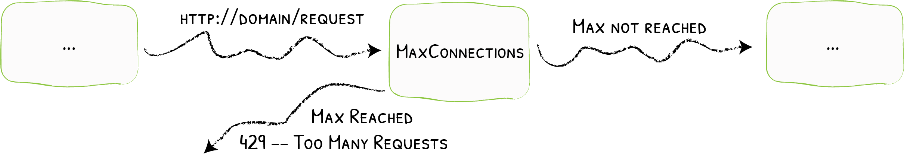

# InFlightReq

Limiting the Number of Simultaneous In-Flight Requests
{: .subtitle }



To proactively prevent services from being overwhelmed with high load, the number of allowed simultaneous in-flight requests can be limited.

## Configuration Examples

```yaml tab="Docker & Swarm"
labels:
  - "traefik.http.middlewares.test-inflightreq.inflightreq.amount=10"
```

```yaml tab="Kubernetes"
apiVersion: traefik.io/v1alpha1
kind: Middleware
metadata:
  name: test-inflightreq
spec:
  inFlightReq:
    amount: 10
```

```yaml tab="Consul Catalog"
# Limiting to 10 simultaneous connections
- "traefik.http.middlewares.test-inflightreq.inflightreq.amount=10"
```

```yaml tab="File (YAML)"
# Limiting to 10 simultaneous connections
http:
  middlewares:
    test-inflightreq:
      inFlightReq:
        amount: 10
```

```toml tab="File (TOML)"
# Limiting to 10 simultaneous connections
[http.middlewares]
  [http.middlewares.test-inflightreq.inFlightReq]
    amount = 10
```

## Configuration Options

### `amount`

The `amount` option defines the maximum amount of allowed simultaneous in-flight request.
The middleware responds with `HTTP 429 Too Many Requests` if there are already `amount` requests in progress (based on the same `sourceCriterion` strategy).

```yaml tab="Docker & Swarm"
labels:
  - "traefik.http.middlewares.test-inflightreq.inflightreq.amount=10"
```

```yaml tab="Kubernetes"
apiVersion: traefik.io/v1alpha1
kind: Middleware
metadata:
  name: test-inflightreq
spec:
  inFlightReq:
    amount: 10
```

```yaml tab="Consul Catalog"
# Limiting to 10 simultaneous connections
- "traefik.http.middlewares.test-inflightreq.inflightreq.amount=10"
```

```yaml tab="File (YAML)"
# Limiting to 10 simultaneous connections
http:
  middlewares:
    test-inflightreq:
      inFlightReq:
        amount: 10
```

```toml tab="File (TOML)"
# Limiting to 10 simultaneous connections
[http.middlewares]
  [http.middlewares.test-inflightreq.inFlightReq]
    amount = 10
```

### `sourceCriterion`

The `sourceCriterion` option defines what criterion is used to group requests as originating from a common source.
If several strategies are defined at the same time, an error will be raised.
If none are set, the default is to use the `requestHost`.

#### `sourceCriterion.ipStrategy`

The `ipStrategy` option defines two parameters that configures how Traefik determines the client IP: `depth`, and `excludedIPs`.

!!! important "As a middleware, InFlightReq happens before the actual proxying to the backend takes place. In addition, the previous network hop only gets appended to `X-Forwarded-For` during the last stages of proxying, i.e. after it has already passed through the middleware. Therefore, during InFlightReq, as the previous network hop is not yet present in `X-Forwarded-For`, it cannot be used and/or relied upon."

##### `ipStrategy.depth`

The `depth` option tells Traefik to use the `X-Forwarded-For` header and select the IP located at the `depth` position (starting from the right).

- If `depth` is greater than the total number of IPs in `X-Forwarded-For`, then the client IP is empty.
- `depth` is ignored if its value is less than or equal to 0.

!!! example "Example of Depth & X-Forwarded-For"

    If `depth` is set to 2, and the request `X-Forwarded-For` header is `"10.0.0.1,11.0.0.1,12.0.0.1,13.0.0.1"` then the "real" client IP is `"10.0.0.1"` (at depth 4) but the IP used as the criterion is `"12.0.0.1"` (`depth=2`).

    | `X-Forwarded-For`                       | `depth` | clientIP     |
    |-----------------------------------------|---------|--------------|
    | `"10.0.0.1,11.0.0.1,12.0.0.1,13.0.0.1"` | `1`     | `"13.0.0.1"` |
    | `"10.0.0.1,11.0.0.1,12.0.0.1,13.0.0.1"` | `3`     | `"11.0.0.1"` |
    | `"10.0.0.1,11.0.0.1,12.0.0.1,13.0.0.1"` | `5`     | `""`         |

```yaml tab="Docker & Swarm"
labels:
  - "traefik.http.middlewares.test-inflightreq.inflightreq.sourcecriterion.ipstrategy.depth=2"
```

```yaml tab="Kubernetes"
apiVersion: traefik.io/v1alpha1
kind: Middleware
metadata:
  name: test-inflightreq
spec:
  inFlightReq:
    sourceCriterion:
      ipStrategy:
        depth: 2
```

```yaml tab="Consul Catalog"
- "traefik.http.middlewares.test-inflightreq.inflightreq.sourcecriterion.ipstrategy.depth=2"
```

```yaml tab="File (YAML)"
http:
  middlewares:
    test-inflightreq:
      inFlightReq:
        sourceCriterion:
          ipStrategy:
            depth: 2
```

```toml tab="File (TOML)"
[http.middlewares]
  [http.middlewares.test-inflightreq.inflightreq]
    [http.middlewares.test-inflightreq.inFlightReq.sourceCriterion.ipStrategy]
      depth = 2
```

##### `ipStrategy.excludedIPs`

`excludedIPs` configures Traefik to scan the `X-Forwarded-For` header and select the first IP not in the list.

!!! important "If `depth` is specified, `excludedIPs` is ignored."

!!! example "Example of ExcludedIPs & X-Forwarded-For"

    | `X-Forwarded-For`                       | `excludedIPs`         | clientIP     |
    |-----------------------------------------|-----------------------|--------------|
    | `"10.0.0.1,11.0.0.1,12.0.0.1,13.0.0.1"` | `"12.0.0.1,13.0.0.1"` | `"11.0.0.1"` |
    | `"10.0.0.1,11.0.0.1,12.0.0.1,13.0.0.1"` | `"15.0.0.1,13.0.0.1"` | `"12.0.0.1"` |
    | `"10.0.0.1,11.0.0.1,12.0.0.1,13.0.0.1"` | `"10.0.0.1,13.0.0.1"` | `"12.0.0.1"` |
    | `"10.0.0.1,11.0.0.1,12.0.0.1,13.0.0.1"` | `"15.0.0.1,16.0.0.1"` | `"13.0.0.1"` |
    | `"10.0.0.1,11.0.0.1"`                   | `"10.0.0.1,11.0.0.1"` | `""`         |

```yaml tab="Docker & Swarm"
labels:
  - "traefik.http.middlewares.test-inflightreq.inflightreq.sourcecriterion.ipstrategy.excludedips=127.0.0.1/32, 192.168.1.7"
```

```yaml tab="Kubernetes"
apiVersion: traefik.io/v1alpha1
kind: Middleware
metadata:
  name: test-inflightreq
spec:
  inFlightReq:
    sourceCriterion:
      ipStrategy:
        excludedIPs:
        - 127.0.0.1/32
        - 192.168.1.7
```

```yaml tab="Consul Catalog"
- "traefik.http.middlewares.test-inflightreq.inflightreq.sourcecriterion.ipstrategy.excludedips=127.0.0.1/32, 192.168.1.7"
```

```yaml tab="File (YAML)"
http:
  middlewares:
    test-inflightreq:
      inFlightReq:
        sourceCriterion:
          ipStrategy:
            excludedIPs:
              - "127.0.0.1/32"
              - "192.168.1.7"
```

```toml tab="File (TOML)"
[http.middlewares]
  [http.middlewares.test-inflightreq.inflightreq]
    [http.middlewares.test-inflightreq.inFlightReq.sourceCriterion.ipStrategy]
      excludedIPs = ["127.0.0.1/32", "192.168.1.7"]
```

#### `sourceCriterion.requestHeaderName`

Name of the header used to group incoming requests.

```yaml tab="Docker & Swarm"
labels:
  - "traefik.http.middlewares.test-inflightreq.inflightreq.sourcecriterion.requestheadername=username"
```

```yaml tab="Kubernetes"
apiVersion: traefik.io/v1alpha1
kind: Middleware
metadata:
  name: test-inflightreq
spec:
  inFlightReq:
	sourceCriterion:
      requestHeaderName: username
```

```yaml tab="Consul Catalog"
- "traefik.http.middlewares.test-inflightreq.inflightreq.sourcecriterion.requestheadername=username"
```

```yaml tab="File (YAML)"
http:
  middlewares:
    test-inflightreq:
      inFlightReq:
        sourceCriterion:
          requestHeaderName: username
```

```toml tab="File (TOML)"
[http.middlewares]
  [http.middlewares.test-inflightreq.inflightreq]
    [http.middlewares.test-inflightreq.inFlightReq.sourceCriterion]
      requestHeaderName = "username"
```

#### `sourceCriterion.requestHost`

Whether to consider the request host as the source.

```yaml tab="Docker & Swarm"
labels:
  - "traefik.http.middlewares.test-inflightreq.inflightreq.sourcecriterion.requesthost=true"
```

```yaml tab="Kubernetes"
apiVersion: traefik.io/v1alpha1
kind: Middleware
metadata:
  name: test-inflightreq
spec:
  inFlightReq:
    sourceCriterion:
      requestHost: true
```

```yaml tab="Consul Catalog"
- "traefik.http.middlewares.test-inflightreq.inflightreq.sourcecriterion.requesthost=true"
```

```yaml tab="File (YAML)"
http:
  middlewares:
    test-inflightreq:
      inFlightReq:
        sourceCriterion:
          requestHost: true
```

```toml tab="File (TOML)"
[http.middlewares]
  [http.middlewares.test-inflightreq.inflightreq]
    [http.middlewares.test-inflightreq.inFlightReq.sourceCriterion]
      requestHost = true
```
