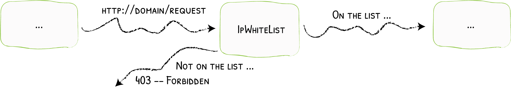

# IPWhiteList

Limiting Clients to Specific IPs
{: .subtitle }



IPWhitelist accepts / refuses requests based on the client IP.

## Configuration Examples

```yaml tab="Docker"
# Accepts request from defined IP
labels:
  - "traefik.http.middlewares.test-ipwhitelist.ipwhitelist.sourcerange=127.0.0.1/32, 192.168.1.7"
```

```yaml tab="Kubernetes"
apiVersion: traefik.io/v1alpha1
kind: Middleware
metadata:
  name: test-ipwhitelist
spec:
  ipWhiteList:
    sourceRange:
      - 127.0.0.1/32
      - 192.168.1.7
```

```yaml tab="Consul Catalog"
# Accepts request from defined IP
- "traefik.http.middlewares.test-ipwhitelist.ipwhitelist.sourcerange=127.0.0.1/32, 192.168.1.7"
```

```json tab="Marathon"
"labels": {
  "traefik.http.middlewares.test-ipwhitelist.ipwhitelist.sourcerange": "127.0.0.1/32,192.168.1.7"
}
```

```yaml tab="Rancher"
# Accepts request from defined IP
labels:
  - "traefik.http.middlewares.test-ipwhitelist.ipwhitelist.sourcerange=127.0.0.1/32, 192.168.1.7"
```

```yaml tab="File (YAML)"
# Accepts request from defined IP
http:
  middlewares:
    test-ipwhitelist:
      ipWhiteList:
        sourceRange:
          - "127.0.0.1/32"
          - "192.168.1.7"
```

```toml tab="File (TOML)"
# Accepts request from defined IP
[http.middlewares]
  [http.middlewares.test-ipwhitelist.ipWhiteList]
    sourceRange = ["127.0.0.1/32", "192.168.1.7"]
```

## Configuration Options

### `sourceRange`

The `sourceRange` option sets the allowed IPs (or ranges of allowed IPs by using CIDR notation).

### `ipStrategy`

The `ipStrategy` option defines two parameters that set how Traefik determines the client IP: `depth`, and `excludedIPs`.  
If no strategy is set, the default behavior is to match `sourceRange` against the Remote address found in the request.

!!! important "As a middleware, whitelisting happens before the actual proxying to the backend takes place. In addition, the previous network hop only gets appended to `X-Forwarded-For` during the last stages of proxying, i.e. after it has already passed through whitelisting. Therefore, during whitelisting, as the previous network hop is not yet present in `X-Forwarded-For`, it cannot be matched against `sourceRange`."

#### `ipStrategy.depth`

The `depth` option tells Traefik to use the `X-Forwarded-For` header and take the IP located at the `depth` position (starting from the right).

- If `depth` is greater than the total number of IPs in `X-Forwarded-For`, then the client IP will be empty.
- `depth` is ignored if its value is less than or equal to 0.

!!! example "Examples of Depth & X-Forwarded-For"

    If `depth` is set to 2, and the request `X-Forwarded-For` header is `"10.0.0.1,11.0.0.1,12.0.0.1,13.0.0.1"` then the "real" client IP is `"10.0.0.1"` (at depth 4) but the IP used for the whitelisting is `"12.0.0.1"` (`depth=2`).

    | `X-Forwarded-For`                       | `depth` | clientIP     |
    |-----------------------------------------|---------|--------------|
    | `"10.0.0.1,11.0.0.1,12.0.0.1,13.0.0.1"` | `1`     | `"13.0.0.1"` |
    | `"10.0.0.1,11.0.0.1,12.0.0.1,13.0.0.1"` | `3`     | `"11.0.0.1"` |
    | `"10.0.0.1,11.0.0.1,12.0.0.1,13.0.0.1"` | `5`     | `""`         |

```yaml tab="Docker"
# Whitelisting Based on `X-Forwarded-For` with `depth=2`
labels:
  - "traefik.http.middlewares.test-ipwhitelist.ipwhitelist.sourcerange=127.0.0.1/32, 192.168.1.7"
  - "traefik.http.middlewares.test-ipwhitelist.ipwhitelist.ipstrategy.depth=2"
```

```yaml tab="Kubernetes"
# Whitelisting Based on `X-Forwarded-For` with `depth=2`
apiVersion: traefik.io/v1alpha1
kind: Middleware
metadata:
  name: test-ipwhitelist
spec:
  ipWhiteList:
    sourceRange:
      - 127.0.0.1/32
      - 192.168.1.7
    ipStrategy:
      depth: 2
```

```yaml tab="Consul Catalog"
# Whitelisting Based on `X-Forwarded-For` with `depth=2`
- "traefik.http.middlewares.test-ipwhitelist.ipwhitelist.sourcerange=127.0.0.1/32, 192.168.1.7"
- "traefik.http.middlewares.test-ipwhitelist.ipwhitelist.ipstrategy.depth=2"
```

```json tab="Marathon"
"labels": {
  "traefik.http.middlewares.test-ipwhitelist.ipwhitelist.sourcerange": "127.0.0.1/32, 192.168.1.7",
  "traefik.http.middlewares.test-ipwhitelist.ipwhitelist.ipstrategy.depth": "2"
}
```

```yaml tab="Rancher"
# Whitelisting Based on `X-Forwarded-For` with `depth=2`
labels:
  - "traefik.http.middlewares.test-ipwhitelist.ipwhitelist.sourcerange=127.0.0.1/32, 192.168.1.7"
  - "traefik.http.middlewares.test-ipwhitelist.ipwhitelist.ipstrategy.depth=2"
```

```yaml tab="File (YAML)"
# Whitelisting Based on `X-Forwarded-For` with `depth=2`
http:
  middlewares:
    test-ipwhitelist:
      ipWhiteList:
        sourceRange:
          - "127.0.0.1/32"
          - "192.168.1.7"
        ipStrategy:
          depth: 2
```

```toml tab="File (TOML)"
# Whitelisting Based on `X-Forwarded-For` with `depth=2`
[http.middlewares]
  [http.middlewares.test-ipwhitelist.ipWhiteList]
    sourceRange = ["127.0.0.1/32", "192.168.1.7"]
    [http.middlewares.test-ipwhitelist.ipWhiteList.ipStrategy]
      depth = 2
```

#### `ipStrategy.excludedIPs`

`excludedIPs` configures Traefik to scan the `X-Forwarded-For` header and select the first IP not in the list.

!!! important "If `depth` is specified, `excludedIPs` is ignored."

!!! example "Example of ExcludedIPs & X-Forwarded-For"

    | `X-Forwarded-For`                       | `excludedIPs`         | clientIP     |
    |-----------------------------------------|-----------------------|--------------|
    | `"10.0.0.1,11.0.0.1,12.0.0.1,13.0.0.1"` | `"12.0.0.1,13.0.0.1"` | `"11.0.0.1"` |
    | `"10.0.0.1,11.0.0.1,12.0.0.1,13.0.0.1"` | `"15.0.0.1,13.0.0.1"` | `"12.0.0.1"` |
    | `"10.0.0.1,11.0.0.1,12.0.0.1,13.0.0.1"` | `"10.0.0.1,13.0.0.1"` | `"12.0.0.1"` |
    | `"10.0.0.1,11.0.0.1,12.0.0.1,13.0.0.1"` | `"15.0.0.1,16.0.0.1"` | `"13.0.0.1"` |
    | `"10.0.0.1,11.0.0.1"`                   | `"10.0.0.1,11.0.0.1"` | `""`         |

```yaml tab="Docker"
# Exclude from `X-Forwarded-For`
labels:
    - "traefik.http.middlewares.test-ipwhitelist.ipwhitelist.ipstrategy.excludedips=127.0.0.1/32, 192.168.1.7"
```

```yaml tab="Kubernetes"
# Exclude from `X-Forwarded-For`
apiVersion: traefik.io/v1alpha1
kind: Middleware
metadata:
  name: test-ipwhitelist
spec:
  ipWhiteList:
    ipStrategy:
      excludedIPs:
        - 127.0.0.1/32
        - 192.168.1.7
```

```yaml tab="Consul Catalog"
# Exclude from `X-Forwarded-For`
- "traefik.http.middlewares.test-ipwhitelist.ipwhitelist.ipstrategy.excludedips=127.0.0.1/32, 192.168.1.7"
```

```json tab="Marathon"
"labels": {
  "traefik.http.middlewares.test-ipwhitelist.ipwhitelist.ipstrategy.excludedips": "127.0.0.1/32, 192.168.1.7"
}
```

```yaml tab="Rancher"
# Exclude from `X-Forwarded-For`
labels:
  - "traefik.http.middlewares.test-ipwhitelist.ipwhitelist.ipstrategy.excludedips=127.0.0.1/32, 192.168.1.7"
```

```yaml tab="File (YAML)"
# Exclude from `X-Forwarded-For`
http:
  middlewares:
    test-ipwhitelist:
      ipWhiteList:
        ipStrategy:
          excludedIPs:
            - "127.0.0.1/32"
            - "192.168.1.7"
```

```toml tab="File (TOML)"
# Exclude from `X-Forwarded-For`
[http.middlewares]
  [http.middlewares.test-ipwhitelist.ipWhiteList]
    [http.middlewares.test-ipwhitelist.ipWhiteList.ipStrategy]
      excludedIPs = ["127.0.0.1/32", "192.168.1.7"]
```
