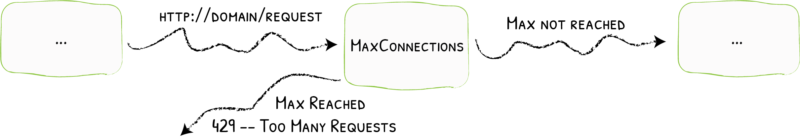

# MaxConnection

Limiting the Number of Simultaneous Clients
{: .subtitle }



To proactively prevent services from being overwhelmed with high load, a maximum connection limit can be applied.

## Configuration Examples

```yaml tab="Docker"
# Limiting to 10 simultaneous connections
labels:
- "traefik.http.middlewares.test-maxconn.maxconn.amount=10"
```

```yaml tab="Kubernetes"
apiVersion: traefik.containo.us/v1alpha1
kind: Middleware
metadata:
  name: addprefix
spec:
  maxConn:
    amount: 10
```

```json tab="Marathon"
"labels": {
  "traefik.http.middlewares.test-maxconn.maxconn.amount": "10"
}
```

```yaml tab="Rancher"
# Limiting to 10 simultaneous connections
labels:
- "traefik.http.middlewares.test-maxconn.maxconn.amount=10"
```

```toml tab="File"
# Limiting to 10 simultaneous connections
[http.middlewares]
  [http.middlewares.test-maxconn.maxconn]
  amount = 10 
```

## Configuration Options

### `amount`

The `amount` option defines the maximum amount of allowed simultaneous connections.
The middleware will return an `HTTP 429 Too Many Requests` if there are already `amount` requests in progress (based on the same `extractorfunc` strategy).

### extractorfunc

The `extractorfunc` defines the strategy used to categorize requests.

The possible values are:

- `request.host` categorizes requests based on the request host.
- `client.ip` categorizes requests based on the client ip.
- `request.header.ANY_HEADER` categorizes requests based on the provided `ANY_HEADER` value.
