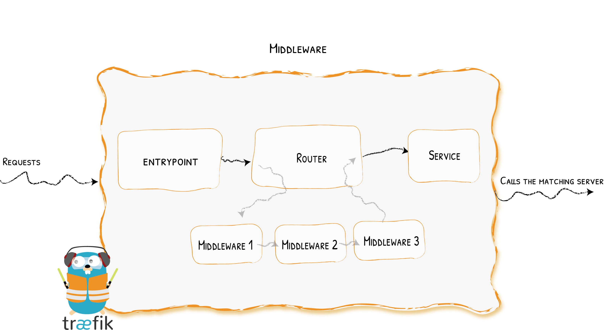

# Middlewares

Tweaking the Request
{: .subtitle }



Attached to the routers, pieces of middleware are a means of tweaking the requests before they are sent to your [service](../routing/services/index.md) (or before the answer from the services are sent to the clients).

There are several available middleware in Traefik, some can modify the request, the headers, some are in charge of redirections, some add authentication, and so on.

Pieces of middleware can be combined in chains to fit every scenario.

## Configuration Example

```yaml tab="Docker"
# As a Docker Label
whoami:
  #  A container that exposes an API to show its IP address
  image: traefik/whoami
  labels:
    # Create a middleware named `foo-add-prefix`
    - "traefik.http.middlewares.foo-add-prefix.addprefix.prefix=/foo"
    # Apply the middleware named `foo-add-prefix` to the router named `router1`
    - "traefik.http.routers.router1.middlewares=foo-add-prefix@docker"
```

```yaml tab="Kubernetes IngressRoute"
# As a Kubernetes Traefik IngressRoute
apiVersion: apiextensions.k8s.io/v1beta1
kind: CustomResourceDefinition
metadata:
  name: middlewares.traefik.containo.us
spec:
  group: traefik.containo.us
  version: v1alpha1
  names:
    kind: Middleware
    plural: middlewares
    singular: middleware
  scope: Namespaced

---
apiVersion: traefik.containo.us/v1alpha1
kind: Middleware
metadata:
  name: stripprefix
spec:
  stripPrefix:
    prefixes:
      - /stripit

---
apiVersion: traefik.containo.us/v1alpha1
kind: IngressRoute
metadata:
  name: ingressroute
spec:
# more fields...
  routes:
    # more fields...
    middlewares:
      - name: stripprefix
```

```yaml tab="Consul Catalog"
# Create a middleware named `foo-add-prefix`
- "traefik.http.middlewares.foo-add-prefix.addprefix.prefix=/foo"
# Apply the middleware named `foo-add-prefix` to the router named `router1`
- "traefik.http.routers.router1.middlewares=foo-add-prefix@consulcatalog"
```

```json tab="Marathon"
"labels": {
  "traefik.http.middlewares.foo-add-prefix.addprefix.prefix": "/foo",
  "traefik.http.routers.router1.middlewares": "foo-add-prefix@marathon"
}
```

```yaml tab="Rancher"
# As a Rancher Label
labels:
  # Create a middleware named `foo-add-prefix`
  - "traefik.http.middlewares.foo-add-prefix.addprefix.prefix=/foo"
  # Apply the middleware named `foo-add-prefix` to the router named `router1`
  - "traefik.http.routers.router1.middlewares=foo-add-prefix@rancher"
```

```toml tab="File (TOML)"
# As TOML Configuration File
[http.routers]
  [http.routers.router1]
    service = "myService"
    middlewares = ["foo-add-prefix"]
    rule = "Host(`example.com`)"

[http.middlewares]
  [http.middlewares.foo-add-prefix.addPrefix]
    prefix = "/foo"

[http.services]
  [http.services.service1]
    [http.services.service1.loadBalancer]

      [[http.services.service1.loadBalancer.servers]]
        url = "http://127.0.0.1:80"
```

```yaml tab="File (YAML)"
# As YAML Configuration File
http:
  routers:
    router1:
      service: myService
      middlewares:
        - "foo-add-prefix"
      rule: "Host(`example.com`)"

  middlewares:
    foo-add-prefix:
      addPrefix:
        prefix: "/foo"

  services:
    service1:
      loadBalancer:
        servers:
          - url: "http://127.0.0.1:80"
```

## Provider Namespace

When you declare a middleware, it lives in its provider's namespace.
For example, if you declare a middleware using a Docker label, under the hoods, it will reside in the docker provider namespace.

If you use multiple providers and wish to reference a middleware declared in another provider
(aka referencing a cross-provider middleware),
then you'll have to append to the middleware name, the `@` separator, followed by the provider name.

```text
<resource-name>@<provider-name>
```

!!! important "Kubernetes Namespace"

    As Kubernetes also has its own notion of namespace, one should not confuse the "provider namespace"
    with the "kubernetes namespace" of a resource when in the context of a cross-provider usage.
    In this case, since the definition of the middleware is not in kubernetes,
    specifying a "kubernetes namespace" when referring to the resource does not make any sense,
    and therefore this specification would be ignored even if present.
    On the other hand, if you declare the middleware as a Custom Resource in Kubernetes and use the 
    non-crd Ingress objects, you'll have to add the kubernetes namespace of the middleware to the 
    annotation like this `<middleware-namespace>-<middleware-name>@kubernetescrd`.

!!! abstract "Referencing a Middleware from Another Provider"

    Declaring the add-foo-prefix in the file provider.

    ```toml tab="File (TOML)"
    [http.middlewares]
      [http.middlewares.add-foo-prefix.addPrefix]
        prefix = "/foo"
    ```
    
    ```yaml tab="File (YAML)"
    http:
      middlewares:
        add-foo-prefix:
          addPrefix:
            prefix: "/foo"
    ```

    Using the add-foo-prefix middleware from other providers:

    ```yaml tab="Docker"
    your-container: #
      image: your-docker-image

      labels:
        # Attach add-foo-prefix@file middleware (declared in file)
        - "traefik.http.routers.my-container.middlewares=add-foo-prefix@file"
    ```

    ```yaml tab="Kubernetes Ingress Route"
    apiVersion: traefik.containo.us/v1alpha1
    kind: IngressRoute
    metadata:
      name: ingressroutestripprefix

    spec:
      entryPoints:
        - web
      routes:
        - match: Host(`example.com`)
          kind: Rule
          services:
            - name: whoami
              port: 80
          middlewares:
            - name: add-foo-prefix@file
            # namespace: bar
            # A namespace specification such as above is ignored
            # when the cross-provider syntax is used.
    ```
    
    ```yaml tab="Kubernetes Ingress"
    apiVersion: traefik.containo.us/v1alpha1
    kind: Middleware
    metadata:
      name: stripprefix
      namespace: appspace
    spec:
      stripPrefix:
        prefixes:
          - /stripit
    
    ---
    apiVersion: networking.k8s.io/v1
    kind: Ingress
    metadata:
      name: ingress
      namespace: appspace
      annotations:
        # referencing a middleware from Kubernetes CRD provider: 
        # <middleware-namespace>-<middleware-name>@kubernetescrd
        "traefik.ingress.kubernetes.io/router.middlewares": appspace-stripprefix@kubernetescrd
    spec:
      # ... regular ingress definition
    ```

## Available Middlewares

| Middleware                                | Purpose                                           | Area                        |
|-------------------------------------------|---------------------------------------------------|-----------------------------|
| [AddPrefix](addprefix.md)                 | Add a Path Prefix                                 | Path Modifier               |
| [BasicAuth](basicauth.md)                 | Basic auth mechanism                              | Security, Authentication    |
| [Buffering](buffering.md)                 | Buffers the request/response                      | Request Lifecycle           |
| [Chain](chain.md)                         | Combine multiple pieces of middleware             | Middleware tool             |
| [CircuitBreaker](circuitbreaker.md)       | Stop calling unhealthy services                   | Request Lifecycle           |
| [Compress](compress.md)                   | Compress the response                             | Content Modifier            |
| [DigestAuth](digestauth.md)               | Adds Digest Authentication                        | Security, Authentication    |
| [Errors](errorpages.md)                   | Define custom error pages                         | Request Lifecycle           |
| [ForwardAuth](forwardauth.md)             | Authentication delegation                         | Security, Authentication    |
| [Headers](headers.md)                     | Add / Update headers                              | Security                    |
| [IPWhiteList](ipwhitelist.md)             | Limit the allowed client IPs                      | Security, Request lifecycle |
| [InFlightReq](inflightreq.md)             | Limit the number of simultaneous connections      | Security, Request lifecycle |
| [PassTLSClientCert](passtlsclientcert.md) | Adding Client Certificates in a Header            | Security                    |
| [RateLimit](ratelimit.md)                 | Limit the call frequency                          | Security, Request lifecycle |
| [RedirectScheme](redirectscheme.md)       | Redirect easily the client elsewhere              | Request lifecycle           |
| [RedirectRegex](redirectregex.md)         | Redirect the client elsewhere                     | Request lifecycle           |
| [ReplacePath](replacepath.md)             | Change the path of the request                    | Path Modifier               |
| [ReplacePathRegex](replacepathregex.md)   | Change the path of the request                    | Path Modifier               |
| [Retry](retry.md)                         | Automatically retry the request in case of errors | Request lifecycle           |
| [StripPrefix](stripprefix.md)             | Change the path of the request                    | Path Modifier               |
| [StripPrefixRegex](stripprefixregex.md)   | Change the path of the request                    | Path Modifier               |
