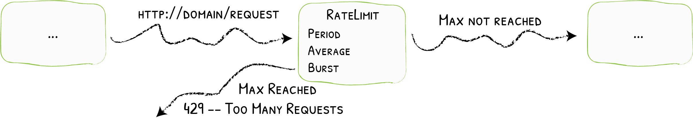

# RateLimit

Protection from Too Many Calls
{: .subtitle }



The RateLimit middleware ensures that services will receive a _fair_ number of requests, and allows you define what is fair.

## Configuration Example

```yaml tab="Docker"
# Here, an average of 5 requests every 3 seconds is allowed and an average of 100 requests every 10 seconds.
# These can "burst" up to 10 and 200 in each period, respectively.
labels:
- "traefik.http.middlewares.test-ratelimit.ratelimit.extractorfunc=client.ip"
- "traefik.http.middlewares.test-ratelimit.ratelimit.rateset.rate0.period=10s"
- "traefik.http.middlewares.test-ratelimit.ratelimit.rateset.rate0.average=100"
- "traefik.http.middlewares.test-ratelimit.ratelimit.rateset.rate0.burst=200"
- "traefik.http.middlewares.test-ratelimit.ratelimit.rateset.rate1.period=3s"
- "traefik.http.middlewares.test-ratelimit.ratelimit.rateset.rate1.average=5"
- "traefik.http.middlewares.test-ratelimit.ratelimit.rateset.rate1.burst=10"
  		
```

```yaml tab="Kubernetes"
# Here, an average of 5 requests every 3 seconds is allowed and an average of 100 requests every 10 seconds.
# These can "burst" up to 10 and 200 in each period, respectively.
apiVersion: traefik.containo.us/v1alpha1
kind: Middleware
metadata:
  name: test-ratelimit
spec:
  rateLimit:
    extractorfunc = "client.ip"
    rate0:
        period = "10s"
        average = 100
        burst = 200
    rate1:
        period = "3s"
        average = 5
        burst = 10
```

```yaml tab="Rancher"
# Here, an average of 5 requests every 3 seconds is allowed and an average of 100 requests every 10 seconds.
# These can "burst" up to 10 and 200 in each period, respectively.
labels:
- "traefik.http.middlewares.test-ratelimit.ratelimit.extractorfunc=client.ip"
- "traefik.http.middlewares.test-ratelimit.ratelimit.rateset.rate0.period=10s"
- "traefik.http.middlewares.test-ratelimit.ratelimit.rateset.rate0.average=100"
- "traefik.http.middlewares.test-ratelimit.ratelimit.rateset.rate0.burst=200"
- "traefik.http.middlewares.test-ratelimit.ratelimit.rateset.rate1.period=3s"
- "traefik.http.middlewares.test-ratelimit.ratelimit.rateset.rate1.average=5"
- "traefik.http.middlewares.test-ratelimit.ratelimit.rateset.rate1.burst=10"
  		
```

```toml tab="File"
# Here, an average of 5 requests every 3 seconds is allowed and an average of 100 requests every 10 seconds.
# These can "burst" up to 10 and 200 in each period, respectively.
[http.middlewares]
  [http.middlewares.test-ratelimit.ratelimit]
    extractorfunc = "client.ip"
    
    [http.middlewares.test-ratelimit.ratelimit.rate0]
      period = "10s"
      average = 100
      burst = 200
    
    [http.middlewares.test-ratelimit.ratelimit.rate1]
      period = "3s"
      average = 5
      burst = 10
```

## Configuration Options

### `extractorfunc`
 
The `extractorfunc` option defines the strategy used to categorize requests.

The possible values are:

- `request.host` categorizes requests based on the request host.
- `client.ip` categorizes requests based on the client ip.
- `request.header.ANY_HEADER` categorizes requests based on the provided `ANY_HEADER` value.

### `ratelimit`

You can combine multiple rate limits. 
The rate limit will trigger with the first reached limit.

Each rate limit has 3 options, `period`, `average`, and `burst`.

The rate limit will allow an average of `average` requests every `period`, with a maximum of `burst` request on that period.

!!! note "Period Format"

    Period is to be given in a format understood by [time.ParseDuration](https://golang.org/pkg/time/#ParseDuration).
