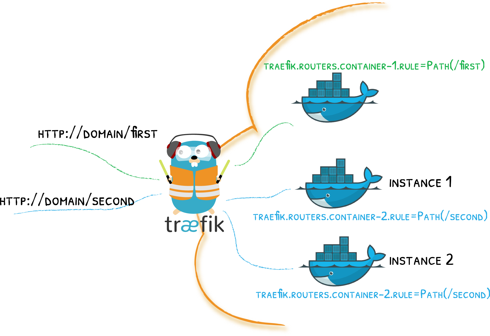

# Traefik & Docker

A Story of Labels & Containers
{: .subtitle }



Attach labels to your containers and let Traefik do the rest!

!!! tip "The Quick Start Uses Docker"
    If you haven't already, maybe you'd like to go through the [quick start](../getting-started/quick-start.md) that uses the docker provider!

## Configuration Examples

??? example "Configuring Docker & Deploying / Exposing Services"

    Enabling the docker provider

    ```toml
    [providers.docker]
    endpoint = "unix:///var/run/docker.sock"
    ```

    Attaching labels to containers (in your docker compose file)

    ```yaml
    version: "3"
    services:
      my-container:
        # ...
        labels:
          - traefik.http.routers.my-container.rule=Host(`my-domain`)
    ```

??? example "Configuring Docker Swarm & Deploying / Exposing Services"

    Enabling the docker provider (Swarm Mode)

    ```toml
    [docker]
    # swarm classic (1.12-)
    # endpoint = "tcp://127.0.0.1:2375"
    # docker swarm mode (1.12+)
    endpoint = "tcp://127.0.0.1:2377"
    swarmMode = true
    ```

    Attaching labels to containers (in your docker compose file)

    ```yaml
    version: "3"
    services:
      my-container:
        deploy:
          labels:
            - traefik.http.routers.my-container.rule=Host(`my-domain`)
    ```

    !!! important "Labels in Docker Swarm Mode"
        If you use a compose file with the Swarm mode, labels should be defined in the `deploy` part of your service.
        This behavior is only enabled for docker-compose version 3+ ([Compose file reference](https://docs.docker.com/compose/compose-file/#labels-1)).

## Provider Configuration Options

!!! tip "Browse the Reference"
    If you're in a hurry, maybe you'd rather go through the [static](../reference/static-configuration.md) and the [dynamic](../reference/dynamic-configuration/docker.md) configuration references.

### `endpoint`

Traefik requires access to the docker socket to get its dynamic configuration.

??? warning "Security Notes"

    Depending on your context, accessing the Docker API without any restriction can be a security concern: If Traefik is attacked, then the attacker might get access to the Docker (or Swarm Mode) backend.

    As explained in the Docker documentation: ([Docker Daemon Attack Surface page](https://docs.docker.com/engine/security/security/#docker-daemon-attack-surface)):

    `[...] only **trusted** users should be allowed to control your Docker daemon [...]`

    !!! note "Improved Security"

        [TraefikEE](https://containo.us/traefikee) solves this problem by separating the control plane (connected to Docker) and the data plane (handling the requests).

    ??? tip "Resources about Docker's Security"

        - [KubeCon EU 2018 Keynote, Running with Scissors, from Liz Rice](https://www.youtube.com/watch?v=ltrV-Qmh3oY)
        - [Don't expose the Docker socket (not even to a container)](https://www.lvh.io/posts/dont-expose-the-docker-socket-not-even-to-a-container.html)
        - [A thread on Stack Overflow about sharing the `/var/run/docker.sock` file](https://news.ycombinator.com/item?id=17983623)
        - [To Dind or not to DinD](https://blog.loof.fr/2018/01/to-dind-or-not-do-dind.html)

??? tip "Security Compensation"

    Expose the Docker socket over TCP, instead of the default Unix socket file.
    It allows different implementation levels of the [AAA (Authentication, Authorization, Accounting) concepts](https://en.wikipedia.org/wiki/AAA_(computer_security)), depending on your security assessment:

    - Authentication with Client Certificates as described in ["Protect the Docker daemon socket."](https://docs.docker.com/engine/security/https/)

    - Authorization with the [Docker Authorization Plugin Mechanism](https://docs.docker.com/engine/extend/plugins_authorization/)

    - Accounting at networking level, by exposing the socket only inside a Docker private network, only available for Traefik.

    - Accounting at container level, by exposing the socket on a another container than Traefik's.
      With Swarm mode, it allows scheduling of Traefik on worker nodes, with only the "socket exposer" container on the manager nodes.

    - Accounting at kernel level, by enforcing kernel calls with mechanisms like [SELinux](https://en.wikipedia.org/wiki/Security-Enhanced_Linux), to only allows an identified set of actions for Traefik's process (or the "socket exposer" process).

    ??? tip "Additional Resources"

        - [Traefik issue GH-4174 about security with Docker socket](https://github.com/containous/traefik/issues/4174)
        - [Inspecting Docker Activity with Socat](https://developers.redhat.com/blog/2015/02/25/inspecting-docker-activity-with-socat/)
        - [Letting Traefik run on Worker Nodes](https://blog.mikesir87.io/2018/07/letting-traefik-run-on-worker-nodes/)
        - [Docker Socket Proxy from Tecnativa](https://github.com/Tecnativa/docker-socket-proxy)

!!! note "Traefik & Swarm Mode"
    To let Traefik access the Docker Socket of the Swarm manager, it is mandatory to schedule Traefik on the Swarm manager nodes.

??? example "Using the docker.sock"

    The docker-compose file shares the docker sock with the Traefik container

    ```yaml
    version: '3'

    services:

      traefik:
         image: traefik:v2.0 # The official v2.0 Traefik docker image
         ports:
           - "80:80"
         volumes:
           - /var/run/docker.sock:/var/run/docker.sock
    ```

    We specify the docker.sock in traefik's configuration file.

    ```toml
    # ...
    [providers]
       [providers.docker]
          endpoint = "unix:///var/run/docker.sock"
    ```

### `usebindportip`

_Optional, Default=false_

Traefik routes requests to the IP/Port of the matching container.
When setting `usebindportip=true`, you tell Traefik to use the IP/Port attached to the container's _binding_ instead of its inner network IP/Port.

When used in conjunction with the `traefik.port` label (that tells Traefik to route requests to a specific port), Traefik tries to find a binding on port `traefik.port`.
If it can't find such a binding, Traefik falls back on the internal network IP of the container, but still uses the `traefik.port` that is set in the label.

??? example "Examples of `usebindportip` in different situations."

    | traefik.port label | Container's binding                                | Routes to      |
    |--------------------|----------------------------------------------------|----------------|
    |          -         |           -                                        | IntIP:IntPort  |
    |          -         | ExtPort:IntPort                                    | IntIP:IntPort  |
    |          -         | ExtIp:ExtPort:IntPort                              | ExtIp:ExtPort  |
    | LblPort            |           -                                        | IntIp:LblPort  |
    | LblPort            | ExtIp:ExtPort:LblPort                              | ExtIp:ExtPort  |
    | LblPort            | ExtIp:ExtPort:OtherPort                            | IntIp:LblPort  |
    | LblPort            | ExtIp1:ExtPort1:IntPort1 & ExtIp2:LblPort:IntPort2 | ExtIp2:LblPort |

    !!! note
        In the above table, ExtIp stands for "external IP found in the binding", IntIp stands for "internal network container's IP", ExtPort stands for "external Port found in the binding", and IntPort stands for "internal network container's port."

### `exposedByDefault`

_Optional, Default=true_

Expose containers by default through Traefik.
If set to false, containers that don't have a `traefik.enable=true` label will be ignored from the resulting routing configuration.

### `network`

_Optional_

Defines a default docker network to use for connections to all containers.

This option can be overridden on a container basis with the `traefik.docker.network` label.

### `domain`

_Optional_

This is the default base domain used for the router rules.

This option can be overridden on a container basis with the
`traefik.domain` label.

### `swarmMode`

_Optional, Default=false_

Activates the Swarm Mode.

### `swarmModeRefreshSeconds`

_Optional, Default=15_

Defines the polling interval (in seconds) in Swarm Mode.

## Routing Configuration Options

### General

Traefik creates, for each container, a corresponding [service](../routing/services/index.md) and [router](../routing/routers/index.md).

The Service automatically gets a server per instance of the container, and the router gets a default rule attached to it, based on the container name.

### Routers

To update the configuration of the Router automatically attached to the container, add labels starting with `traefik.http.routers.{name-of-your-choice}.` and followed by the option you want to change. For example, to change the rule, you could add the label `traefik.http.routers.my-container.rule=Host(my-domain)`.

Every [Router](../routing/routers/index.md) parameter can be updated this way.

### Services

To update the configuration of the Service automatically attached to the container, add labels starting with `traefik.http.services.{name-of-your-choice}.`, followed by the option you want to change. For example, to change the load balancer method, you'd add the label `traefik.http.services.{name-of-your-choice}.loadbalancer.method=drr`.

Every [Service](../routing/services/index.md) parameter can be updated this way.

### Middleware

You can declare pieces of middleware using labels starting with `traefik.http.middlewares.{name-of-your-choice}.`, followed by the middleware type/options. For example, to declare a middleware [`schemeredirect`](../middlewares/redirectscheme.md) named `my-redirect`, you'd write `traefik.http.middlewares.my-redirect.schemeredirect.scheme: https`.

??? example "Declaring and Referencing a Middleware"

    ```yaml
       services:
         my-container:
           # ...
           labels:
             - traefik.http.middlewares.my-redirect.schemeredirect.scheme=https
             - traefik.http.routers.middlewares=my-redirect
    ```

!!! warning "Conflicts in Declaration"

    If you declare multiple middleware with the same name but with different parameters, the middleware fails to be declared.

### TCP

You can declare TCP Routers and/or Services using labels.

??? example "Declaring TCP Routers and Services"

    ```yaml
       services:
         my-container:
           # ...
           labels:
             - traefik.tcp.routers.my-router.rule="HostSNI(`my-host.com`)"
             - traefik.tcp.routers.my-router.rule.tls="true"
             - traefik.tcp.services.my-service.loadbalancer.server.port="4123"
    ```

!!! warning "TCP and HTTP"

    If you declare a TCP Router/Service, it will prevent Traefik from automatically create an HTTP Router/Service (like it does by default if no TCP Router/Service is defined).
    You can declare both a TCP Router/Service and an HTTP Router/Service for the same container (but you have to do so manually).

### Specific Options

#### `traefik.enable`

You can tell Traefik to consider (or not) the container by setting `traefik.enable` to true or false.

This option overrides the value of `exposedByDefault`.

#### `traefik.tags`

Sets the tags for [constraints filtering](./overview.md#constraints-configuration).

#### `traefik.docker.network`

Overrides the default docker network to use for connections to the container.

If a container is linked to several networks, be sure to set the proper network name (you can check this with `docker inspect <container_id>`), otherwise it will randomly pick one (depending on how docker is returning them).

!!! warning
    When deploying a stack from a compose file `stack`, the networks defined are prefixed with `stack`.
