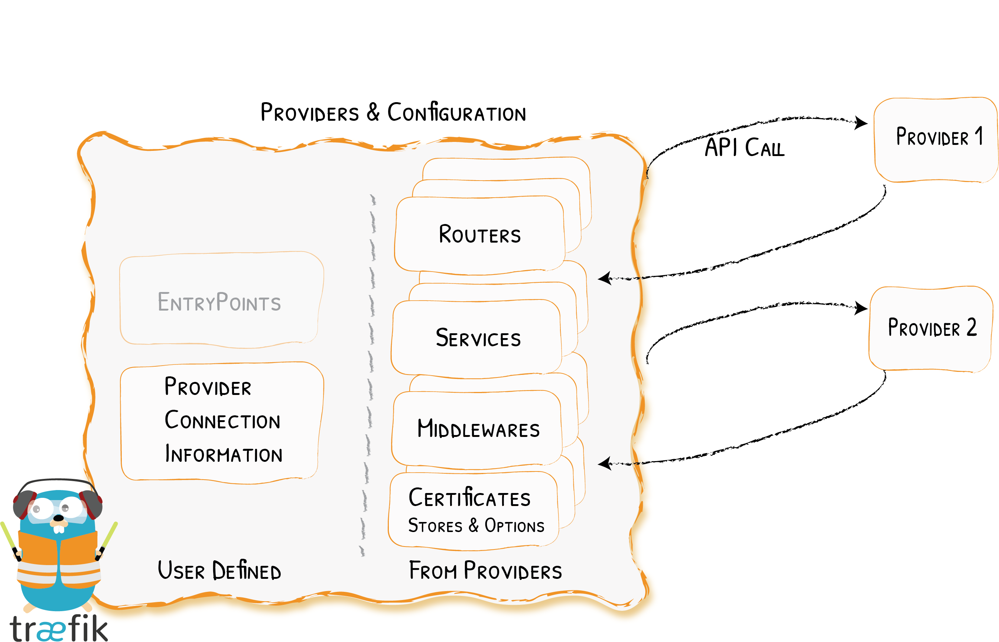

# Overview

Traefik's Many Friends
{: .subtitle }



Configuration discovery in Traefik is achieved through _Providers_.

The _providers_ are infrastructure components, whether orchestrators, container engines, cloud providers, or key-value stores.
The idea is that Traefik queries the provider APIs in order to find relevant information about routing,
and when Traefik detects a change, it dynamically updates the routes.

## Orchestrators

While each provider is different, you can think of each as belonging to one of four categories:

- Label-based: each deployed container has a set of labels attached to it
- Key-Value-based: each deployed container updates a key-value store with relevant information
- Annotation-based: a separate object, with annotations, defines the characteristics of the container
- File-based: uses files to define configuration

## Provider Namespace

When you declare certain objects in the Traefik dynamic configuration,
such as middleware, services, TLS options or server transports, they reside in their provider's namespace.
For example, if you declare a middleware using a Docker label, it resides in the Docker provider namespace.

If you use multiple providers and wish to reference such an object declared in another provider
(e.g. referencing a cross-provider object like middleware), then the object name should be suffixed by the `@`
separator, and the provider name.

For the list of the providers names, see the [supported providers](#supported-providers) table below.

```text
<resource-name>@<provider-name>
```

!!! important "Kubernetes Namespace"

    As Kubernetes also has its own notion of namespace,
    one should not confuse the _provider namespace_ with the _Kubernetes Namespace_ of a resource when in the context of cross-provider usage.

    In this case, since the definition of a Traefik dynamic configuration object is not in Kubernetes,
    specifying a Kubernetes Namespace when referring to the resource does not make any sense.

    On the other hand, if you were to declare a middleware as a Custom Resource in Kubernetes and use the non-CRD Ingress objects,
    you would have to add the Kubernetes Namespace of the middleware to the annotation like this `<middleware-namespace>-<middleware-name>@kubernetescrd`.

!!! abstract "Referencing a Traefik Dynamic Configuration Object from Another Provider"

    Declaring the add-foo-prefix in the file provider.

    ```yaml tab="File (YAML)"
    http:
      middlewares:
        add-foo-prefix:
          addPrefix:
            prefix: "/foo"
    ```

    ```toml tab="File (TOML)"
    [http.middlewares]
      [http.middlewares.add-foo-prefix.addPrefix]
        prefix = "/foo"
    ```

    Using the add-foo-prefix middleware from other providers:

    ```yaml tab="Docker"
    your-container: #
      image: your-docker-image

      labels:
        # Attach add-foo-prefix@file middleware (declared in file)
        - "traefik.http.routers.my-container.middlewares=add-foo-prefix@file"
    ```

    ```yaml tab="Kubernetes Ingress Route"
    apiVersion: traefik.io/v1alpha1
    kind: IngressRoute
    metadata:
      name: ingressroutestripprefix

    spec:
      entryPoints:
        - web
      routes:
        - match: Host(`example.com`)
          kind: Rule
          services:
            - name: whoami
              port: 80
          middlewares:
            - name: add-foo-prefix@file
            # namespace: bar
            # A namespace specification such as above is ignored
            # when the cross-provider syntax is used.
    ```

    ```yaml tab="Kubernetes Ingress"
    apiVersion: traefik.io/v1alpha1
    kind: Middleware
    metadata:
      name: stripprefix
      namespace: appspace
    spec:
      stripPrefix:
        prefixes:
          - /stripit

    ---
    apiVersion: networking.k8s.io/v1
    kind: Ingress
    metadata:
      name: ingress
      namespace: appspace
      annotations:
        # referencing a middleware from Kubernetes CRD provider: 
        # <middleware-namespace>-<middleware-name>@kubernetescrd
        "traefik.ingress.kubernetes.io/router.middlewares": appspace-stripprefix@kubernetescrd
    spec:
      # ... regular ingress definition
    ```

## Supported Providers

Below is the list of the currently supported providers in Traefik.

| Provider                                          | Type         | Configuration Type   | Provider Name       |
|---------------------------------------------------|--------------|----------------------|---------------------|
| [Docker](./docker.md)                             | Orchestrator | Label                | `docker`            |
| [Kubernetes IngressRoute](./kubernetes-crd.md)    | Orchestrator | Custom Resource      | `kubernetescrd`     |
| [Kubernetes Ingress](./kubernetes-ingress.md)     | Orchestrator | Ingress              | `kubernetes`        |
| [Kubernetes Gateway API](./kubernetes-gateway.md) | Orchestrator | Gateway API Resource | `kubernetesgateway` |
| [Consul Catalog](./consul-catalog.md)             | Orchestrator | Label                | `consulcatalog`     |
| [Nomad](./nomad.md)                               | Orchestrator | Label                | `nomad`             |
| [ECS](./ecs.md)                                   | Orchestrator | Label                | `ecs`               |
| [Marathon](./marathon.md)                         | Orchestrator | Label                | `marathon`          |
| [Rancher](./rancher.md)                           | Orchestrator | Label                | `rancher`           |
| [File](./file.md)                                 | Manual       | YAML/TOML format     | `file`              |
| [Consul](./consul.md)                             | KV           | KV                   | `consul`            |
| [Etcd](./etcd.md)                                 | KV           | KV                   | `etcd`              |
| [ZooKeeper](./zookeeper.md)                       | KV           | KV                   | `zookeeper`         |
| [Redis](./redis.md)                               | KV           | KV                   | `redis`             |
| [HTTP](./http.md)                                 | Manual       | JSON format          | `http`              |

!!! info "More Providers"

    The current version of Traefik does not yet support every provider that Traefik v1.7 did.
    See the [previous version (v1.7)](https://doc.traefik.io/traefik/v1.7/) for more providers.

### Configuration Reload Frequency

#### `providers.providersThrottleDuration`

_Optional, Default: 2s_

In some cases, some providers might undergo a sudden burst of changes,
which would generate a lot of configuration change events.
If Traefik took them all into account,
that would trigger a lot more configuration reloads than is necessary,
or even useful.

In order to mitigate that, the `providers.providersThrottleDuration` option can be set.
It is the duration that Traefik waits for, after a configuration reload,
before taking into account any new configuration refresh event.
If multiple events occur within this time, only the most recent one is taken into account,
and all others are discarded.

This option cannot be set per provider,
but the throttling algorithm applies to each of them independently.

The value of `providers.providersThrottleDuration` should be provided in seconds or as a valid duration format,
see [time.ParseDuration](https://golang.org/pkg/time/#ParseDuration).

```yaml tab="File (YAML)"
providers:
  providersThrottleDuration: 10s
```

```toml tab="File (TOML)"
[providers]
  providers.providersThrottleDuration = 10s
```

```bash tab="CLI"
--providers.providersThrottleDuration=10s
```

<!--
TODO (document TCP VS HTTP dynamic configuration)
-->

## Restrict the Scope of Service Discovery

By default, Traefik creates routes for all detected containers.

If you want to limit the scope of the Traefik service discovery,
i.e. disallow route creation for some containers,
you can do so in two different ways:

- the generic configuration option `exposedByDefault`,
- a finer granularity mechanism based on constraints.

### `exposedByDefault` and `traefik.enable`

List of providers that support these features:

- [Docker](./docker.md#exposedbydefault)
- [ECS](./ecs.md#exposedbydefault)
- [Consul Catalog](./consul-catalog.md#exposedbydefault)
- [Nomad](./nomad.md#exposedbydefault)
- [Rancher](./rancher.md#exposedbydefault)
- [Marathon](./marathon.md#exposedbydefault)

### Constraints

List of providers that support constraints:

- [Docker](./docker.md#constraints)
- [ECS](./ecs.md#constraints)
- [Consul Catalog](./consul-catalog.md#constraints)
- [Nomad](./nomad.md#constraints)
- [Rancher](./rancher.md#constraints)
- [Marathon](./marathon.md#constraints)
- [Kubernetes CRD](./kubernetes-crd.md#labelselector)
- [Kubernetes Ingress](./kubernetes-ingress.md#labelselector)
- [Kubernetes Gateway](./kubernetes-gateway.md#labelselector)

{!traefik-for-business-applications.md!}
