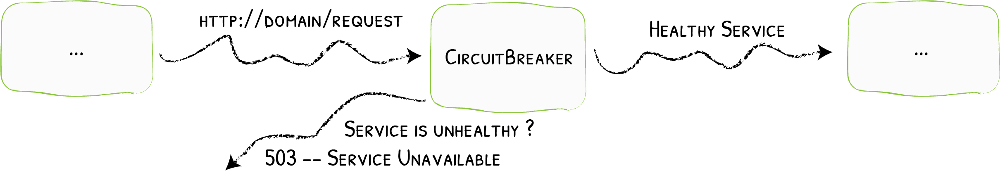

The HTTP circuit breaker prevents stacking requests to unhealthy Services, resulting in cascading failures.

When your system is healthy, the circuit is closed (normal operations).
When your system becomes unhealthy, the circuit opens, and the requests are no longer forwarded, but instead are handled by a fallback mechanism.

To assess if your system is healthy, the circuit breaker constantly monitors the services.

The circuit breaker only analyzes what happens *after* its position within the middleware chain. What happens *before* has no impact on its state.

Each router gets its own instance of a given circuit breaker.
One circuit breaker instance can be open while the other remains closed: their state is not shared.

This is the expected behavior, we want you to be able to define what makes a service healthy without having to declare a circuit breaker for each route.

## Configuration Examples

```yaml tab="Structured (YAML)"
# Latency Check
http:
  middlewares:
    latency-check:
      circuitBreaker:
        expression: "LatencyAtQuantileMS(50.0) > 100"
```

```toml tab="Structured (TOML)"
# Latency Check
[http.middlewares]
  [http.middlewares.latency-check.circuitBreaker]
    expression = "LatencyAtQuantileMS(50.0) > 100"
```

```yaml tab="Labels"
# Latency Check
labels:
  - "traefik.http.middlewares.latency-check.circuitbreaker.expression=LatencyAtQuantileMS(50.0) > 100"
```

```json tab="Tags"
{
  //..
  "Tags" : [
    "traefik.http.middlewares.latency-check.circuitbreaker.expression=LatencyAtQuantileMS(50.0) > 100"
  ]
}
```

```yaml tab="Kubernetes"
# Latency Check
apiVersion: traefik.io/v1alpha1
kind: Middleware
metadata:
  name: latency-check
spec:
  circuitBreaker:
    expression: LatencyAtQuantileMS(50.0) > 100
```

## Configuration Options

| Field | Description | Default | Required |
|:------|:------------|:--------|:---------|
| `expression` | Condition to open the circuit breaker and applies the fallback mechanism instead of calling your services.<br />More information [here](#expression) | 100ms | No |
| `checkPeriod` | The interval between successive checks of the circuit breaker condition (when in standby state). | 100ms | No |
| `fallbackDuration` | The duration for which the circuit breaker will wait before trying to recover (from a tripped state). | 10s | No |
| `recoveryDuration` | The duration for which the circuit breaker will try to recover (as soon as it is in recovering state). | 10s | No |
| `responseCode` | The status code that the circuit breaker will return while it is in the open state. | 503 | No |

### expression

The `expression` option can check three different metrics:

| Metrics | Description | Example |
|:------|:------------|:--------|
| `NetworkErrorRatio`   | The network error ratio to open the circuit breaker. | `NetworkErrorRatio() > 0.30` opens the circuit breaker at a 30% ratio of network errors |
| `ResponseCodeRatio`   | The status code ratio to open the circuit breaker.<br />More information [below](#responsecoderatio) | `ResponseCodeRatio(500, 600, 0, 600) > 0.25` opens the circuit breaker if 25% of the requests returned a 5XX status (amongst the request that returned a status code from 0 to 5XX)  |
| `LatencyAtQuantileMS` | The latency at a quantile in milliseconds to open the circuit breaker when a given proportion of your requests become too slow.<br /> Only floating point number (with the trailing .0) for the quantile value. | `LatencyAtQuantileMS(50.0) > 100` opens the circuit breaker when the median latency (quantile 50) reaches 100ms. |

#### ResponseCodeRatio

- It accepts four parameters, `from`, `to`, `dividedByFrom`, `dividedByTo`.
- The operation that will be computed is sum(`to` -> `from`) / sum (`dividedByFrom` -> `dividedByTo`). If sum (`dividedByFrom` -> `dividedByTo`) equals 0, then `ResponseCodeRatio` returns 0.
- `from` is inclusive, `to` is exclusive.

#### Using Multiple Metrics

You can combine multiple metrics using operators in your `expression`.

Supported operators are:

- AND (`&&`)
- OR (`||`)

For example, `ResponseCodeRatio(500, 600, 0, 600) > 0.30 || NetworkErrorRatio() > 0.10` triggers the circuit breaker when 30% of the requests return a 5XX status code, or when the ratio of network errors reaches 10%.

#### Operators

Here is the list of supported operators:

- Greater than (`>`)
- Greater or equal than (`>=`)
- Lesser than (`<`)
- Lesser or equal than (`<=`)
- Equal (`==`)
- Not Equal (`!=`)

### Fallback mechanism

By default the fallback mechanism returns a `HTTP 503 Service Unavailable` to the client instead of calling the target service.  
The response code can be configured.

## State

There are three possible states for your circuit breaker:

- `Closed` (your service operates normally).
- `Open` (the fallback mechanism takes over your service).
- `Recovering` (the circuit breaker tries to resume normal operations by progressively sending requests to your service).

### Closed

While the circuit is closed, the circuit breaker only collects metrics to analyze the behavior of the requests.

At specified intervals (`checkPeriod`), the circuit breaker evaluates `expression` to decide if its state must change.

### Open

While open, the fallback mechanism takes over the normal service calls for a duration of `FallbackDuration`.
The fallback mechanism returns a `HTTP 503` (or `ResponseCode`) to the client.
After this duration, it enters the recovering state.

### Recovering

While recovering, the circuit breaker sends linearly increasing amounts of requests to your service (for `RecoveryDuration`).
If your service fails during recovery, the circuit breaker opens again.
If the service operates normally during the entire recovery duration, then the circuit breaker closes.
