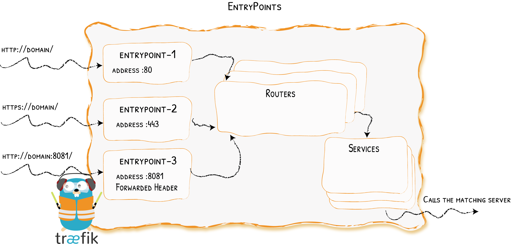

# EntryPoints

Opening Connections for Incoming Requests
{: .subtitle }



EntryPoints are the network entry points into Traefik.
They define the port which will receive the packets,
and whether to listen for TCP or UDP.

## Configuration Examples

??? example "Port 80 only"

    ```yaml tab="File (YAML)"
    ## Static configuration
    entryPoints:
      web:
       address: ":80"
    ```

    ```toml tab="File (TOML)"
    ## Static configuration
    [entryPoints]
      [entryPoints.web]
        address = ":80"
    ```

    ```bash tab="CLI"
    ## Static configuration
    --entryPoints.web.address=:80
    ```

    We define an `entrypoint` called `web` that will listen on port `80`.

??? example "Port 80 & 443"

    ```yaml tab="File (YAML)"
    ## Static configuration
    entryPoints:
      web:
        address: ":80"

      websecure:
        address: ":443"
    ```

    ```toml tab="File (TOML)"
    ## Static configuration
    [entryPoints]
      [entryPoints.web]
        address = ":80"

      [entryPoints.websecure]
        address = ":443"
    ```

    ```bash tab="CLI"
    ## Static configuration
    --entryPoints.web.address=:80
    --entryPoints.websecure.address=:443
    ```

    - Two entrypoints are defined: one called `web`, and the other called `websecure`.
    - `web` listens on port `80`, and `websecure` on port `443`.

??? example "UDP on port 1704"

    ```yaml tab="File (YAML)"
    ## Static configuration
    entryPoints:
      streaming:
        address: ":1704/udp"
    ```

    ```toml tab="File (TOML)"
    ## Static configuration
    [entryPoints]
      [entryPoints.streaming]
        address = ":1704/udp"
    ```

    ```bash tab="CLI"
    ## Static configuration
    --entryPoints.streaming.address=:1704/udp
    ```

## Configuration

### General

EntryPoints are part of the [static configuration](../getting-started/configuration-overview.md#the-static-configuration).
They can be defined by using a file (YAML or TOML) or CLI arguments.

??? info "See the complete reference for the list of available options"

    ```yaml tab="File (YAML)"
    ## Static configuration
    entryPoints:
      name:
        address: ":8888" # same as ":8888/tcp"
        http2:
          maxConcurrentStreams: 42
        http3:
          advertisedPort: 8888
        transport:
          lifeCycle:
            requestAcceptGraceTimeout: 42
            graceTimeOut: 42
          respondingTimeouts:
            readTimeout: 42
            writeTimeout: 42
            idleTimeout: 42
        proxyProtocol:
          insecure: true
          trustedIPs:
            - "127.0.0.1"
            - "192.168.0.1"
        forwardedHeaders:
          insecure: true
          trustedIPs:
            - "127.0.0.1"
            - "192.168.0.1"
    ```

    ```toml tab="File (TOML)"
    ## Static configuration
    [entryPoints]
      [entryPoints.name]
        address = ":8888" # same as ":8888/tcp"
        [entryPoints.name.http2]
          maxConcurrentStreams = 42
        [entryPoints.name.http3]
          advertisedPort = 8888
        [entryPoints.name.transport]
          [entryPoints.name.transport.lifeCycle]
            requestAcceptGraceTimeout = 42
            graceTimeOut = 42
          [entryPoints.name.transport.respondingTimeouts]
            readTimeout = 42
            writeTimeout = 42
            idleTimeout = 42
        [entryPoints.name.proxyProtocol]
          insecure = true
          trustedIPs = ["127.0.0.1", "192.168.0.1"]
        [entryPoints.name.forwardedHeaders]
          insecure = true
          trustedIPs = ["127.0.0.1", "192.168.0.1"]
    ```

    ```bash tab="CLI"
    ## Static configuration
    --entryPoints.name.address=:8888 # same as :8888/tcp
    --entryPoints.name.http2.maxConcurrentStreams=42
    --entryPoints.name.http3.advertisedport=8888
    --entryPoints.name.transport.lifeCycle.requestAcceptGraceTimeout=42
    --entryPoints.name.transport.lifeCycle.graceTimeOut=42
    --entryPoints.name.transport.respondingTimeouts.readTimeout=42
    --entryPoints.name.transport.respondingTimeouts.writeTimeout=42
    --entryPoints.name.transport.respondingTimeouts.idleTimeout=42
    --entryPoints.name.proxyProtocol.insecure=true
    --entryPoints.name.proxyProtocol.trustedIPs=127.0.0.1,192.168.0.1
    --entryPoints.name.forwardedHeaders.insecure=true
    --entryPoints.name.forwardedHeaders.trustedIPs=127.0.0.1,192.168.0.1
    ```

### Address

The address defines the port, and optionally the hostname, on which to listen for incoming connections and packets.
It also defines the protocol to use (TCP or UDP).
If no protocol is specified, the default is TCP.
The format is:

```bash
[host]:port[/tcp|/udp]
```

If both TCP and UDP are wanted for the same port, two entryPoints definitions are needed, such as in the example below.

??? example "Both TCP and UDP on Port 3179"

    ```yaml tab="File (YAML)"
    ## Static configuration
    entryPoints:
      tcpep:
       address: ":3179"
      udpep:
       address: ":3179/udp"
    ```

    ```toml tab="File (TOML)"
    ## Static configuration
    [entryPoints]
      [entryPoints.tcpep]
        address = ":3179"
      [entryPoints.udpep]
        address = ":3179/udp"
    ```

    ```bash tab="CLI"
    ## Static configuration
    --entryPoints.tcpep.address=:3179
    --entryPoints.udpep.address=:3179/udp
    ```

??? example "Listen on Specific IP Addresses Only"

    ```yaml tab="File (yaml)"
    entryPoints:
      specificIPv4:
        address: "192.168.2.7:8888"
      specificIPv6:
        address: "[2001:db8::1]:8888"
    ```

    ```toml tab="File (TOML)"
    [entryPoints.specificIPv4]
      address = "192.168.2.7:8888"
    [entryPoints.specificIPv6]
      address = "[2001:db8::1]:8888"
    ```

    ```bash tab="CLI"
    --entryPoints.specificIPv4.address=192.168.2.7:8888
    --entryPoints.specificIPv6.address=[2001:db8::1]:8888
    ```

    Full details for how to specify `address` can be found in [net.Listen](https://golang.org/pkg/net/#Listen) (and [net.Dial](https://golang.org/pkg/net/#Dial)) of the doc for go.

### AllowACMEByPass

_Optional, Default=false_

`allowACMEByPass` determines whether a user defined router can handle ACME TLS or HTTP challenges instead of the Traefik dedicated one.
This option can be used when a Traefik instance has one or more certificate resolvers configured,
but is also used to route challenges connections/requests to services that could also initiate their own ACME challenges.

??? info "No Certificate Resolvers configured"

    It is not necessary to use the `allowACMEByPass' option certificate option if no certificate resolver is defined.
    In fact, Traefik will automatically allow ACME TLS or HTTP requests to be handled by custom routers in this case, since there can be no concurrency with its own challenge handlers.

```yaml tab="File (YAML)"
entryPoints:
  foo:
    allowACMEByPass: true
```

```toml tab="File (TOML)"
[entryPoints.foo]
  allowACMEByPass = true
```

```bash tab="CLI"
--entryPoints.name.allowACMEByPass=true
```

### ReusePort

_Optional, Default=false_

The `ReusePort` option enables EntryPoints from the same or different processes
listening on the same TCP/UDP port by utilizing the `SO_REUSEPORT` socket option.
It also allows the kernel to act like a load balancer to distribute incoming
connections between entry points.

For example, you can use it with the [transport.lifeCycle](#lifecycle) to do
canary deployments against Traefik itself. Like upgrading Traefik version or
reloading the static configuration without any service downtime.

!!! warning "Supported platforms"

    The `ReusePort` option currently works only on Linux, FreeBSD, OpenBSD and Darwin.
    It will be ignored on other platforms.

    There is a known bug in the Linux kernel that may cause unintended TCP connection failures when using the `ReusePort` option.
    For more details, see https://lwn.net/Articles/853637/.

??? example "Listen on the same port"

    ```yaml tab="File (yaml)"
    entryPoints:
      web:
        address: ":80"
        reusePort: true
    ```

    ```toml tab="File (TOML)"
    [entryPoints.web]
      address = ":80"
      reusePort = true
    ```

    ```bash tab="CLI"
    --entryPoints.web.address=:80
    --entryPoints.web.reusePort=true
    ```

    Now it is possible to run multiple Traefik processes with the same EntryPoint configuration.

??? example "Listen on the same port but bind to a different host"

    ```yaml tab="File (yaml)"
    entryPoints:
      web:
        address: ":80"
        reusePort: true
      privateWeb:
        address: "192.168.1.2:80"
        reusePort: true
    ```

    ```toml tab="File (TOML)"
    [entryPoints.web]
      address = ":80"
      reusePort = true
    [entryPoints.privateWeb]
      address = "192.168.1.2:80"
      reusePort = true
    ```

    ```bash tab="CLI"
    --entryPoints.web.address=:80
    --entryPoints.web.reusePort=true
    --entryPoints.privateWeb.address=192.168.1.2:80
    --entryPoints.privateWeb.reusePort=true
    ```

    Requests to `192.168.1.2:80` will only be handled by routers that have `privateWeb` as the entry point.

### AsDefault

_Optional, Default=false_

The `AsDefault` option marks the EntryPoint to be in the list of default EntryPoints.
EntryPoints in this list are used (by default) on HTTP and TCP routers that do not define their own [EntryPoints option](./routers/index.md#entrypoints).

!!! info "List of default EntryPoints"

    If there is no EntryPoint with the `AsDefault` option set to `true`, 
    then the list of default EntryPoints includes all HTTP/TCP EntryPoints.

    If at least one EntryPoint has the `AsDefault` option set to `true`,
    then the list of default EntryPoints includes only EntryPoints that have the `AsDefault` option set to `true`.

    Some built-in EntryPoints are always excluded from the list, namely: `traefik`.

!!! warning "Only TCP and HTTP"

    The `AsDefault` option has no effect on UDP EntryPoints.
    When a UDP router does not define the [EntryPoints option](./routers/index.md#entrypoints_2),
    it is attached to all available UDP EntryPoints.

??? example "Defining only one EntryPoint as default"

    ```yaml tab="File (yaml)"
    entryPoints:
      web:
        address: ":80"
      websecure:
        address: ":443"
        asDefault: true
    ```

    ```toml tab="File (TOML)"
    [entryPoints.web]
      address = ":80"
    [entryPoints.websecure]
      address = ":443"
      asDefault = true
    ```

    ```bash tab="CLI"
    --entryPoints.web.address=:80
    --entryPoints.websecure.address=:443
    --entryPoints.websecure.asDefault=true
    ```

### HTTP/2

#### `maxConcurrentStreams`

_Optional, Default=250_

`maxConcurrentStreams` specifies the number of concurrent streams per connection that each client is allowed to initiate.
The `maxConcurrentStreams` value must be greater than zero.

```yaml tab="File (YAML)"
entryPoints:
  foo:
    http2:
      maxConcurrentStreams: 250
```

```toml tab="File (TOML)"
[entryPoints.foo]
  [entryPoints.foo.http2]
    maxConcurrentStreams = 250
```

```bash tab="CLI"
--entryPoints.name.http2.maxConcurrentStreams=250
```

### HTTP/3

#### `http3`

`http3` enables HTTP/3 protocol on the entryPoint.
HTTP/3 requires a TCP entryPoint,
as HTTP/3 always starts as a TCP connection that then gets upgraded to UDP.
In most scenarios,
this entryPoint is the same as the one used for TLS traffic.

```yaml tab="File (YAML)"
entryPoints:
  name:
    http3: {}
```

```toml tab="File (TOML)"
[entryPoints.name.http3]
```

```bash tab="CLI"
--entryPoints.name.http3
```

??? info "HTTP/3 uses UDP+TLS"

    As HTTP/3 actually uses UDP, when traefik is configured with a TCP entryPoint on port N with HTTP/3 enabled,
    the underlying HTTP/3 server that is started automatically listens on UDP port N too. As a consequence,
    it means port N cannot be used by another UDP entryPoint.
    Since HTTP/3 requires the use of TLS,
    only routers with TLS enabled will be usable with HTTP/3.

#### `advertisedPort`

`http3.advertisedPort` defines which UDP port to advertise as the HTTP/3 authority.
It defaults to the entryPoint's address port.
It can be used to override the authority in the `alt-svc` header, for example if the public facing port is different from where Traefik is listening.

!!! info "http3.advertisedPort"

    ```yaml tab="File (YAML)"
    entryPoints:
      name:
        http3:
          advertisedPort: 443
    ```

    ```toml tab="File (TOML)"
    [entryPoints.name.http3]
      advertisedPort = 443
    ```
    
    ```bash tab="CLI"
    --entryPoints.name.http3.advertisedport=443
    ```

### Forwarded Headers

You can configure Traefik to trust the forwarded headers information (`X-Forwarded-*`).

??? info "`forwardedHeaders.trustedIPs`"

    Trusting Forwarded Headers from specific IPs.

    ```yaml tab="File (YAML)"
    ## Static configuration
    entryPoints:
      web:
        address: ":80"
        forwardedHeaders:
          trustedIPs:
            - "127.0.0.1/32"
            - "192.168.1.7"
    ```

    ```toml tab="File (TOML)"
    ## Static configuration
    [entryPoints]
      [entryPoints.web]
        address = ":80"

        [entryPoints.web.forwardedHeaders]
          trustedIPs = ["127.0.0.1/32", "192.168.1.7"]
    ```

    ```bash tab="CLI"
    ## Static configuration
    --entryPoints.web.address=:80
    --entryPoints.web.forwardedHeaders.trustedIPs=127.0.0.1/32,192.168.1.7
    ```

??? info "`forwardedHeaders.insecure`"

    Insecure Mode (Always Trusting Forwarded Headers).

    ```yaml tab="File (YAML)"
    ## Static configuration
    entryPoints:
      web:
        address: ":80"
        forwardedHeaders:
          insecure: true
    ```

    ```toml tab="File (TOML)"
    ## Static configuration
    [entryPoints]
      [entryPoints.web]
        address = ":80"

        [entryPoints.web.forwardedHeaders]
          insecure = true
    ```

    ```bash tab="CLI"
    ## Static configuration
    --entryPoints.web.address=:80
    --entryPoints.web.forwardedHeaders.insecure
    ```

??? info "`forwardedHeaders.connection`"
    
    As per RFC7230, Traefik respects the Connection options from the client request.
    By doing so, it removes any header field(s) listed in the request Connection header and the Connection header field itself when empty.
    The removal happens as soon as the request is handled by Traefik,
    thus the removed headers are not available when the request passes through the middleware chain.
    The `connection` option lists the Connection headers allowed to passthrough the middleware chain before their removal.

    ```yaml tab="File (YAML)"
    ## Static configuration
    entryPoints:
      web:
        address: ":80"
        forwardedHeaders:
          connection:
            - foobar
    ```

    ```toml tab="File (TOML)"
    ## Static configuration
    [entryPoints]
      [entryPoints.web]
        address = ":80"

        [entryPoints.web.forwardedHeaders]
          connection = ["foobar"]
    ```

    ```bash tab="CLI"
    ## Static configuration
    --entryPoints.web.address=:80
    --entryPoints.web.forwardedHeaders.connection=foobar
    ```

### Transport

#### `respondingTimeouts`

`respondingTimeouts` are timeouts for incoming requests to the Traefik instance.
Setting them has no effect for UDP entryPoints.

??? info "`transport.respondingTimeouts.readTimeout`"

    _Optional, Default=60s_

    `readTimeout` is the maximum duration for reading the entire request, including the body.

    If zero, no timeout exists.  
    Can be provided in a format supported by [time.ParseDuration](https://golang.org/pkg/time/#ParseDuration) or as raw values (digits).
    If no units are provided, the value is parsed assuming seconds.
    We strongly suggest adapting this value accordingly to your needs.

    ```yaml tab="File (YAML)"
    ## Static configuration
    entryPoints:
      name:
        address: ":8888"
        transport:
          respondingTimeouts:
            readTimeout: 42
    ```

    ```toml tab="File (TOML)"
    ## Static configuration
    [entryPoints]
      [entryPoints.name]
        address = ":8888"
        [entryPoints.name.transport]
          [entryPoints.name.transport.respondingTimeouts]
            readTimeout = 42
    ```

    ```bash tab="CLI"
    ## Static configuration
    --entryPoints.name.address=:8888
    --entryPoints.name.transport.respondingTimeouts.readTimeout=42
    ```

??? info "`transport.respondingTimeouts.writeTimeout`"

    _Optional, Default=0s_

    `writeTimeout` is the maximum duration before timing out writes of the response.

    It covers the time from the end of the request header read to the end of the response write.
    If zero, no timeout exists.  
    Can be provided in a format supported by [time.ParseDuration](https://golang.org/pkg/time/#ParseDuration) or as raw values (digits).
    If no units are provided, the value is parsed assuming seconds.

    ```yaml tab="File (YAML)"
    ## Static configuration
    entryPoints:
      name:
        address: ":8888"
        transport:
          respondingTimeouts:
            writeTimeout: 42
    ```

    ```toml tab="File (TOML)"
    ## Static configuration
    [entryPoints]
      [entryPoints.name]
        address = ":8888"
        [entryPoints.name.transport]
          [entryPoints.name.transport.respondingTimeouts]
            writeTimeout = 42
    ```

    ```bash tab="CLI"
    ## Static configuration
    --entryPoints.name.address=:8888
    --entryPoints.name.transport.respondingTimeouts.writeTimeout=42
    ```

??? info "`transport.respondingTimeouts.idleTimeout`"

    _Optional, Default=180s_

    `idleTimeout` is the maximum duration an idle (keep-alive) connection will remain idle before closing itself.

    If zero, no timeout exists.  
    Can be provided in a format supported by [time.ParseDuration](https://golang.org/pkg/time/#ParseDuration) or as raw values (digits).
    If no units are provided, the value is parsed assuming seconds.

    ```yaml tab="File (YAML)"
    ## Static configuration
    entryPoints:
      name:
        address: ":8888"
        transport:
          respondingTimeouts:
            idleTimeout: 42
    ```

    ```toml tab="File (TOML)"
    ## Static configuration
    [entryPoints]
      [entryPoints.name]
        address = ":8888"
        [entryPoints.name.transport]
          [entryPoints.name.transport.respondingTimeouts]
            idleTimeout = 42
    ```

    ```bash tab="CLI"
    ## Static configuration
    --entryPoints.name.address=:8888
    --entryPoints.name.transport.respondingTimeouts.idleTimeout=42
    ```

#### `lifeCycle`

Controls the behavior of Traefik during the shutdown phase.

??? info "`lifeCycle.requestAcceptGraceTimeout`"

    _Optional, Default=0s_

    Duration to keep accepting requests prior to initiating the graceful termination period (as defined by the `graceTimeOut` option).
    This option is meant to give downstream load-balancers sufficient time to take Traefik out of rotation.

    Can be provided in a format supported by [time.ParseDuration](https://golang.org/pkg/time/#ParseDuration) or as raw values (digits).

    If no units are provided, the value is parsed assuming seconds.
    The zero duration disables the request accepting grace period, i.e., Traefik will immediately proceed to the grace period.

    ```yaml tab="File (YAML)"
    ## Static configuration
    entryPoints:
      name:
        address: ":8888"
        transport:
          lifeCycle:
            requestAcceptGraceTimeout: 42
    ```

    ```toml tab="File (TOML)"
    ## Static configuration
    [entryPoints]
      [entryPoints.name]
        address = ":8888"
        [entryPoints.name.transport]
          [entryPoints.name.transport.lifeCycle]
            requestAcceptGraceTimeout = 42
    ```

    ```bash tab="CLI"
    ## Static configuration
    --entryPoints.name.address=:8888
    --entryPoints.name.transport.lifeCycle.requestAcceptGraceTimeout=42
    ```

??? info "`lifeCycle.graceTimeOut`"

    _Optional, Default=10s_

    Duration to give active requests a chance to finish before Traefik stops.

    Can be provided in a format supported by [time.ParseDuration](https://golang.org/pkg/time/#ParseDuration) or as raw values (digits).

    If no units are provided, the value is parsed assuming seconds.

    !!! warning "In this time frame no new requests are accepted."

    ```yaml tab="File (YAML)"
    ## Static configuration
    entryPoints:
      name:
        address: ":8888"
        transport:
          lifeCycle:
            graceTimeOut: 42
    ```

    ```toml tab="File (TOML)"
    ## Static configuration
    [entryPoints]
      [entryPoints.name]
        address = ":8888"
        [entryPoints.name.transport]
          [entryPoints.name.transport.lifeCycle]
            graceTimeOut = 42
    ```

    ```bash tab="CLI"
    ## Static configuration
    --entryPoints.name.address=:8888
    --entryPoints.name.transport.lifeCycle.graceTimeOut=42
    ```

#### `keepAliveMaxRequests`

_Optional, Default=0_

The maximum number of requests Traefik can handle before sending a `Connection: Close` header to the client (for HTTP2, Traefik sends a GOAWAY). Zero means no limit.

```yaml tab="File (YAML)"
## Static configuration
entryPoints:
  name:
    address: ":8888"
    transport:
      keepAliveMaxRequests: 42
```

```toml tab="File (TOML)"
## Static configuration
[entryPoints]
  [entryPoints.name]
    address = ":8888"
    [entryPoints.name.transport]
      keepAliveMaxRequests = 42
```

```bash tab="CLI"
## Static configuration
--entryPoints.name.address=:8888
--entryPoints.name.transport.keepAliveMaxRequests=42
```

#### `keepAliveMaxTime`

_Optional, Default=0s_

The maximum duration Traefik can handle requests before sending a `Connection: Close` header to the client (for HTTP2, Traefik sends a GOAWAY). Zero means no limit.

```yaml tab="File (YAML)"
## Static configuration
entryPoints:
  name:
    address: ":8888"
    transport:
      keepAliveMaxTime: 42s
```

```toml tab="File (TOML)"
## Static configuration
[entryPoints]
  [entryPoints.name]
    address = ":8888"
    [entryPoints.name.transport]
      keepAliveMaxTime = "42s"
```

```bash tab="CLI"
## Static configuration
--entryPoints.name.address=:8888
--entryPoints.name.transport.keepAliveMaxTime=42s
```

### ProxyProtocol

Traefik supports [PROXY protocol](https://www.haproxy.org/download/2.0/doc/proxy-protocol.txt) version 1 and 2.

If PROXY protocol header parsing is enabled for the entry point, this entry point can accept connections with or without PROXY protocol headers.

If the PROXY protocol header is passed, then the version is determined automatically.

??? info "`proxyProtocol.trustedIPs`"

    Enabling PROXY protocol with Trusted IPs.

    ```yaml tab="File (YAML)"
    ## Static configuration
    entryPoints:
      web:
        address: ":80"
        proxyProtocol:
          trustedIPs:
            - "127.0.0.1/32"
            - "192.168.1.7"
    ```

    ```toml tab="File (TOML)"
    ## Static configuration
    [entryPoints]
      [entryPoints.web]
        address = ":80"

        [entryPoints.web.proxyProtocol]
          trustedIPs = ["127.0.0.1/32", "192.168.1.7"]
    ```

    ```bash tab="CLI"
    --entryPoints.web.address=:80
    --entryPoints.web.proxyProtocol.trustedIPs=127.0.0.1/32,192.168.1.7
    ```

    IPs in `trustedIPs` only will lead to remote client address replacement: Declare load-balancer IPs or CIDR range here.

??? info "`proxyProtocol.insecure`"

    Insecure Mode (Testing Environment Only).

    In a test environments, you can configure Traefik to trust every incoming connection.
    Doing so, every remote client address will be replaced (`trustedIPs` won't have any effect)

    ```yaml tab="File (YAML)"
    ## Static configuration
    entryPoints:
      web:
        address: ":80"
        proxyProtocol:
          insecure: true
    ```

    ```toml tab="File (TOML)"
    ## Static configuration
    [entryPoints]
      [entryPoints.web]
        address = ":80"

        [entryPoints.web.proxyProtocol]
          insecure = true
    ```

    ```bash tab="CLI"
    --entryPoints.web.address=:80
    --entryPoints.web.proxyProtocol.insecure
    ```

!!! warning "Queuing Traefik behind Another Load Balancer"

    When queuing Traefik behind another load-balancer, make sure to configure PROXY protocol on both sides.
    Not doing so could introduce a security risk in your system (enabling request forgery).

## HTTP Options

This whole section is dedicated to options, keyed by entry point, that will apply only to HTTP routing.

### Redirection

??? example "HTTPS redirection (80 to 443)"

    ```yaml tab="File (YAML)"
    entryPoints:
      web:
        address: :80
        http:
          redirections:
            entryPoint:
              to: websecure
              scheme: https

      websecure:
        address: :443
    ```

    ```toml tab="File (TOML)"
    [entryPoints.web]
      address = ":80"

      [entryPoints.web.http]
        [entryPoints.web.http.redirections]
          [entryPoints.web.http.redirections.entryPoint]
            to = "websecure"
            scheme = "https"

    [entryPoints.websecure]
      address = ":443"
    ```

    ```bash tab="CLI"
    --entryPoints.web.address=:80
    --entryPoints.web.http.redirections.entryPoint.to=websecure
    --entryPoints.web.http.redirections.entryPoint.scheme=https
    --entryPoints.websecure.address=:443
    ```

#### `entryPoint`

This section is a convenience to enable (permanent) redirecting of all incoming requests on an entry point (e.g. port `80`) to another entry point (e.g. port `443`) or an explicit port (`:443`).

??? info "`entryPoint.to`"

    _Required_

    The target element, it can be:

      - an entry point name (ex: `websecure`)
      - a port (`:443`)

    ```yaml tab="File (YAML)"
    entryPoints:
      foo:
        # ...
        http:
          redirections:
            entryPoint:
              to: websecure
    ```

    ```toml tab="File (TOML)"
    [entryPoints.foo]
      # ...
      [entryPoints.foo.http.redirections]
        [entryPoints.foo.http.redirections.entryPoint]
          to = "websecure"
    ```

    ```bash tab="CLI"
    --entryPoints.foo.http.redirections.entryPoint.to=websecure
    ```

??? info "`entryPoint.scheme`"

    _Optional, Default="https"_

    The redirection target scheme.

    ```yaml tab="File (YAML)"
    entryPoints:
      foo:
        # ...
        http:
          redirections:
            entryPoint:
              # ...
              scheme: https
    ```

    ```toml tab="File (TOML)"
    [entryPoints.foo]
      # ...
      [entryPoints.foo.http.redirections]
        [entryPoints.foo.http.redirections.entryPoint]
          # ...
          scheme = "https"
    ```

    ```bash tab="CLI"
    --entryPoints.foo.http.redirections.entryPoint.scheme=https
    ```

??? info "`entryPoint.permanent`"

    _Optional, Default=true_

    To apply a permanent redirection.

    ```yaml tab="File (YAML)"
    entryPoints:
      foo:
        # ...
        http:
          redirections:
            entryPoint:
              # ...
              permanent: true
    ```

    ```toml tab="File (TOML)"
    [entryPoints.foo]
      # ...
      [entryPoints.foo.http.redirections]
        [entryPoints.foo.http.redirections.entryPoint]
          # ...
          permanent = true
    ```

    ```bash tab="CLI"
    --entryPoints.foo.http.redirections.entrypoint.permanent=true
    ```

??? info "`entryPoint.priority`"

    _Optional, Default=MaxInt-1_

    Priority of the generated router.

    ```yaml tab="File (YAML)"
    entryPoints:
      foo:
        # ...
        http:
          redirections:
            entryPoint:
              # ...
              priority: 10
    ```

    ```toml tab="File (TOML)"
    [entryPoints.foo]
      # ...
      [entryPoints.foo.http.redirections]
        [entryPoints.foo.http.redirections.entryPoint]
          # ...
          priority = 10
    ```

    ```bash tab="CLI"
    --entryPoints.foo.http.redirections.entrypoint.priority=10
    ```

### EncodeQuerySemicolons

_Optional, Default=false_

The `encodeQuerySemicolons` option allows to enable query semicolons encoding.
One could use this option to avoid non-encoded semicolons to be interpreted as query parameter separators by Traefik.
When using this option, the non-encoded semicolons characters in query will be transmitted encoded to the backend.

```yaml tab="File (YAML)"
entryPoints:
  websecure:
    address: ':443'
    http:
      encodeQuerySemicolons: true
```

```toml tab="File (TOML)"
[entryPoints.websecure]
  address = ":443"

  [entryPoints.websecure.http]
    encodeQuerySemicolons = true
```

```bash tab="CLI"
--entryPoints.websecure.address=:443
--entryPoints.websecure.http.encodequerysemicolons=true
```

#### Examples

| EncodeQuerySemicolons | Request Query       | Resulting Request Query |
|-----------------------|---------------------|-------------------------|
| false                 | foo=bar;baz=bar     | foo=bar&baz=bar         |
| true                  | foo=bar;baz=bar     | foo=bar%3Bbaz=bar       |
| false                 | foo=bar&baz=bar;foo | foo=bar&baz=bar&foo     |
| true                  | foo=bar&baz=bar;foo | foo=bar&baz=bar%3Bfoo   |

### SanitizePath

_Optional, Default=true_

The `sanitizePath` option defines whether to enable the request path sanitization.
When disabled, the incoming request path is passed to the backend as is.
This can be useful when dealing with legacy clients that are not url-encoding data in the request path.
For example, as base64 uses the “/” character internally,
if it's not url encoded,
it can lead to unsafe routing when the `sanitizePath` option is set to `false`.

!!! warning "Security"

    Setting the sanitizePath option to false is not safe.
    Ensure every request is properly url encoded instead.

```yaml tab="File (YAML)"
entryPoints:
  websecure:
    address: ':443'
    http:
      sanitizePath: false
```

```toml tab="File (TOML)"
[entryPoints.websecure]
  address = ":443"

  [entryPoints.websecure.http]
    sanitizePath = false
```

```bash tab="CLI"
--entryPoints.websecure.address=:443
--entryPoints.websecure.http.sanitizePath=false
```

#### Examples

| SanitizePath | Request Path    | Resulting Request Path |
|--------------|-----------------|------------------------|
| false        | /./foo/bar      | /./foo/bar             |
| true         | /./foo/bar      | /foo/bar               |
| false        | /foo/../bar     | /foo/../bar            |
| true         | /foo/../bar     | /bar                   |
| false        | /foo/bar//      | /foo/bar//             |
| true         | /foo/bar//      | /foo/bar/              |
| false        | /./foo/../bar// | /./foo/../bar//        |
| true         | /./foo/../bar// | /bar/                  |

### Middlewares

The list of middlewares that are prepended by default to the list of middlewares of each router associated to the named entry point.

```yaml tab="File (YAML)"
entryPoints:
  websecure:
    address: ':443'
    http:
      middlewares:
        - auth@file
        - strip@file
```

```toml tab="File (TOML)"
[entryPoints.websecure]
  address = ":443"

  [entryPoints.websecure.http]
    middlewares = ["auth@file", "strip@file"]
```

```bash tab="CLI"
--entryPoints.websecure.address=:443
--entryPoints.websecure.http.middlewares=auth@file,strip@file
```

### TLS

This section is about the default TLS configuration applied to all routers associated with the named entry point.

If a TLS section (i.e. any of its fields) is user-defined, then the default configuration does not apply at all.

The TLS section is the same as the [TLS section on HTTP routers](./routers/index.md#tls).

```yaml tab="File (YAML)"
entryPoints:
  websecure:
    address: ':443'
    http:
      tls:
        options: foobar
        certResolver: leresolver
        domains:
          - main: example.com
            sans:
              - foo.example.com
              - bar.example.com
          - main: test.com
            sans:
              - foo.test.com
              - bar.test.com
```

```toml tab="File (TOML)"
[entryPoints.websecure]
  address = ":443"

    [entryPoints.websecure.http.tls]
      options = "foobar"
      certResolver = "leresolver"
      [[entryPoints.websecure.http.tls.domains]]
        main = "example.com"
        sans = ["foo.example.com", "bar.example.com"]
      [[entryPoints.websecure.http.tls.domains]]
        main = "test.com"
        sans = ["foo.test.com", "bar.test.com"]
```

```bash tab="CLI"
--entryPoints.websecure.address=:443
--entryPoints.websecure.http.tls.options=foobar
--entryPoints.websecure.http.tls.certResolver=leresolver
--entryPoints.websecure.http.tls.domains[0].main=example.com
--entryPoints.websecure.http.tls.domains[0].sans=foo.example.com,bar.example.com
--entryPoints.websecure.http.tls.domains[1].main=test.com
--entryPoints.websecure.http.tls.domains[1].sans=foo.test.com,bar.test.com
```

??? example "Let's Encrypt"

    ```yaml tab="File (YAML)"
    entryPoints:
      websecure:
        address: ':443'
        http:
          tls:
            certResolver: leresolver
    ```

    ```toml tab="File (TOML)"
    [entryPoints.websecure]
      address = ":443"

        [entryPoints.websecure.http.tls]
          certResolver = "leresolver"
    ```

    ```bash tab="CLI"
    --entryPoints.websecure.address=:443
    --entryPoints.websecure.http.tls.certResolver=leresolver
    ```

## UDP Options

This whole section is dedicated to options, keyed by entry point, that will apply only to UDP routing.

### Timeout

_Optional, Default=3s_

Timeout defines how long to wait on an idle session before releasing the related resources.
The Timeout value must be greater than zero.

```yaml tab="File (YAML)"
entryPoints:
  foo:
    address: ':8000/udp'
    udp:
      timeout: 10s
```

```toml tab="File (TOML)"
[entryPoints.foo]
  address = ":8000/udp"

    [entryPoints.foo.udp]
      timeout = "10s"
```

```bash tab="CLI"
--entryPoints.foo.address=:8000/udp
--entryPoints.foo.udp.timeout=10s
```

## Systemd Socket Activation

Traefik supports [systemd socket activation](https://www.freedesktop.org/software/systemd/man/latest/systemd-socket-activate.html).

When a socket activation file descriptor name matches an EntryPoint name, the corresponding file descriptor will be used as the TCP/UDP listener for the matching EntryPoint.

```bash
systemd-socket-activate -l 80 -l 443 --fdname web:websecure  ./traefik --entrypoints.web --entrypoints.websecure
```

!!! warning "EntryPoint Address"

    When a socket activation file descriptor name matches an EntryPoint name its address configuration is ignored. For support UDP routing, address must have /udp suffix (--entrypoints.my-udp-entrypoint.address=/udp)

!!! warning "Docker Support"

    Socket activation is not supported by Docker but works with Podman containers.

!!! warning "Multiple listeners in socket file"

    Each systemd socket file must contain only one Listen directive, except in the case of HTTP/3, where the file must include both ListenStream and ListenDatagram directives. To set up TCP and UDP listeners on the same port, use multiple socket files with different entrypoints names.

## Observability Options

This section is dedicated to options to control observability for an EntryPoint.

!!! info "Note that you must first enable access-logs, tracing, and/or metrics."

!!! warning "AddInternals option"

    By default, and for any type of signals (access-logs, metrics and tracing),
    Traefik disables observability for internal resources.
    The observability options described below cannot interfere with the `AddInternals` ones,
    and will be ignored.

    For instance, if a router exposes the `api@internal` service and `metrics.AddInternals` is false,
    it will never produces metrics, even if the EntryPoint observability configuration enables metrics.

### AccessLogs

_Optional, Default=true_

AccessLogs defines whether a router attached to this EntryPoint produces access-logs by default.
Nonetheless, a router defining its own observability configuration will opt-out from this default.

```yaml tab="File (YAML)"
entryPoints:
  foo:
    address: ':8000/udp'
    observability:
      accessLogs: false
```

```toml tab="File (TOML)"
[entryPoints.foo]
  address = ":8000/udp"

    [entryPoints.foo.observability]
      accessLogs = false
```

```bash tab="CLI"
--entryPoints.foo.address=:8000/udp
--entryPoints.foo.observability.accessLogs=false
```

### Metrics

_Optional, Default=true_

Metrics defines whether a router attached to this EntryPoint produces metrics by default.
Nonetheless, a router defining its own observability configuration will opt-out from this default.

```yaml tab="File (YAML)"
entryPoints:
  foo:
    address: ':8000/udp'
    observability:
      metrics: false
```

```toml tab="File (TOML)"
[entryPoints.foo]
  address = ":8000/udp"

    [entryPoints.foo.observability]
      metrics = false
```

```bash tab="CLI"
--entryPoints.foo.address=:8000/udp
--entryPoints.foo.observability.metrics=false
```

### Tracing

_Optional, Default=true_

Tracing defines whether a router attached to this EntryPoint produces traces by default.
Nonetheless, a router defining its own observability configuration will opt-out from this default.

```yaml tab="File (YAML)"
entryPoints:
  foo:
    address: ':8000/udp'
    observability:
      tracing: false
```

```toml tab="File (TOML)"
[entryPoints.foo]
  address = ":8000/udp"

    [entryPoints.foo.observability]
      tracing = false
```

```bash tab="CLI"
--entryPoints.foo.address=:8000/udp
--entryPoints.foo.observability.tracing=false
```

{!traefik-for-business-applications.md!}
