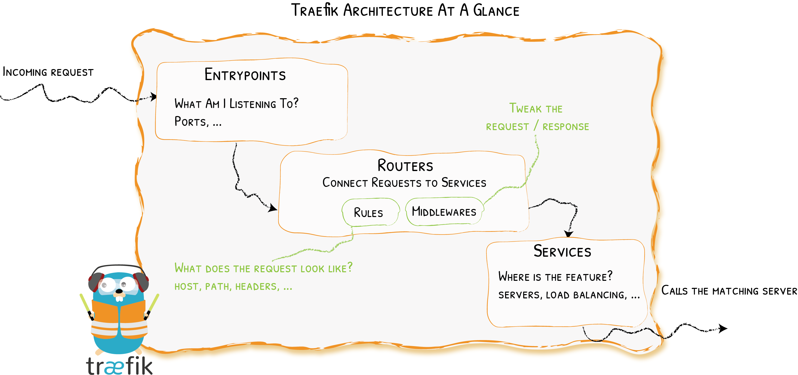

# Overview

What's Happening to the Requests?
{: .subtitle }

Let's zoom in on Traefik's architecture and talk about the components that enable the routes to be created.

First, when you start Traefik, you define [entrypoints](../entrypoints/) (in their most basic forms, they are port numbers).
Then, connected to these entrypoints, [routers](../routers/) analyze the incoming requests to see if they match a set of [rules](../routers/#rule).
If they do, the router might transform the request using pieces of [middleware](../middlewares/overview.md) before forwarding them to your [services](./services/index.md).



## Clear Responsibilities

- [_Providers_](../providers/overview.md) discover the services that live on your infrastructure (their IP, health, ...)
- [_Entrypoints_](./entrypoints.md) listen for incoming traffic (ports, ...)
- [_Routers_](./routers/index.md) analyse the requests (host, path, headers, SSL, ...)
- [_Services_](./services/index.md) forward the request to your services (load balancing, ...)
- [_Middlewares_](../middlewares/overview.md) may update the request or make decisions based on the request (authentication, rate limiting, headers, ...)

## Example with a File Provider

Below is an example of a full configuration file for the [file provider](../providers/file.md) that forwards `http://example.com/whoami/` requests to a service reachable on `http://private/whoami-service/`.
In the process, Traefik will make sure that the user is authenticated (using the [BasicAuth middleware](../middlewares/http/basicauth.md)).

Static configuration:

```yaml tab="File (YAML)"
entryPoints:
  web:
    # Listen on port 8081 for incoming requests
    address: :8081

providers:
  # Enable the file provider to define routers / middlewares / services in file
  file:
    directory: /path/to/dynamic/conf
```

```toml tab="File (TOML)"
[entryPoints]
  [entryPoints.web]
    # Listen on port 8081 for incoming requests
    address = ":8081"

[providers]
  # Enable the file provider to define routers / middlewares / services in file
  [providers.file]
    directory = "/path/to/dynamic/conf"
```

```bash tab="CLI"
# Listen on port 8081 for incoming requests
--entryPoints.web.address=:8081

# Enable the file provider to define routers / middlewares / services in file
--providers.file.directory=/path/to/dynamic/conf
```

Dynamic configuration:

```yaml tab="YAML"
# http routing section
http:
  routers:
    # Define a connection between requests and services
    to-whoami:
      rule: "Host(`example.com`) && PathPrefix(`/whoami/`)"
       # If the rule matches, applies the middleware
      middlewares:
      - test-user
      # If the rule matches, forward to the whoami service (declared below)
      service: whoami

  middlewares:
    # Define an authentication mechanism
    test-user:
      basicAuth:
        users:
        - test:$apr1$H6uskkkW$IgXLP6ewTrSuBkTrqE8wj/

  services:
    # Define how to reach an existing service on our infrastructure
    whoami:
      loadBalancer:
        servers:
        - url: http://private/whoami-service
```

```toml tab="TOML"
# http routing section
[http]
  [http.routers]
     # Define a connection between requests and services
     [http.routers.to-whoami]
      rule = "Host(`example.com`) && PathPrefix(`/whoami/`)"
      # If the rule matches, applies the middleware
      middlewares = ["test-user"]
      # If the rule matches, forward to the whoami service (declared below)
      service = "whoami"

  [http.middlewares]
    # Define an authentication mechanism
    [http.middlewares.test-user.basicAuth]
      users = ["test:$apr1$H6uskkkW$IgXLP6ewTrSuBkTrqE8wj/"]

  [http.services]
    # Define how to reach an existing service on our infrastructure
    [http.services.whoami.loadBalancer]
      [[http.services.whoami.loadBalancer.servers]]
        url = "http://private/whoami-service"
```

!!! info ""

    In this example, we use the [file provider](../providers/file.md).
    Even if it is one of the least magical way of configuring Traefik, it explicitly describes every available notion.

!!! info "HTTP / TCP"

    In this example, we've defined routing rules for http requests only.
    Traefik also supports TCP requests. To add [TCP routers](./routers/index.md) and [TCP services](./services/index.md), declare them in a TCP section like in the following.

    ??? example "Adding a TCP route for TLS requests on whoami-tcp.example.com"

        **Static Configuration**

        ```yaml tab="File (YAML)"
        entryPoints:
          web:
            # Listen on port 8081 for incoming requests
            address: :8081
        providers:
          # Enable the file provider to define routers / middlewares / services in file
          file:
            directory: /path/to/dynamic/conf
        ```

        ```toml tab="File (TOML)"
        [entryPoints]
          [entryPoints.web]
            # Listen on port 8081 for incoming requests
            address = ":8081"

        [providers]
          # Enable the file provider to define routers / middlewares / services in file
          [providers.file]
            directory = "/path/to/dynamic/conf"
        ```

        ```bash tab="CLI"
        # Listen on port 8081 for incoming requests
        --entryPoints.web.address=:8081

        # Enable the file provider to define routers / middlewares / services in file
        --providers.file.directory=/path/to/dynamic/conf
        ```

        **Dynamic Configuration**

        ```yaml tab="YAML"
        # http routing section
        http:

          routers:
            # Define a connection between requests and services
            to-whoami:
              rule: Host(`example.com`) && PathPrefix(`/whoami/`)
              # If the rule matches, applies the middleware
              middlewares:
              - test-user
              # If the rule matches, forward to the whoami service (declared below)
              service: whoami

          middlewares:
            # Define an authentication mechanism
            test-user:
              basicAuth:
                users:
                - test:$apr1$H6uskkkW$IgXLP6ewTrSuBkTrqE8wj/

          services:
            # Define how to reach an existing service on our infrastructure
            whoami:
              loadBalancer:
                servers:
                - url: http://private/whoami-service
        tcp:

          routers:
            to-whoami-tcp:
              service: whoami-tcp
              rule: HostSNI(`whoami-tcp.example.com`)
              tls: {}

          services:
            whoami-tcp:
              loadBalancer:
                servers:
                - address: xx.xx.xx.xx:xx
        ```

        ```toml tab="TOML"
        # http routing section
        [http]
          [http.routers]
            # Define a connection between requests and services
            [http.routers.to-whoami]
              rule = "Host(`example.com`) && PathPrefix(`/whoami/`)"
              # If the rule matches, applies the middleware
              middlewares = ["test-user"]
              # If the rule matches, forward to the whoami service (declared below)
              service = "whoami"

          [http.middlewares]
             # Define an authentication mechanism
             [http.middlewares.test-user.basicAuth]
               users = ["test:$apr1$H6uskkkW$IgXLP6ewTrSuBkTrqE8wj/"]

          [http.services]
             # Define how to reach an existing service on our infrastructure
             [http.services.whoami.loadBalancer]
               [[http.services.whoami.loadBalancer.servers]]
                 url = "http://private/whoami-service"

        [tcp]
          [tcp.routers]
            [tcp.routers.to-whoami-tcp]
              rule = "HostSNI(`whoami-tcp.example.com`)"
              service = "whoami-tcp"
              [tcp.routers.to-whoami-tcp.tls]

          [tcp.services]
            [tcp.services.whoami-tcp.loadBalancer]
              [[tcp.services.whoami-tcp.loadBalancer.servers]]
                address = "xx.xx.xx.xx:xx"
        ```

## Transport configuration

Most of what happens to the connection between the clients and Traefik,
and then between Traefik and the backend servers, is configured through the
[entrypoints](../entrypoints) and the [routers](../routers).

In addition, a few parameters are dedicated to configuring globally
what happens with the connections between Traefik and the backends.
This is done through the [`serversTransport`](#http-servers-transports) and [`tcpServersTransport`](#tcp-servers-transports)
sections of the configuration, which features these options:

### HTTP Servers Transports

#### `insecureSkipVerify`

_Optional, Default=false_

`insecureSkipVerify` disables SSL certificate verification.

```yaml tab="File (YAML)"
## Static configuration
serversTransport:
  insecureSkipVerify: true
```

```toml tab="File (TOML)"
## Static configuration
[serversTransport]
  insecureSkipVerify = true
```

```bash tab="CLI"
## Static configuration
--serversTransport.insecureSkipVerify=true
```

#### `rootCAs`

_Optional_

`rootCAs` is the list of certificates (as file paths, or data bytes)
that will be set as Root Certificate Authorities when using a self-signed TLS certificate.

```yaml tab="File (YAML)"
## Static configuration
serversTransport:
  rootCAs:
    - foo.crt
    - bar.crt
```

```toml tab="File (TOML)"
## Static configuration
[serversTransport]
  rootCAs = ["foo.crt", "bar.crt"]
```

```bash tab="CLI"
## Static configuration
--serversTransport.rootCAs=foo.crt,bar.crt
```

#### `maxIdleConnsPerHost`

_Optional, Default=2_

If non-zero, `maxIdleConnsPerHost` controls the maximum idle (keep-alive) connections to keep per-host.

```yaml tab="File (YAML)"
## Static configuration
serversTransport:
  maxIdleConnsPerHost: 7
```

```toml tab="File (TOML)"
## Static configuration
[serversTransport]
  maxIdleConnsPerHost = 7
```

```bash tab="CLI"
## Static configuration
--serversTransport.maxIdleConnsPerHost=7
```

!!! info "Disable connection reuse"
    
    The default value of `maxIdleConnsPerHost` is 2, and the zero value is the fallback to the default (2).
    If you want to disable connection reuse, set `maxIdleConnsPerHost` to -1.

#### `spiffe`

Please note that [SPIFFE](../https/spiffe.md) must be enabled in the static configuration 
before using it to secure the connection between Traefik and the backends.  

#### `spiffe.ids`

_Optional_

`ids` defines the allowed SPIFFE IDs.
This takes precedence over the SPIFFE TrustDomain.

```yaml tab="File (YAML)"
## Static configuration
serversTransport:
    spiffe:
      ids:
        - spiffe://trust-domain/id1
        - spiffe://trust-domain/id2
```

```toml tab="File (TOML)"
## Static configuration
[serversTransport.spiffe]
  ids = ["spiffe://trust-domain/id1", "spiffe://trust-domain/id2"]
```

```bash tab="CLI"
## Static configuration
--serversTransport.spiffe.ids=spiffe://trust-domain/id1,spiffe://trust-domain/id2
```

#### `spiffe.trustDomain`

_Optional_

`trustDomain` defines the allowed SPIFFE trust domain.

```yaml tab="File (YAML)"
## Static configuration
serversTransport:
  trustDomain: spiffe://trust-domain
```

```toml tab="File (TOML)"
## Static configuration
[serversTransport.spiffe]
  trustDomain = "spiffe://trust-domain"
```

```bash tab="CLI"
## Static configuration
--serversTransport.spiffe.trustDomain=spiffe://trust-domain
```

#### `forwardingTimeouts`

`forwardingTimeouts` is about a number of timeouts relevant to when forwarding requests to the backend servers.

#### `forwardingTimeouts.dialTimeout`

_Optional, Default=30s_

`dialTimeout` is the maximum duration allowed for a connection to a backend server to be established.
Zero means no timeout.

```yaml tab="File (YAML)"
## Static configuration
serversTransport:
  forwardingTimeouts:
    dialTimeout: 1s
```

```toml tab="File (TOML)"
## Static configuration
[serversTransport.forwardingTimeouts]
  dialTimeout = "1s"
```

```bash tab="CLI"
## Static configuration
--serversTransport.forwardingTimeouts.dialTimeout=1s
```

#### `forwardingTimeouts.responseHeaderTimeout`

_Optional, Default=0s_

`responseHeaderTimeout`, if non-zero, specifies the amount of time to wait for a server's response headers
after fully writing the request (including its body, if any).
This time does not include the time to read the response body.
Zero means no timeout.

```yaml tab="File (YAML)"
## Static configuration
serversTransport:
  forwardingTimeouts:
    responseHeaderTimeout: 1s
```

```toml tab="File (TOML)"
## Static configuration
[serversTransport.forwardingTimeouts]
  responseHeaderTimeout = "1s"
```

```bash tab="CLI"
## Static configuration
--serversTransport.forwardingTimeouts.responseHeaderTimeout=1s
```

#### `forwardingTimeouts.idleConnTimeout`

_Optional, Default=90s_

`idleConnTimeout`, is the maximum amount of time an idle (keep-alive) connection
will remain idle before closing itself.
Zero means no limit.

```yaml tab="File (YAML)"
## Static configuration
serversTransport:
  forwardingTimeouts:
    idleConnTimeout: 1s
```

```toml tab="File (TOML)"
## Static configuration
[serversTransport.forwardingTimeouts]
  idleConnTimeout = "1s"
```

```bash tab="CLI"
## Static configuration
--serversTransport.forwardingTimeouts.idleConnTimeout=1s
```

### TCP Servers Transports

#### `dialTimeout`

_Optional, Default="30s"_

`dialTimeout` is the maximum duration allowed for a connection to a backend server to be established.
Zero means no timeout.

```yaml tab="File (YAML)"
## Static configuration
tcpServersTransport:
  dialTimeout: 30s
```

```toml tab="File (TOML)"
## Static configuration
[tcpServersTransport]
  dialTimeout = "30s"
```

```bash tab="CLI"
## Static configuration
--tcpServersTransport.dialTimeout=30s
```

#### `dialKeepAlive`

_Optional, Default="15s"_

`dialKeepAlive` defines the interval between keep-alive probes sent on an active network connection.
If zero, keep-alive probes are sent with a default value (currently 15 seconds), if supported by the protocol and
operating system. Network protocols or operating systems that do not support keep-alives ignore this field. If negative,
keep-alive probes are disabled.

```yaml tab="File (YAML)"
## Static configuration
tcpServersTransport:
  dialKeepAlive: 30s
```

```toml tab="File (TOML)"
## Static configuration
[tcpServersTransport]
  dialKeepAlive = "30s"
```

```bash tab="CLI"
## Static configuration
--tcpServersTransport.dialKeepAlive=30s
```

#### `tls`

`tls` defines the TLS configuration to connect with TCP backends.

_Optional_

An empty `tls` section enables TLS.

```yaml tab="File (YAML)"
## Static configuration
tcpServersTransport:
  tls: {}
```

```toml tab="File (TOML)"
## Static configuration
[tcpServersTransport.tls]
```

```bash tab="CLI"
## Static configuration
--tcpServersTransport.tls=true
```

#### `tls.insecureSkipVerify`

_Optional_

`insecureSkipVerify` disables the server's certificate chain and host name verification.

```yaml tab="File (YAML)"
## Static configuration
tcpServersTransport:
  tls:
    insecureSkipVerify: true
```

```toml tab="File (TOML)"
## Static configuration
[tcpServersTransport.tls]
  insecureSkipVerify = true
```

```bash tab="CLI"
## Static configuration
--tcpServersTransport.tls.insecureSkipVerify=true
```

#### `tls.rootCAs`

_Optional_

`rootCAs` defines the set of Root Certificate Authorities (as file paths, or data bytes)
to use when verifying self-signed TLS server certificates.

```yaml tab="File (YAML)"
## Static configuration
tcpServersTransport:
  tls:
    rootCAs:
      - foo.crt
      - bar.crt
```

```toml tab="File (TOML)"
## Static configuration
[tcpServersTransport.tls]
  rootCAs = ["foo.crt", "bar.crt"]
```

```bash tab="CLI"
## Static configuration
--tcpServersTransport.tls.rootCAs=foo.crt,bar.crt
```

#### `spiffe`

Please note that [SPIFFE](../https/spiffe.md) must be enabled in the static configuration
before using it to secure the connection between Traefik and the backends.

#### `spiffe.ids`

_Optional_

`ids` defines the allowed SPIFFE IDs.
This takes precedence over the SPIFFE TrustDomain.

```yaml tab="File (YAML)"
## Static configuration
tcpServersTransport:
    spiffe:
      ids:
        - spiffe://trust-domain/id1
        - spiffe://trust-domain/id2
```

```toml tab="File (TOML)"
## Static configuration
[tcpServersTransport.spiffe]
  ids = ["spiffe://trust-domain/id1", "spiffe://trust-domain/id2"]
```

```bash tab="CLI"
## Static configuration
--tcpServersTransport.spiffe.ids=spiffe://trust-domain/id1,spiffe://trust-domain/id2
```

#### `spiffe.trustDomain`

_Optional_

`trustDomain` defines the allowed SPIFFE trust domain.

```yaml tab="File (YAML)"
## Static configuration
tcpServersTransport:
  trustDomain: spiffe://trust-domain
```

```toml tab="File (TOML)"
## Static configuration
[tcpServersTransport.spiffe]
  trustDomain = "spiffe://trust-domain"
```

```bash tab="CLI"
## Static configuration
--tcpServersTransport.spiffe.trustDomain=spiffe://trust-domain
```

{!traefik-for-business-applications.md!}
