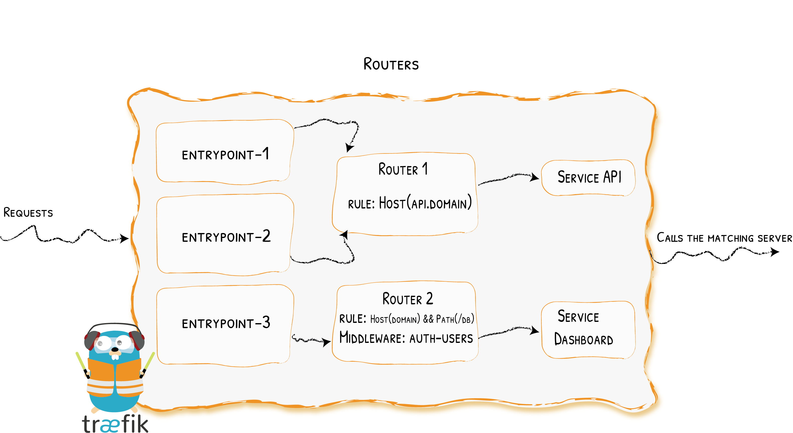

# Routers

Connecting Requests to Services
{: .subtitle }



A router is in charge of connecting incoming requests to the services that can handle them.
In the process, routers may use pieces of [middleware](../../middlewares/overview.md) to update the request,
or act before forwarding the request to the service.

## Configuration Example

??? example "Requests /foo are Handled by service-foo -- Using the [File Provider](../../providers/file.md)"

    ```toml tab="TOML"
    ## Dynamic configuration
    [http.routers]
      [http.routers.my-router]
        rule = "Path(`/foo`)"
        service = "service-foo"
    ```

    ```yaml tab="YAML"
    ## Dynamic configuration
    http:
      routers:
        my-router:
          rule: "Path(`/foo`)"
          service: service-foo
    ```

??? example "Forwarding all (non-tls) requests on port 3306 to a database service"
    
    **Dynamic Configuration**
    
    ```toml tab="File (TOML)"
    ## Dynamic configuration
    [tcp]
      [tcp.routers]
        [tcp.routers.to-database]
          entryPoints = ["mysql"]
          # Catch every request (only available rule for non-tls routers. See below.)
          rule = "HostSNI(`*`)"
          service = "database"
    ```
    
    ```yaml tab="File (YAML)"
    ## Dynamic configuration
    tcp:
      routers:
        to-database:
          entryPoints:
            - "mysql"
          # Catch every request (only available rule for non-tls routers. See below.)
          rule: "HostSNI(`*`)"
          service: database
    ```
    
    **Static Configuration**
    
    ```toml tab="File (TOML)"
    ## Static configuration
    [entryPoints]
      [entryPoints.web]
        address = ":80"
      [entryPoints.mysql]
        address = ":3306"   
    ```
     
    ```yaml tab="File (YAML)"
    ## Static configuration
    entryPoints:
      web:
        address: ":80"
      mysql:
        address: ":3306"   
    ```
    
    ```bash tab="CLI"
    ## Static configuration
    --entryPoints.web.address=:80
    --entryPoints.mysql.address=:3306
    ```

## Configuring HTTP Routers

!!! warning "The character `@` is not authorized in the router name"

### EntryPoints

If not specified, HTTP routers will accept requests from all defined entry points.
If you want to limit the router scope to a set of entry points, set the `entryPoints` option.

??? example "Listens to Every EntryPoint"
    
    **Dynamic Configuration**
    
    ```toml tab="File (TOML)"
    ## Dynamic configuration
    [http.routers]
      [http.routers.Router-1]
        # By default, routers listen to every entry points
        rule = "Host(`example.com`)"
        service = "service-1"
    ```
    
    ```yaml tab="File (YAML)"
    ## Dynamic configuration
    http:
      routers:
        Router-1:
          # By default, routers listen to every entry points
          rule: "Host(`example.com`)"
          service: "service-1"
    ```
    
    **Static Configuration**
    
    ```toml tab="File (TOML)"
    ## Static configuration
    [entryPoints]
      [entryPoints.web]
        address = ":80"
      [entryPoints.websecure]
        address = ":443"
      [entryPoints.other]
        address = ":9090"
    ```
    
    ```yaml tab="File (YAML)"
    ## Static configuration
    entryPoints:
      web:
        address: ":80"
      websecure:
        address: ":443"
      other:
        address: ":9090"
    ```
    
    ```bash tab="CLI"
    ## Static configuration
    --entrypoints.web.address=:80
    --entrypoints.websecure.address=:443
    --entrypoints.other.address=:9090
    ```

??? example "Listens to Specific EntryPoints"
    
    **Dynamic Configuration**
    
    ```toml tab="File (TOML)"
    ## Dynamic configuration
    [http.routers]
      [http.routers.Router-1]
        # won't listen to entry point web
        entryPoints = ["websecure", "other"]
        rule = "Host(`example.com`)"
        service = "service-1"
    ```
    
    ```yaml tab="File (YAML)"
    ## Dynamic configuration
    http:
      routers:
        Router-1:
          # won't listen to entry point web
          entryPoints:
            - "websecure"
            - "other"
          rule: "Host(`example.com`)"
          service: "service-1"
    ```

    **Static Configuration**
    
    ```toml tab="File (TOML)"
    ## Static configuration
    [entryPoints]
      [entryPoints.web]
        address = ":80"
      [entryPoints.websecure]
        address = ":443"
      [entryPoints.other]
        address = ":9090"
    ```
    
    ```yaml tab="File (YAML)"
    ## Static configuration
    entryPoints:
      web:
        address: ":80"
      websecure:
        address: ":443"
      other:
        address: ":9090"
    ```
    
    ```bash tab="CLI"
    ## Static configuration
    --entrypoints.web.address=:80
    --entrypoints.websecure.address=:443
    --entrypoints.other.address=:9090
    ```

### Rule

Rules are a set of matchers configured with values, that determine if a particular request matches specific criteria.
If the rule is verified, the router becomes active, calls middlewares, and then forwards the request to the service.

??? tip "Backticks or Quotes?"
    To set the value of a rule, use [backticks](https://en.wiktionary.org/wiki/backtick) ``` ` ``` or escaped double-quotes `\"`.
    
    Single quotes `'` are not accepted as values are [Golang's String Literals](https://golang.org/ref/spec#String_literals).

!!! example "Host is example.com"

    ```toml
    rule = "Host(`example.com`)"
    ```

!!! example "Host is example.com OR Host is example.org AND path is /traefik"

    ```toml
    rule = "Host(`example.com`) || (Host(`example.org`) && Path(`/traefik`))"
    ```

The table below lists all the available matchers:

| Rule                                                                   | Description                                                                                                    |
|------------------------------------------------------------------------|----------------------------------------------------------------------------------------------------------------|
| ```Headers(`key`, `value`)```                                          | Check if there is a key `key`defined in the headers, with the value `value`                                    |
| ```HeadersRegexp(`key`, `regexp`)```                                   | Check if there is a key `key`defined in the headers, with a value that matches the regular expression `regexp` |
| ```Host(`example.com`, ...)```                                         | Check if the request domain (host header value) targets one of the given `domains`.                            |
| ```HostHeader(`example.com`, ...)```                                   | Check if the request domain (host header value) targets one of the given `domains`.                            |
| ```HostRegexp(`example.com`, `{subdomain:[a-z]+}.example.com`, ...)``` | Check if the request domain matches the given `regexp`.                                                        |
| ```Method(`GET`, ...)```                                               | Check if the request method is one of the given `methods` (`GET`, `POST`, `PUT`, `DELETE`, `PATCH`)            |
| ```Path(`/path`, `/articles/{cat:[a-z]+}/{id:[0-9]+}`, ...)```         | Match exact request path. It accepts a sequence of literal and regular expression paths.                       |
| ```PathPrefix(`/products/`, `/articles/{cat:[a-z]+}/{id:[0-9]+}`)```   | Match request prefix path. It accepts a sequence of literal and regular expression prefix paths.               |
| ```Query(`foo=bar`, `bar=baz`)```                                      | Match Query String parameters. It accepts a sequence of key=value pairs.                                       |

!!! important "Regexp Syntax"

    In order to use regular expressions with `Host` and `Path` expressions,
    you must declare an arbitrarily named variable followed by the colon-separated regular expression, all enclosed in curly braces.
    Any pattern supported by [Go's regexp package](https://golang.org/pkg/regexp/) may be used (example: `/posts/{id:[0-9]+}`).

!!! info "Combining Matchers Using Operators and Parenthesis"

    You can combine multiple matchers using the AND (`&&`) and OR (`||`) operators. You can also use parenthesis.

!!! important "Rule, Middleware, and Services"

    The rule is evaluated "before" any middleware has the opportunity to work, and "before" the request is forwarded to the service.

!!! info "Path Vs PathPrefix"

    Use `Path` if your service listens on the exact path only. For instance, `Path: /products` would match `/products` but not `/products/shoes`.

    Use a `*Prefix*` matcher if your service listens on a particular base path but also serves requests on sub-paths.
    For instance, `PathPrefix: /products` would match `/products` but also `/products/shoes` and `/products/shirts`.
    Since the path is forwarded as-is, your service is expected to listen on `/products`.

### Priority

To avoid path overlap, routes are sorted, by default, in descending order using rules length. The priority is directly equal to the length of the rule, and so the longest length has the highest priority.

A value of `0` for the priority is ignored: `priority = 0` means that the default rules length sorting is used.

??? info "How default priorities are computed"

    ```toml tab="File (TOML)"
    ## Dynamic configuration
    [http.routers]
      [http.routers.Router-1]
        rule = "HostRegexp(`.*\.traefik\.com`)"
        # ...
      [http.routers.Router-2]
        rule = "Host(`foobar.traefik.com`)"
        # ...
    ```
    
    ```yaml tab="File (YAML)"
    ## Dynamic configuration
    http:
      routers:
        Router-1:
          rule: "HostRegexp(`.*\.traefik\.com`)"
          # ...
        Router-2:
          rule: "Host(`foobar.traefik.com`)"
          # ...
    ```
    
    In this case, all requests with host `foobar.traefik.com` will be routed through `Router-1` instead of `Router-2`.
    
    | Name     | Rule                                 | Priority |
    |----------|--------------------------------------|----------|
    | Router-1 | ```HostRegexp(`.*\.traefik\.com`)``` | 30       |
    | Router-2 | ```Host(`foobar.traefik.com`)```     | 26       |
    
    The previous table shows that `Router-1` has a higher priority than `Router-2`.
    
    To solve this issue, the priority must be set.

??? example "Set priorities -- using the [File Provider](../../providers/file.md)"
    
    ```toml tab="File (TOML)"
    ## Dynamic configuration
    [http.routers]
      [http.routers.Router-1]
        rule = "HostRegexp(`.*\.traefik\.com`)"
        entryPoints = ["web"]
        service = "service-1"
        priority = 1
      [http.routers.Router-2]
        rule = "Host(`foobar.traefik.com`)"
        entryPoints = ["web"]
        priority = 2
        service = "service-2"
    ```
    
    ```yaml tab="File (YAML)"
    ## Dynamic configuration
    http:
      routers:
        Router-1:
          rule: "HostRegexp(`.*\.traefik\.com`)"
          entryPoints:
          - "web"
          service: service-1
          priority: 1
        Router-2:
          rule: "Host(`foobar.traefik.com`)"
          entryPoints:
          - "web"
          priority: 2
          service: service-2
    ```

    In this configuration, the priority is configured to allow `Router-2` to handle requests with the `foobar.traefik.com` host.

### Middlewares

You can attach a list of [middlewares](../../middlewares/overview.md) to each HTTP router.
The middlewares will take effect only if the rule matches, and before forwarding the request to the service.

!!! warning "The character `@` is not authorized in the middleware name."

!!! tip "Middlewares order"
    
    Middlewares are applied in the same order as their declaration in **router**.

??? example "With a [middleware](../../middlewares/overview.md) -- using the [File Provider](../../providers/file.md)"

    ```toml tab="TOML"
    ## Dynamic configuration
    [http.routers]
      [http.routers.my-router]
        rule = "Path(`/foo`)"
        # declared elsewhere
        middlewares = ["authentication"]
        service = "service-foo"
    ```

    ```yaml tab="YAML"
    ## Dynamic configuration
    http:
      routers:
        my-router:
          rule: "Path(`/foo`)"
          # declared elsewhere
          middlewares:
          - authentication
          service: service-foo
    ```

### Service

Each request must eventually be handled by a [service](../services/index.md),
which is why each router definition should include a service target,
which is basically where the request will be passed along to.

In general, a service assigned to a router should have been defined,
but there are exceptions for label-based providers.
See the specific [docker](../providers/docker.md#service-definition), [rancher](../providers/rancher.md#service-definition),
or [marathon](../providers/marathon.md#service-definition) documentation.

!!! warning "The character `@` is not authorized in the service name."

!!! important "HTTP routers can only target HTTP services (not TCP services)."

### TLS

#### General

 When a TLS section is specified, it instructs Traefik that the current router is dedicated to HTTPS requests only (and that the router should ignore HTTP (non TLS) requests).
Traefik will terminate the SSL connections (meaning that it will send decrypted data to the services).

??? example "Configuring the router to accept HTTPS requests only"

    ```toml tab="File (TOML)"
    ## Dynamic configuration
    [http.routers]
      [http.routers.Router-1]
        rule = "Host(`foo-domain`) && Path(`/foo-path/`)"
        service = "service-id"
        # will terminate the TLS request
        [http.routers.Router-1.tls]
    ```
    
    ```yaml tab="File (YAML)"
    ## Dynamic configuration
    http:
      routers:
        Router-1:
          rule: "Host(`foo-domain`) && Path(`/foo-path/`)"
          service: service-id
          # will terminate the TLS request
          tls: {}
    ```

!!! important "Routers for HTTP & HTTPS"

    If you need to define the same route for both HTTP and HTTPS requests, you will need to define two different routers:
    one with the tls section, one without.

    ??? example "HTTP & HTTPS routes"

        ```toml tab="File (TOML)"
        ## Dynamic configuration
        [http.routers]
          [http.routers.my-https-router]
            rule = "Host(`foo-domain`) && Path(`/foo-path/`)"
            service = "service-id"
            # will terminate the TLS request
            [http.routers.my-https-router.tls]

          [http.routers.my-http-router]
            rule = "Host(`foo-domain`) && Path(`/foo-path/`)"
            service = "service-id"
        ```

        ```yaml tab="File (YAML)"
        ## Dynamic configuration
        http:
          routers:
            my-https-router:
              rule: "Host(`foo-domain`) && Path(`/foo-path/`)"
              service: service-id
              # will terminate the TLS request
              tls: {}

            my-http-router:
              rule: "Host(`foo-domain`) && Path(`/foo-path/`)"
              service: service-id
        ```

#### `options`

The `options` field enables fine-grained control of the TLS parameters.
It refers to a [TLS Options](../../https/tls.md#tls-options) and will be applied only if a `Host` rule is defined.

!!! info "Server Name Association"

    Even though one might get the impression that a TLS options reference is mapped to a router, or a router rule,
    one should realize that it is actually mapped only to the host name found in the `Host` part of the rule.
    Of course, there could also be several `Host` parts in a rule, in which case the TLS options reference would be mapped to as many host names.

    Another thing to keep in mind is:
    the TLS option is picked from the mapping mentioned above and based on the server name provided during the TLS handshake,
    and it all happens before routing actually occurs.

!!! info "Domain Fronting"

    In the case of domain fronting,
    if the TLS options associated with the Host Header and the SNI are different then Traefik will respond with a status code `421`.

??? example "Configuring the TLS options"

    ```toml tab="File (TOML)"
    ## Dynamic configuration
    [http.routers]
      [http.routers.Router-1]
        rule = "Host(`foo-domain`) && Path(`/foo-path/`)"
        service = "service-id"
        # will terminate the TLS request
        [http.routers.Router-1.tls]
          options = "foo"
    
    [tls.options]
      [tls.options.foo]
        minVersion = "VersionTLS12"
        cipherSuites = [
          "TLS_ECDHE_RSA_WITH_AES_256_GCM_SHA384",
          "TLS_ECDHE_ECDSA_WITH_CHACHA20_POLY1305_SHA256",
          "TLS_ECDHE_RSA_WITH_CHACHA20_POLY1305_SHA256",
          "TLS_ECDHE_ECDSA_WITH_AES_128_GCM_SHA256",
          "TLS_ECDHE_RSA_WITH_AES_128_GCM_SHA256",
        ]
    ```
    
    ```yaml tab="File (YAML)"
    ## Dynamic configuration
    http:
      routers:
        Router-1:
          rule: "Host(`foo-domain`) && Path(`/foo-path/`)"
          service: service-id
          # will terminate the TLS request
          tls:
            options: foo
    
    tls:
      options:
        foo:
          minVersion: VersionTLS12
          cipherSuites:
            - TLS_ECDHE_RSA_WITH_AES_256_GCM_SHA384
            - TLS_ECDHE_ECDSA_WITH_CHACHA20_POLY1305_SHA256
            - TLS_ECDHE_RSA_WITH_CHACHA20_POLY1305_SHA256
            - TLS_ECDHE_ECDSA_WITH_AES_128_GCM_SHA256
            - TLS_ECDHE_RSA_WITH_AES_128_GCM_SHA256
    ```

!!! important "Conflicting TLS Options"

    Since a TLS options reference is mapped to a host name,
    if a configuration introduces a situation where the same host name (from a `Host` rule) gets matched with two TLS options references,
    a conflict occurs, such as in the example below:

    ```toml tab="File (TOML)"
    ## Dynamic configuration
    [http.routers]
      [http.routers.routerfoo]
        rule = "Host(`snitest.com`) && Path(`/foo`)"
        [http.routers.routerfoo.tls]
          options = "foo"

    [http.routers]
      [http.routers.routerbar]
        rule = "Host(`snitest.com`) && Path(`/bar`)"
        [http.routers.routerbar.tls]
          options = "bar"
    ```

    ```yaml tab="File (YAML)"
    ## Dynamic configuration
    http:
      routers:
        routerfoo:
          rule: "Host(`snitest.com`) && Path(`/foo`)"
          tls:
            options: foo

        routerbar:
          rule: "Host(`snitest.com`) && Path(`/bar`)"
          tls:
            options: bar
    ```

    If that happens, both mappings are discarded, and the host name (`snitest.com` in this case) for these routers gets associated with the default TLS options instead.

#### `certResolver`

If `certResolver` is defined, Traefik will try to generate certificates based on routers `Host` & `HostSNI` rules.

```toml tab="File (TOML)"
## Dynamic configuration
[http.routers]
  [http.routers.routerfoo]
    rule = "Host(`snitest.com`) && Path(`/foo`)"
    [http.routers.routerfoo.tls]
      certResolver = "foo"
```

```yaml tab="File (YAML)"
## Dynamic configuration
http:
  routers:
    routerfoo:
      rule: "Host(`snitest.com`) && Path(`/foo`)"
      tls:
        certResolver: foo
```

!!! info "Multiple Hosts in a Rule"
    The rule ```Host(`test1.example.com`,`test2.example.com`)``` will request a certificate with the main domain `test1.example.com` and SAN `test2.example.com`.

#### `domains`

You can set SANs (alternative domains) for each main domain.
Every domain must have A/AAAA records pointing to Traefik.
Each domain & SAN will lead to a certificate request.

```toml tab="File (TOML)"
## Dynamic configuration
[http.routers]
  [http.routers.routerbar]
    rule = "Host(`snitest.com`) && Path(`/bar`)"
    [http.routers.routerbar.tls]
      certResolver = "bar"
      [[http.routers.routerbar.tls.domains]]
        main = "snitest.com"
        sans = ["*.snitest.com"]
```

```yaml tab="File (YAML)"
## Dynamic configuration
http:
  routers:
    routerbar:
      rule: "Host(`snitest.com`) && Path(`/bar`)"
      tls:
        certResolver: "bar"
        domains:
          - main: "snitest.com"
            sans:
              - "*.snitest.com"
```

[ACME v2](https://community.letsencrypt.org/t/acme-v2-and-wildcard-certificate-support-is-live/55579) supports wildcard certificates.
As described in [Let's Encrypt's post](https://community.letsencrypt.org/t/staging-endpoint-for-acme-v2/49605) wildcard certificates can only be generated through a [`DNS-01` challenge](../../https/acme.md#dnschallenge).

Most likely the root domain should receive a certificate too, so it needs to be specified as SAN and 2 `DNS-01` challenges are executed.
In this case the generated DNS TXT record for both domains is the same.
Even though this behavior is [DNS RFC](https://community.letsencrypt.org/t/wildcard-issuance-two-txt-records-for-the-same-name/54528/2) compliant,
it can lead to problems as all DNS providers keep DNS records cached for a given time (TTL) and this TTL can be greater than the challenge timeout making the `DNS-01` challenge fail.

The Traefik ACME client library [lego](https://github.com/go-acme/lego) supports some but not all DNS providers to work around this issue.
The [supported `provider` table](../../https/acme.md#providers) indicates if they allow generating certificates for a wildcard domain and its root domain.

!!! important "Wildcard certificates can only be verified through a [`DNS-01` challenge](../../https/acme.md#dnschallenge)."

!!! warning "Double Wildcard Certificates"
    It is not possible to request a double wildcard certificate for a domain (for example `*.*.local.com`).

## Configuring TCP Routers

!!! warning "The character `@` is not authorized in the router name"

### General

If both HTTP routers and TCP routers listen to the same entry points, the TCP routers will apply *before* the HTTP routers.
If no matching route is found for the TCP routers, then the HTTP routers will take over.

### EntryPoints

If not specified, TCP routers will accept requests from all defined entry points.
If you want to limit the router scope to a set of entry points, set the entry points option.

??? example "Listens to Every Entry Point"
    
    **Dynamic Configuration**

    ```toml tab="File (TOML)"
    ## Dynamic configuration
    
    [tcp.routers]
      [tcp.routers.Router-1]
        # By default, routers listen to every entrypoints
        rule = "HostSNI(`example.com`)"
        service = "service-1"
        # will route TLS requests (and ignore non tls requests)
        [tcp.routers.Router-1.tls]
    ```
    
    ```yaml tab="File (YAML)"
    ## Dynamic configuration
    
    tcp:
      routers:
        Router-1:
          # By default, routers listen to every entrypoints
          rule: "HostSNI(`example.com`)"
          service: "service-1"
          # will route TLS requests (and ignore non tls requests)
          tls: {}
    ```

    **Static Configuration**
    
    ```toml tab="File (TOML)"
    ## Static configuration
    
    [entryPoints]
      [entryPoints.web]
        address = ":80"
      [entryPoints.websecure]
        address = ":443"
      [entryPoints.other]
        address = ":9090"
    ```
    
    ```yaml tab="File (YAML)"
    ## Static configuration
    
    entryPoints:
      web:
        address: ":80"
      websecure:
        address: ":443"
      other:
        address: ":9090"
    ```
    
    ```bash tab="CLI"
    ## Static configuration
    --entrypoints.web.address=:80
    --entrypoints.websecure.address=:443
    --entrypoints.other.address=:9090
    ```

??? example "Listens to Specific Entry Points"
    
    **Dynamic Configuration**
    
    ```toml tab="File (TOML)"
    ## Dynamic configuration
    [tcp.routers]
      [tcp.routers.Router-1]
        # won't listen to entry point web
        entryPoints = ["websecure", "other"]
        rule = "HostSNI(`example.com`)"
        service = "service-1"
        # will route TLS requests (and ignore non tls requests)
        [tcp.routers.Router-1.tls]
    ```
    
    ```yaml tab="File (YAML)"
    ## Dynamic configuration
    tcp:
      routers:
        Router-1:
          # won't listen to entry point web
          entryPoints:
            - "websecure"
            - "other"
          rule: "HostSNI(`example.com`)"
          service: "service-1"
          # will route TLS requests (and ignore non tls requests)
          tls: {}
    ```

    **Static Configuration**
    
    ```toml tab="File (TOML)"
    ## Static configuration
    
    [entryPoints]
      [entryPoints.web]
        address = ":80"
      [entryPoints.websecure]
        address = ":443"
      [entryPoints.other]
        address = ":9090"
    ```
    
    ```yaml tab="File (YAML)"
    ## Static configuration
    
    entryPoints:
      web:
        address: ":80"
      websecure:
        address: ":443"
      other:
        address: ":9090"
    ```
    
    ```bash tab="CLI"
    ## Static configuration
    --entrypoints.web.address=:80
    --entrypoints.websecure.address=:443
    --entrypoints.other.address=:9090
    ```

### Rule

| Rule                           | Description                                                             |
|--------------------------------|-------------------------------------------------------------------------|
| ```HostSNI(`domain-1`, ...)``` | Check if the Server Name Indication corresponds to the given `domains`. |

!!! important "HostSNI & TLS"

    It is important to note that the Server Name Indication is an extension of the TLS protocol.
    Hence, only TLS routers will be able to specify a domain name with that rule.
    However, non-TLS routers will have to explicitly use that rule with `*` (every domain) to state that every non-TLS request will be handled by the router.

### Services

You must attach a TCP [service](../services/index.md) per TCP router.
Services are the target for the router.

!!! important "TCP routers can only target TCP services (not HTTP services)."

### TLS

#### General

When a TLS section is specified,
it instructs Traefik that the current router is dedicated to TLS requests only (and that the router should ignore non-TLS requests).

By default, a router with a TLS section will terminate the TLS connections, meaning that it will send decrypted data to the services.

??? example "Router for TLS requests"

    ```toml tab="File (TOML)"
    ## Dynamic configuration
    [tcp.routers]
      [tcp.routers.Router-1]
        rule = "HostSNI(`foo-domain`)"
        service = "service-id"
        # will terminate the TLS request by default
        [tcp.routers.Router-1.tls]
    ```

    ```yaml tab="File (YAML)"
    ## Dynamic configuration
    tcp:
      routers:
        Router-1:
          rule: "HostSNI(`foo-domain`)"
          service: service-id
          # will terminate the TLS request by default
          tls: {}
    ```

#### `passthrough`

As seen above, a TLS router will terminate the TLS connection by default.
However, the `passthrough` option can be specified to set whether the requests should be forwarded "as is", keeping all data encrypted.

It defaults to `false`.

??? example "Configuring passthrough"

    ```toml tab="File (TOML)"
    ## Dynamic configuration
    [tcp.routers]
      [tcp.routers.Router-1]
        rule = "HostSNI(`foo-domain`)"
        service = "service-id"
        [tcp.routers.Router-1.tls]
          passthrough = true
    ```

    ```yaml tab="File (YAML)"
    ## Dynamic configuration
    tcp:
      routers:
        Router-1:
          rule: "HostSNI(`foo-domain`)"
          service: service-id
          tls:
            passthrough: true
    ```

#### `options`

The `options` field enables fine-grained control of the TLS parameters.  
It refers to a [TLS Options](../../https/tls.md#tls-options) and will be applied only if a `HostSNI` rule is defined.

!!! example "Configuring the tls options"

    ```toml tab="File (TOML)"
    ## Dynamic configuration
    [tcp.routers]
      [tcp.routers.Router-1]
        rule = "HostSNI(`foo-domain`)"
        service = "service-id"
        # will terminate the TLS request
        [tcp.routers.Router-1.tls]
          options = "foo"
    
    [tls.options]
      [tls.options.foo]
        minVersion = "VersionTLS12"
        cipherSuites = [
          "TLS_ECDHE_RSA_WITH_AES_256_GCM_SHA384",
          "TLS_ECDHE_ECDSA_WITH_CHACHA20_POLY1305_SHA256",
          "TLS_ECDHE_RSA_WITH_CHACHA20_POLY1305_SHA256",
          "TLS_ECDHE_ECDSA_WITH_AES_128_GCM_SHA256",
          "TLS_ECDHE_RSA_WITH_AES_128_GCM_SHA256",
        ]
    ```

    ```yaml tab="File (YAML)"
    ## Dynamic configuration
    tcp:
      routers:
        Router-1:
          rule: "HostSNI(`foo-domain`)"
          service: service-id
          # will terminate the TLS request
          tls:
            options: foo
    
    tls:
      options:
        foo:
          minVersion: VersionTLS12
          cipherSuites:
            - TLS_ECDHE_RSA_WITH_AES_256_GCM_SHA384
            - TLS_ECDHE_ECDSA_WITH_CHACHA20_POLY1305_SHA256
            - TLS_ECDHE_RSA_WITH_CHACHA20_POLY1305_SHA256
            - TLS_ECDHE_ECDSA_WITH_AES_128_GCM_SHA256
            - TLS_ECDHE_RSA_WITH_AES_128_GCM_SHA256
    ```

#### `certResolver`

See [`certResolver` for HTTP router](./index.md#certresolver) for more information.

```toml tab="File (TOML)"
## Dynamic configuration
[tcp.routers]
  [tcp.routers.routerfoo]
    rule = "HostSNI(`snitest.com`)"
    [tcp.routers.routerfoo.tls]
      certResolver = "foo"
```

```yaml tab="File (YAML)"
## Dynamic configuration
tcp:
  routers:
    routerfoo:
      rule: "HostSNI(`snitest.com`)"
      tls:
        certResolver: foo
```

#### `domains`

See [`domains` for HTTP router](./index.md#domains) for more information.

```toml tab="File (TOML)"
## Dynamic configuration
[tcp.routers]
  [tcp.routers.routerbar]
    rule = "HostSNI(`snitest.com`)"
    [tcp.routers.routerbar.tls]
      certResolver = "bar"
      [[tcp.routers.routerbar.tls.domains]]
        main = "snitest.com"
        sans = ["*.snitest.com"]
```

```yaml tab="File (YAML)"
## Dynamic configuration
tcp:
  routers:
    routerbar:
      rule: "HostSNI(`snitest.com`)"
      tls:
        certResolver: "bar"
        domains:
          - main: "snitest.com"
            sans: 
              - "*.snitest.com"
```

## Configuring UDP Routers

!!! warning "The character `@` is not allowed in the router name"

### General

Similarly to TCP, as UDP is the transport layer, there is no concept of a request,
so there is no notion of an URL path prefix to match an incoming UDP packet with.
Furthermore, as there is no good TLS support at the moment for multiple hosts,
there is no Host SNI notion to match against either.
Therefore, there is no criterion that could be used as a rule to match incoming packets in order to route them.
So UDP "routers" at this time are pretty much only load-balancers in one form or another.

!!! important "Sessions and timeout"

	Even though UDP is connectionless (and because of that),
	the implementation of an UDP router in Traefik relies on what we (and a couple of other implementations) call a `session`.
	It basically means that some state is kept about an ongoing communication between a client and a backend,
	notably so that the proxy knows where to forward a response packet from a backend.
	As expected, a `timeout` is associated to each of these sessions,
	so that they get cleaned out if they go through a period of inactivity longer than a given duration (that is hardcoded to 3 seconds for now).
	Making this timeout configurable will be considered later if we get more usage feedback on this matter.

### EntryPoints

If not specified, UDP routers will accept packets from all defined (UDP) entry points.
If one wants to limit the router scope to a set of entry points, one should set the entry points option.

??? example "Listens to Every Entry Point"

    **Dynamic Configuration**

    ```toml tab="File (TOML)"
    ## Dynamic configuration

    [udp.routers]
      [udp.routers.Router-1]
        # By default, routers listen to all UDP entrypoints,
        # i.e. "other", and "streaming".
        service = "service-1"
    ```

    ```yaml tab="File (YAML)"
    ## Dynamic configuration

    udp:
      routers:
        Router-1:
          # By default, routers listen to all UDP entrypoints
          # i.e. "other", and "streaming".
          service: "service-1"
    ```

    **Static Configuration**

    ```toml tab="File (TOML)"
    ## Static configuration

    [entryPoints]
      # not used by UDP routers
      [entryPoints.web]
        address = ":80"
      # used by UDP routers
      [entryPoints.other]
        address = ":9090/udp"
      [entryPoints.streaming]
        address = ":9191/udp"
    ```

    ```yaml tab="File (YAML)"
    ## Static configuration

    entryPoints:
      # not used by UDP routers
      web:
        address: ":80"
      # used by UDP routers
      other:
        address: ":9090/udp"
      streaming:
        address: ":9191/udp"
    ```

    ```bash tab="CLI"
    ## Static configuration
    --entrypoints.web.address=":80"
    --entrypoints.other.address=":9090/udp"
    --entrypoints.streaming.address=":9191/udp"
    ```

??? example "Listens to Specific Entry Points"

    **Dynamic Configuration**

    ```toml tab="File (TOML)"
    ## Dynamic configuration
    [udp.routers]
      [udp.routers.Router-1]
        # does not listen on "other" entry point
        entryPoints = ["streaming"]
        service = "service-1"
    ```

    ```yaml tab="File (YAML)"
    ## Dynamic configuration
    udp:
      routers:
        Router-1:
          # does not listen on "other" entry point
          entryPoints:
            - "streaming"
          service: "service-1"
    ```

    **Static Configuration**

    ```toml tab="File (TOML)"
    ## Static configuration

    [entryPoints]
      [entryPoints.web]
        address = ":80"
      [entryPoints.other]
        address = ":9090/udp"
      [entryPoints.streaming]
        address = ":9191/udp"
    ```

    ```yaml tab="File (YAML)"
    ## Static configuration

    entryPoints:
      web:
        address: ":80"
      other:
        address: ":9090/udp"
      streaming:
        address: ":9191/udp"
    ```

    ```bash tab="CLI"
    ## Static configuration
    --entrypoints.web.address=":80"
    --entrypoints.other.address=":9090/udp"
    --entrypoints.streaming.address=":9191/udp"
    ```

### Services

There must be one (and only one) UDP [service](../services/index.md) referenced per UDP router.
Services are the target for the router.

!!! important "UDP routers can only target UDP services (and not HTTP or TCP services)."
