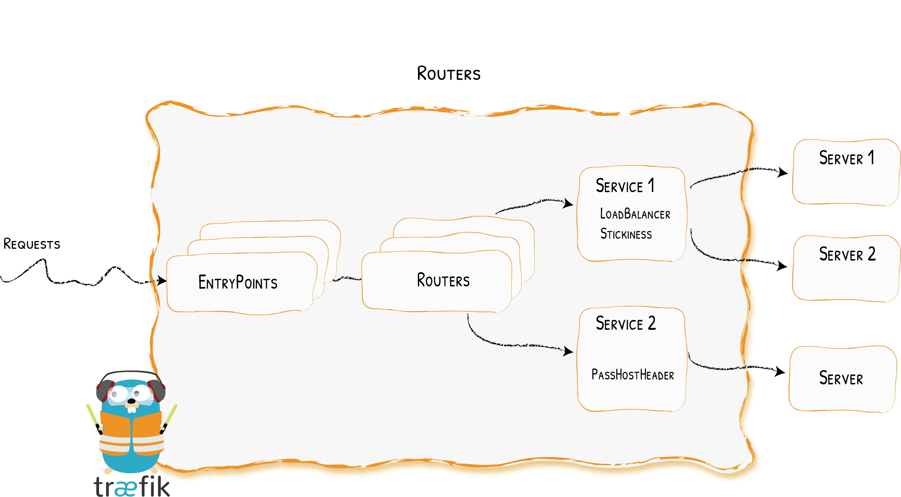

# Services

Configuring How to Reach the Services
{: .subtitle }



The `Services` are responsible for configuring how to reach the actual services that will eventually handle the incoming requests.

## Configuration Examples

??? example "Declaring an HTTP Service with Two Servers -- Using the [File Provider](../../providers/file.md)"

    ```toml tab="TOML"
    ## Dynamic configuration
    [http.services]
      [http.services.my-service.loadBalancer]

        [[http.services.my-service.loadBalancer.servers]]
          url = "http://<private-ip-server-1>:<private-port-server-1>/"
        [[http.services.my-service.loadBalancer.servers]]
          url = "http://<private-ip-server-2>:<private-port-server-2>/"
    ```

    ```yaml tab="YAML"
    ## Dynamic configuration
    http:
      services:
        my-service:
          loadBalancer:
            servers:
            - url: "http://<private-ip-server-1>:<private-port-server-1>/"
            - url: "http://<private-ip-server-2>:<private-port-server-2>/"
    ```

??? example "Declaring a TCP Service with Two Servers -- Using the [File Provider](../../providers/file.md)"

    ```toml tab="TOML"
    ## Dynamic configuration
    [tcp.services]
      [tcp.services.my-service.loadBalancer]
         [[tcp.services.my-service.loadBalancer.servers]]
           address = "<private-ip-server-1>:<private-port-server-1>"
         [[tcp.services.my-service.loadBalancer.servers]]
           address = "<private-ip-server-2>:<private-port-server-2>"
    ```

    ```yaml tab="YAML"
    tcp:
      services:
        my-service:
          loadBalancer:
            servers:
            - address: "<private-ip-server-1>:<private-port-server-1>"
            - address: "<private-ip-server-2>:<private-port-server-2>"
    ```

??? example "Declaring a UDP Service with Two Servers -- Using the [File Provider](../../providers/file.md)"

    ```toml tab="TOML"
    ## Dynamic configuration
    [udp.services]
      [udp.services.my-service.loadBalancer]
         [[udp.services.my-service.loadBalancer.servers]]
           address = "<private-ip-server-1>:<private-port-server-1>"
         [[udp.services.my-service.loadBalancer.servers]]
           address = "<private-ip-server-2>:<private-port-server-2>"
    ```

    ```yaml tab="YAML"
    udp:
      services:
        my-service:
          loadBalancer:
            servers:
            - address: "<private-ip-server-1>:<private-port-server-1>"
            - address: "<private-ip-server-2>:<private-port-server-2>"
    ```

## Configuring HTTP Services

### Servers Load Balancer

The load balancers are able to load balance the requests between multiple instances of your programs.

Each service has a load-balancer, even if there is only one server to forward traffic to.

??? example "Declaring a Service with Two Servers (with Load Balancing) -- Using the [File Provider](../../providers/file.md)"

    ```toml tab="TOML"
    ## Dynamic configuration
    [http.services]
      [http.services.my-service.loadBalancer]

        [[http.services.my-service.loadBalancer.servers]]
          url = "http://private-ip-server-1/"
        [[http.services.my-service.loadBalancer.servers]]
          url = "http://private-ip-server-2/"
    ```

    ```yaml tab="YAML"
    http:
      services:
        my-service:
          loadBalancer:
            servers:
            - url: "http://private-ip-server-1/"
            - url: "http://private-ip-server-2/"
    ```

#### Servers

Servers declare a single instance of your program.
The `url` option point to a specific instance.

!!! info ""
    Paths in the servers' `url` have no effect.
    If you want the requests to be sent to a specific path on your servers,
    configure your [`routers`](../routers/index.md) to use a corresponding [middleware](../../middlewares/overview.md) (e.g. the [AddPrefix](../../middlewares/addprefix.md) or [ReplacePath](../../middlewares/replacepath.md)) middlewares.

??? example "A Service with One Server -- Using the [File Provider](../../providers/file.md)"

    ```toml tab="TOML"
    ## Dynamic configuration
    [http.services]
      [http.services.my-service.loadBalancer]
        [[http.services.my-service.loadBalancer.servers]]
          url = "http://private-ip-server-1/"
    ```

    ```yaml tab="YAML"
    ## Dynamic configuration
    http:
      services:
        my-service:
          loadBalancer:
            servers:
              - url: "http://private-ip-server-1/"
    ```

#### Load-balancing

For now, only round robin load balancing is supported:

??? example "Load Balancing -- Using the [File Provider](../../providers/file.md)"

    ```toml tab="TOML"
    ## Dynamic configuration
    [http.services]
      [http.services.my-service.loadBalancer]
        [[http.services.my-service.loadBalancer.servers]]
          url = "http://private-ip-server-1/"
        [[http.services.my-service.loadBalancer.servers]]
          url = "http://private-ip-server-2/"
    ```

    ```yaml tab="YAML"
    ## Dynamic configuration
    http:
      services:
        my-service:
          loadBalancer:
            servers:
            - url: "http://private-ip-server-1/"
            - url: "http://private-ip-server-2/"
    ```

#### Sticky sessions

When sticky sessions are enabled, a cookie is set on the initial request and response to let the client know which server handles the first response.
On subsequent requests, to keep the session alive with the same server, the client should resend the same cookie.

!!! info "Stickiness on multiple levels"

    When chaining or mixing load-balancers (e.g. a load-balancer of servers is one of the "children" of a load-balancer of services), for stickiness to work all the way, the option needs to be specified at all required levels. Which means the client needs to send a cookie with as many key/value pairs as there are sticky levels.

!!! info "Stickiness & Unhealthy Servers"

    If the server specified in the cookie becomes unhealthy, the request will be forwarded to a new server (and the cookie will keep track of the new server).

!!! info "Cookie Name"

    The default cookie name is an abbreviation of a sha1 (ex: `_1d52e`).

!!! info "Secure & HTTPOnly & SameSite flags"

    By default, the affinity cookie is created without those flags.
    One however can change that through configuration.
    
    `SameSite` can be `none`, `lax`, `strict` or empty.

??? example "Adding Stickiness -- Using the [File Provider](../../providers/file.md)"

    ```toml tab="TOML"
    ## Dynamic configuration
    [http.services]
      [http.services.my-service]
        [http.services.my-service.loadBalancer.sticky.cookie]
    ```

    ```yaml tab="YAML"
    ## Dynamic configuration
    http:
      services:
        my-service:
          loadBalancer:
            sticky:
             cookie: {}
    ```

??? example "Adding Stickiness with custom Options -- Using the [File Provider](../../providers/file.md)"

    ```toml tab="TOML"
    ## Dynamic configuration
    [http.services]
      [http.services.my-service]
        [http.services.my-service.loadBalancer.sticky.cookie]
          name = "my_sticky_cookie_name"
          secure = true
          httpOnly = true
          sameSite = "none"
    ```

    ```yaml tab="YAML"
    ## Dynamic configuration
    http:
      services:
        my-service:
          loadBalancer:
            sticky:
              cookie:
                name: my_sticky_cookie_name
                secure: true
                httpOnly: true
    ```

??? example "Setting Stickiness on all the required levels -- Using the [File Provider](../../providers/file.md)"

    ```toml tab="TOML"
    ## Dynamic configuration
    [http.services]
      [http.services.wrr1]
        [http.services.wrr1.weighted.sticky.cookie]
          name = "lvl1"
        [[http.services.wrr1.weighted.services]]
          name = "whoami1"
          weight = 1
        [[http.services.wrr1.weighted.services]]
          name = "whoami2"
          weight = 1

      [http.services.whoami1]
        [http.services.whoami1.loadBalancer]
          [http.services.whoami1.loadBalancer.sticky.cookie]
            name = "lvl2"
          [[http.services.whoami1.loadBalancer.servers]]
            url = "http://127.0.0.1:8081"
          [[http.services.whoami1.loadBalancer.servers]]
            url = "http://127.0.0.1:8082"

      [http.services.whoami2]
        [http.services.whoami2.loadBalancer]
          [http.services.whoami2.loadBalancer.sticky.cookie]
            name = "lvl2"
          [[http.services.whoami2.loadBalancer.servers]]
            url = "http://127.0.0.1:8083"
          [[http.services.whoami2.loadBalancer.servers]]
            url = "http://127.0.0.1:8084"
    ```

    ```yaml tab="YAML"
    ## Dynamic configuration
    http:
      services:
        wrr1:
          weighted:
            sticky:
              cookie:
                name: lvl1
            services:
              - name: whoami1
                weight: 1
              - name: whoami2
                weight: 1

        whoami1:
          loadBalancer:
            sticky:
              cookie:
                name: lvl2
            servers:
              - url: http://127.0.0.1:8081
              - url: http://127.0.0.1:8082

        whoami2:
          loadBalancer:
            sticky:
              cookie:
                name: lvl2
            servers:
              - url: http://127.0.0.1:8083
              - url: http://127.0.0.1:8084
    ```

    To keep a session open with the same server, the client would then need to specify the two levels within the cookie for each request, e.g. with curl:
    
    ```
    curl -b "lvl1=whoami1; lvl2=http://127.0.0.1:8081" http://localhost:8000
    ```

#### Health Check

Configure health check to remove unhealthy servers from the load balancing rotation.
Traefik will consider your servers healthy as long as they return status codes between `2XX` and `3XX` to the health check requests (carried out every `interval`).

Below are the available options for the health check mechanism:

- `path` is appended to the server URL to set the health check endpoint.
- `scheme`, if defined, will replace the server URL `scheme` for the health check endpoint
- `hostname`, if defined, will apply `Host` header `hostname` to the health check request.
- `port`, if defined, will replace the server URL `port` for the health check endpoint.
- `interval` defines the frequency of the health check calls.
- `timeout` defines the maximum duration Traefik will wait for a health check request before considering the server failed (unhealthy).
- `headers` defines custom headers to be sent to the health check endpoint.
- `followRedirects` defines whether redirects should be followed during the health check calls (default: true).

!!! info "Interval & Timeout Format"

    Interval and timeout are to be given in a format understood by [time.ParseDuration](https://golang.org/pkg/time/#ParseDuration).
    The interval must be greater than the timeout. If configuration doesn't reflect this, the interval will be set to timeout + 1 second.

!!! info "Recovering Servers"

    Traefik keeps monitoring the health of unhealthy servers.
    If a server has recovered (returning `2xx` -> `3xx` responses again), it will be added back to the load balacer rotation pool.

!!! warning "Health check in Kubernetes"

    The Traefik health check is not available for `kubernetesCRD` and `kubernetesIngress` providers because Kubernetes
    already has a health check mechanism.
    Unhealthy pods will be removed by kubernetes. (cf [liveness documentation](https://kubernetes.io/docs/tasks/configure-pod-container/configure-liveness-readiness-startup-probes/#define-a-liveness-http-request))

??? example "Custom Interval & Timeout -- Using the [File Provider](../../providers/file.md)"

    ```toml tab="TOML"
    ## Dynamic configuration
    [http.services]
      [http.services.Service-1]
        [http.services.Service-1.loadBalancer.healthCheck]
          path = "/health"
          interval = "10s"
          timeout = "3s"
    ```

    ```yaml tab="YAML"
    ## Dynamic configuration
    http:
      services:
        Service-1:
          loadBalancer:
            healthCheck:
              path: /health
              interval: "10s"
              timeout: "3s"
    ```

??? example "Custom Port -- Using the [File Provider](../../providers/file.md)"

    ```toml tab="TOML"
    ## Dynamic configuration
    [http.services]
      [http.services.Service-1]
        [http.services.Service-1.loadBalancer.healthCheck]
          path = "/health"
          port = 8080
    ```

    ```yaml tab="YAML"
    ## Dynamic configuration
    http:
      services:
        Service-1:
          loadBalancer:
            healthCheck:
              path: /health
              port: 8080
    ```

??? example "Custom Scheme -- Using the [File Provider](../../providers/file.md)"

    ```toml tab="TOML"
    ## Dynamic configuration
    [http.services]
      [http.services.Service-1]
        [http.services.Service-1.loadBalancer.healthCheck]
          path = "/health"
          scheme = "http"
    ```

    ```yaml tab="YAML"
    ## Dynamic configuration
    http:
      services:
        Service-1:
          loadBalancer:
            healthCheck:
              path: /health
              scheme: http
    ```

??? example "Additional HTTP Headers -- Using the [File Provider](../../providers/file.md)"

    ```toml tab="TOML"
    ## Dynamic configuration
    [http.services]
      [http.services.Service-1]
        [http.services.Service-1.loadBalancer.healthCheck]
          path = "/health"

          [http.services.Service-1.loadBalancer.healthCheck.headers]
            My-Custom-Header = "foo"
            My-Header = "bar"
    ```

    ```yaml tab="YAML"
    ## Dynamic configuration
    http:
      services:
        Service-1:
          loadBalancer:
            healthCheck:
              path: /health
              headers:
                My-Custom-Header: foo
                My-Header: bar
    ```

#### Pass Host Header

The `passHostHeader` allows to forward client Host header to server.

By default, `passHostHeader` is true.

??? example "Don't forward the host header -- Using the [File Provider](../../providers/file.md)"

    ```toml tab="TOML"
    ## Dynamic configuration
    [http.services]
      [http.services.Service01]
        [http.services.Service01.loadBalancer]
          passHostHeader = false
    ```

    ```yaml tab="YAML"
    ## Dynamic configuration
    http:
      services:
        Service01:
          loadBalancer:
            passHostHeader: false
    ```

#### Response Forwarding

This section is about configuring how Traefik forwards the response from the backend server to the client.

Below are the available options for the Response Forwarding mechanism:

- `FlushInterval` specifies the interval in between flushes to the client while copying the response body.
  It is a duration in milliseconds, defaulting to 100.
  A negative value means to flush immediately after each write to the client.
  The FlushInterval is ignored when ReverseProxy recognizes a response as a streaming response;
  for such responses, writes are flushed to the client immediately.

??? example "Using a custom FlushInterval -- Using the [File Provider](../../providers/file.md)"

    ```toml tab="TOML"
    ## Dynamic configuration
    [http.services]
      [http.services.Service-1]
        [http.services.Service-1.loadBalancer.responseForwarding]
          flushInterval = "1s"
    ```

    ```yaml tab="YAML"
    ## Dynamic configuration
    http:
      services:
        Service-1:
          loadBalancer:
            responseForwarding:
              flushInterval: 1s
    ```

### Weighted Round Robin (service)

The WRR is able to load balance the requests between multiple services based on weights.

This strategy is only available to load balance between [services](./index.md) and not between [servers](./index.md#servers).

!!! info "Supported Providers"
    
    This strategy can be defined currently with the [File](../../providers/file.md) or [IngressRoute](../../providers/kubernetes-crd.md) providers.

```toml tab="TOML"
## Dynamic configuration
[http.services]
  [http.services.app]
    [[http.services.app.weighted.services]]
      name = "appv1"
      weight = 3
    [[http.services.app.weighted.services]]
      name = "appv2"
      weight = 1

  [http.services.appv1]
    [http.services.appv1.loadBalancer]
      [[http.services.appv1.loadBalancer.servers]]
        url = "http://private-ip-server-1/"

  [http.services.appv2]
    [http.services.appv2.loadBalancer]
      [[http.services.appv2.loadBalancer.servers]]
        url = "http://private-ip-server-2/"
```

```yaml tab="YAML"
## Dynamic configuration
http:
  services:
    app:
      weighted:
        services:
        - name: appv1
          weight: 3
        - name: appv2
          weight: 1

    appv1:
      loadBalancer:
        servers:
        - url: "http://private-ip-server-1/"

    appv2:
      loadBalancer:
        servers:
        - url: "http://private-ip-server-2/"
```

### Mirroring (service)

The mirroring is able to mirror requests sent to a service to other services.
Please note that by default the whole request is buffered in memory while it is being mirrored.
See the maxBodySize option in the example below for how to modify this behaviour.

!!! info "Supported Providers"
    
    This strategy can be defined currently with the [File](../../providers/file.md) or [IngressRoute](../../providers/kubernetes-crd.md) providers.

```toml tab="TOML"
## Dynamic configuration
[http.services]
  [http.services.mirrored-api]
    [http.services.mirrored-api.mirroring]
      service = "appv1"
      # maxBodySize is the maximum size in bytes allowed for the body of the request.
      # If the body is larger, the request is not mirrored.
      # Default value is -1, which means unlimited size.
      maxBodySize = 1024
    [[http.services.mirrored-api.mirroring.mirrors]]
      name = "appv2"
      percent = 10

  [http.services.appv1]
    [http.services.appv1.loadBalancer]
      [[http.services.appv1.loadBalancer.servers]]
        url = "http://private-ip-server-1/"

  [http.services.appv2]
    [http.services.appv2.loadBalancer]
      [[http.services.appv2.loadBalancer.servers]]
        url = "http://private-ip-server-2/"
```

```yaml tab="YAML"
## Dynamic configuration
http:
  services:
    mirrored-api:
      mirroring:
        service: appv1
        # maxBodySize is the maximum size allowed for the body of the request.
        # If the body is larger, the request is not mirrored.
        # Default value is -1, which means unlimited size.
        maxBodySize: 1024
        mirrors:
        - name: appv2
          percent: 10

    appv1:
      loadBalancer:
        servers:
        - url: "http://private-ip-server-1/"

    appv2:
      loadBalancer:
        servers:
        - url: "http://private-ip-server-2/"
```

## Configuring TCP Services

### General

Each of the fields of the service section represents a kind of service.
Which means, that for each specified service, one of the fields, and only one,
has to be enabled to define what kind of service is created.
Currently, the two available kinds are `LoadBalancer`, and `Weighted`.

### Servers Load Balancer

The servers load balancer is in charge of balancing the requests between the servers of the same service.

??? example "Declaring a Service with Two Servers -- Using the [File Provider](../../providers/file.md)"

    ```toml tab="TOML"
    ## Dynamic configuration
    [tcp.services]
      [tcp.services.my-service.loadBalancer]
        [[tcp.services.my-service.loadBalancer.servers]]
          address = "xx.xx.xx.xx:xx"
        [[tcp.services.my-service.loadBalancer.servers]]
           address = "xx.xx.xx.xx:xx"
    ```

    ```yaml tab="YAML"
    ## Dynamic configuration
    tcp:
      services:
        my-service:
          loadBalancer:
            servers:
            - address: "xx.xx.xx.xx:xx"
            - address: "xx.xx.xx.xx:xx"
    ```

#### Servers

Servers declare a single instance of your program.
The `address` option (IP:Port) point to a specific instance.

??? example "A Service with One Server -- Using the [File Provider](../../providers/file.md)"

    ```toml tab="TOML"
    ## Dynamic configuration
    [tcp.services]
      [tcp.services.my-service.loadBalancer]
        [[tcp.services.my-service.loadBalancer.servers]]
          address = "xx.xx.xx.xx:xx"
    ```

    ```yaml tab="YAML"
    ## Dynamic configuration
    tcp:
      services:
        my-service:
          loadBalancer:
            servers:
              - address: "xx.xx.xx.xx:xx"
    ```

#### Termination Delay

As a proxy between a client and a server, it can happen that either side (e.g. client side) decides to terminate its writing capability on the connection (i.e. issuance of a FIN packet).
The proxy needs to propagate that intent to the other side, and so when that happens, it also does the same on its connection with the other side (e.g. backend side).

However, if for some reason (bad implementation, or malicious intent) the other side does not eventually do the same as well,
the connection would stay half-open, which would lock resources for however long.

To that end, as soon as the proxy enters this termination sequence, it sets a deadline on fully terminating the connections on both sides.

The termination delay controls that deadline.
It is a duration in milliseconds, defaulting to 100.
A negative value means an infinite deadline (i.e. the connection is never fully terminated by the proxy itself).

??? example "A Service with a termination delay -- Using the [File Provider](../../providers/file.md)"

    ```toml tab="TOML"
    ## Dynamic configuration
    [tcp.services]
      [tcp.services.my-service.loadBalancer]
        [[tcp.services.my-service.loadBalancer]]
          terminationDelay = 200
    ```

    ```yaml tab="YAML"
    ## Dynamic configuration
    tcp:
      services:
        my-service:
          loadBalancer:
            terminationDelay: 200
    ```

### Weighted Round Robin

The Weighted Round Robin (alias `WRR`) load-balancer of services is in charge of balancing the requests between multiple services based on provided weights.

This strategy is only available to load balance between [services](./index.md) and not between [servers](./index.md#servers).

!!! info "Supported Providers"
    
    This strategy can be defined currently with the [File](../../providers/file.md) or [IngressRoute](../../providers/kubernetes-crd.md) providers.

```toml tab="TOML"
## Dynamic configuration
[tcp.services]
  [tcp.services.app]
    [[tcp.services.app.weighted.services]]
      name = "appv1"
      weight = 3
    [[tcp.services.app.weighted.services]]
      name = "appv2"
      weight = 1

  [tcp.services.appv1]
    [tcp.services.appv1.loadBalancer]
      [[tcp.services.appv1.loadBalancer.servers]]
        address = "private-ip-server-1:8080/"

  [tcp.services.appv2]
    [tcp.services.appv2.loadBalancer]
      [[tcp.services.appv2.loadBalancer.servers]]
        address = "private-ip-server-2:8080/"
```

```yaml tab="YAML"
## Dynamic configuration
tcp:
  services:
    app:
      weighted:
        services:
        - name: appv1
          weight: 3
        - name: appv2
          weight: 1

    appv1:
      loadBalancer:
        servers:
        - address: "xxx.xxx.xxx.xxx:8080"

    appv2:
      loadBalancer:
        servers:
        - address: "xxx.xxx.xxx.xxx:8080"
```

## Configuring UDP Services

### General

Each of the fields of the service section represents a kind of service.
Which means, that for each specified service, one of the fields, and only one,
has to be enabled to define what kind of service is created.
Currently, the two available kinds are `LoadBalancer`, and `Weighted`.

### Servers Load Balancer

The servers load balancer is in charge of balancing the requests between the servers of the same service.

??? example "Declaring a Service with Two Servers -- Using the [File Provider](../../providers/file.md)"

    ```toml tab="TOML"
    ## Dynamic configuration
    [udp.services]
      [udp.services.my-service.loadBalancer]
        [[udp.services.my-service.loadBalancer.servers]]
          address = "xx.xx.xx.xx:xx"
        [[udp.services.my-service.loadBalancer.servers]]
          address = "xx.xx.xx.xx:xx"
    ```

    ```yaml tab="YAML"
    ## Dynamic configuration
    udp:
      services:
        my-service:
          loadBalancer:
            servers:
            - address: "xx.xx.xx.xx:xx"
            - address: "xx.xx.xx.xx:xx"
    ```

#### Servers

The Servers field defines all the servers that are part of this load-balancing group,
i.e. each address (IP:Port) on which an instance of the service's program is deployed.

??? example "A Service with One Server -- Using the [File Provider](../../providers/file.md)"

    ```toml tab="TOML"
    ## Dynamic configuration
    [udp.services]
      [udp.services.my-service.loadBalancer]
        [[udp.services.my-service.loadBalancer.servers]]
          address = "xx.xx.xx.xx:xx"
    ```

    ```yaml tab="YAML"
    ## Dynamic configuration
    udp:
      services:
        my-service:
          loadBalancer:
            servers:
              - address: "xx.xx.xx.xx:xx"
    ```

### Weighted Round Robin

The Weighted Round Robin (alias `WRR`) load-balancer of services is in charge of balancing the requests between multiple services based on provided weights.

This strategy is only available to load balance between [services](./index.md) and not between [servers](./index.md#servers).

This strategy can only be defined with [File](../../providers/file.md).

```toml tab="TOML"
## Dynamic configuration
[udp.services]
  [udp.services.app]
    [[udp.services.app.weighted.services]]
      name = "appv1"
      weight = 3
    [[udp.services.app.weighted.services]]
      name = "appv2"
      weight = 1

  [udp.services.appv1]
    [udp.services.appv1.loadBalancer]
      [[udp.services.appv1.loadBalancer.servers]]
        address = "private-ip-server-1:8080/"

  [udp.services.appv2]
    [udp.services.appv2.loadBalancer]
      [[udp.services.appv2.loadBalancer.servers]]
        address = "private-ip-server-2:8080/"
```

```yaml tab="YAML"
## Dynamic configuration
udp:
  services:
    app:
      weighted:
        services:
        - name: appv1
          weight: 3
        - name: appv2
          weight: 1

    appv1:
      loadBalancer:
        servers:
        - address: "xxx.xxx.xxx.xxx:8080"

    appv2:
      loadBalancer:
        servers:
        - address: "xxx.xxx.xxx.xxx:8080"
```
