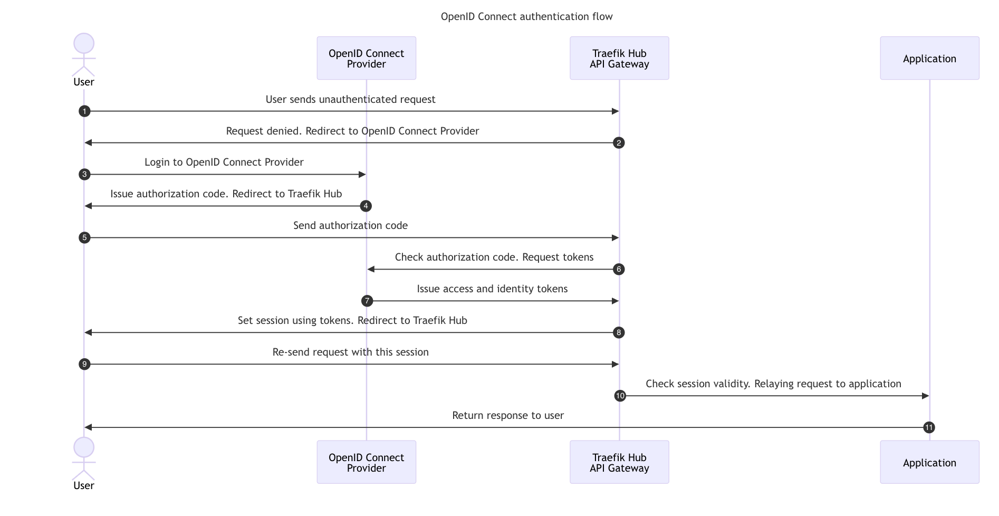

# Secure API Access with OIDC

!!! info "Traefik Hub Feature"
    This middleware is available exclusively in [Traefik Hub](https://traefik.io/traefik-hub/). Learn more about [Traefik Hub's advanced features](https://doc.traefik.io/traefik-hub/api-gateway/intro).

OpenID Connect Authentication is built on top of the OAuth2 Authorization Code Flow (defined in [OAuth 2.0 RFC 6749, section 4.1](https://tools.ietf.org/html/rfc6749#section-4.1)).
It allows an application to be secured by delegating authentication to an external provider (Keycloak, Okta etc.)
and obtaining the end user's session claims and scopes for authorization purposes.

To authenticate the user, the middleware redirects through the authentication provider.
Once the authentication is complete, users are redirected back to the middleware before being authorized to access the upstream application, as described in the diagram below:



<br />

To allow the OIDC Middleware to use the credentials provided by the requests, apply the following configuration:

```yaml tab="Middleware OIDC"
apiVersion: traefik.io/v1alpha1
kind: Middleware
metadata:
  name: oidc-login
  namespace: apps
spec:
  plugin:
    oidc:
      issuer: MY_ISSUER_URL
      clientId: "urn:k8s:secret:oidc-client:client_id"
      clientSecret: "urn:k8s:secret:oidc-client:client_secret"
      redirectUrl: /oidc/callback
```

```yaml tab="Kubernetes Secrets"
apiVersion: v1
kind: Secret
metadata:
  name: oidc-client
stringData:
  client_id: my-oauth-client-ID # Set your ClientID here
  client_secret: my-oauth-client-secret # Set your client secret here
```

```yaml tab="IngressRoute"
apiVersion: traefik.io/v1alpha1
kind: IngressRoute
metadata:
  name: secure-applications-apigateway-oauth2-client-credentials
  namespace: apps
spec:
  entryPoints:
    - websecure
  routes:
  - match: Path(`/my-app`)
    kind: Rule
    services:
    - name: whoami
      port: 80
    middlewares:
    - name: oidc-login
```

```yaml tab="Service & Deployment"
kind: Deployment
apiVersion: apps/v1
metadata:
  name: whoami
  namespace: apps
spec:
  replicas: 3
  selector:
    matchLabels:
      app: whoami
  template:
    metadata:
      labels:
        app: whoami
    spec:
      containers:
      - name: whoami
        image: traefik/whoami

---
apiVersion: v1
kind: Service
metadata:
  name: whoami
  namespace: apps
spec:
  ports:
  - port: 80
    name: whoami
  selector:
    app: whoami
```

!!! note "Advanced Configuration"

    Advanced options are described in the [reference page](../reference/routing-configuration/http/middlewares/oidc.md).

    For example, you can find how to customize the session storage:
    - Using a cookie ([Options `session`](../reference/routing-configuration/http/middlewares/oidc.md#configuration-options) (default behavior))
    - Using a [Redis store](../reference/routing-configuration/http/middlewares/oidc.md#sessionstore).  


