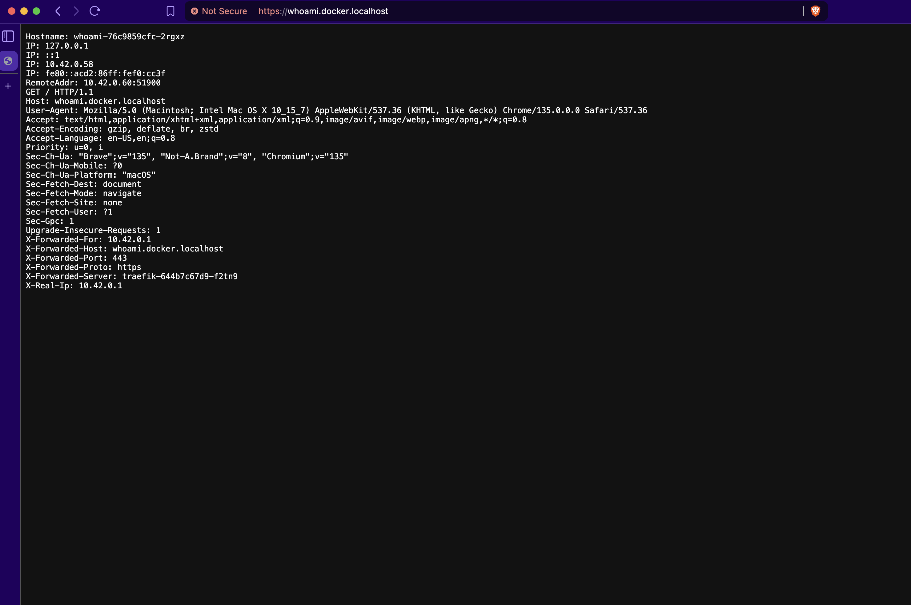

This guide provides an in-depth walkthrough for installing and configuring Traefik Proxy within a Docker container using the official Traefik Docker image & Docker Compose. In this guide, we'll cover the following:

- Enable the [Docker provider](../reference/install-configuration/providers/docker.md)
- Expose **web** (HTTP :80) and **websecure** (HTTPS :443) entrypoints  
- Redirect all HTTP traffic to HTTPS
- Secure the Traefik dashboard with **basic‑auth**  
- Terminate TLS with a self‑signed certificate for `*.docker.localhost`
- Deploy the **whoami** demo service
- Enable access‑logs and Prometheus metrics

## Prerequisites  

- Docker Desktop / Engine 
- Docker Compose 
- `openssl`
- `htpasswd` from `apache2-utils`

## Create a self‑signed certificate

Before Traefik can serve HTTPS locally it needs a certificate. In production you’d use one from a trusted CA, but for a single‑machine stack a quick self‑signed cert is enough. We can create one with openssl by running the following commands:

```bash
mkdir -p certs
openssl req -x509 -nodes -days 365 -newkey rsa:2048 \
  -keyout certs/local.key -out certs/local.crt \
  -subj "/CN=*.docker.localhost"
```

The `certs` folder now holds `local.crt` and `local.key`, which will be mounted read‑only into Traefik.

## Create the Traefik Dashboard Credentials

In production, it is advisable to have some form of authentication/security for the Traefik dashboard. Traefik can be secured with the [basic‑auth middleware](../reference/routing-configuration/http/middlewares/basicauth.md). To do this, generate a hashed username / password pair that Traefik’s middleware will validate:

```bash
htpasswd -nb admin "P@ssw0rd" | sed -e 's/\$/\$\$/g'
```

Copy the full output (e.g., admin:$$apr1$$…) — we'll need this for the middleware configuration.

## Create a docker-compose.yaml

Now define the whole stack in a Compose file. This file declares Traefik, mounts the certificate, sets up a dedicated network, and later hosts the whoami demo service.

!!! note
    You can also choose to use the Docker CLI and a configuration file to run Traefik, but for this tutorial, we'll be using Docker Compose.

First, create a folder named `dynamic` and create a file named `tls.yaml` for dynamic configuration. Paste the TLS certificate configuration into the file:
    
```yaml
tls:
  certificates:
    - certFile: /certs/local.crt
      keyFile:  /certs/local.key
```

In the same folder as the `dynamic/tls.yaml` file, create a `docker-compose.yaml` file and include the following:

```yaml
services:
  traefik:
    image: traefik:v3.4
    container_name: traefik
    restart: unless-stopped
    security_opt:
      - no-new-privileges:true

    networks:
     # Connect to the 'traefik_proxy' overlay network for inter-container communication across nodes
      - proxy

    ports:
      - "80:80"
      - "443:443"
      - "8080:8080"

    volumes:
      - /var/run/docker.sock:/var/run/docker.sock:ro
      - ./certs:/certs:ro
      - ./dynamic:/dynamic:ro

    command:
      # EntryPoints
      - "--entrypoints.web.address=:80"
      - "--entrypoints.web.http.redirections.entrypoint.to=websecure"
      - "--entrypoints.web.http.redirections.entrypoint.scheme=https"
      - "--entrypoints.web.http.redirections.entrypoint.permanent=true"
      - "--entrypoints.websecure.address=:443"
      - "--entrypoints.websecure.http.tls=true"

      # Attach the static configuration tls.yaml file that contains the tls configuration settings
      - "--providers.file.filename=/dynamic/tls.yaml"

      # Providers 
      - "--providers.docker=true"
      - "--providers.docker.exposedbydefault=false"
      - "--providers.docker.network=proxy"

      # API & Dashboard 
      - "--api.dashboard=true"
      - "--api.insecure=false"

      # Observability 
      - "--log.level=INFO"
      - "--accesslog=true"
      - "--metrics.prometheus=true"

  # Traefik Dynamic configuration via Docker labels
    labels:
      # Enable self‑routing
      - "traefik.enable=true"

      # Dashboard router
      - "traefik.http.routers.dashboard.rule=Host(`dashboard.docker.localhost`)"
      - "traefik.http.routers.dashboard.entrypoints=websecure"
      - "traefik.http.routers.dashboard.service=api@internal"
      - "traefik.http.routers.dashboard.tls=true"

      # Basic‑auth middleware
      - "traefik.http.middlewares.dashboard-auth.basicauth.users=<PASTE_HASH_HERE>"
      - "traefik.http.routers.dashboard.middlewares=dashboard-auth@docker"

# Whoami application
  whoami:
    image: traefik/whoami
    container_name: whoami
    restart: unless-stopped
    networks:
      - proxy
    labels:
      - "traefik.enable=true"
      - "traefik.http.routers.whoami.rule=Host(`whoami.docker.localhost`)"
      - "traefik.http.routers.whoami.entrypoints=websecure"
      - "traefik.http.routers.whoami.tls=true"

networks:
  proxy:
    name: proxy
```

!!! info
    - Remember to replace `<PASTE_HASH_HERE>` with the hash generated earlier.
    - The `--api.insecure=false` flag is used to secure the API and prevent the dashboard from being exposed on port 8080. This is done because we are exposing the dashboard with a HTTPS router.

## Launch the stack

With the Compose file and supporting assets in place, start the containers and let Docker wire up networking behind the scenes:

```bash
docker compose up -d
```

Traefik will start, read its static configuration from the `command` arguments, connect to the Docker socket, detect its own labels for dynamic configuration (dashboard routing and auth), and begin listening on ports 80 and 443. HTTP requests will be redirected to HTTPS.

## Access the Dashboard

Now that Traefik is deployed, you can access the dashboard at [https://dashboard.docker.localhost](https://dashboard.docker.localhost) and it should prompt for the Basic Authentication credentials you configured:


## Test the whoami Application

You can test the application using curl:

```bash
curl -k https://whoami.docker.localhost/
```

```bash
Hostname: whoami-76c9859cfc-k7jzs
IP: 127.0.0.1
IP: ::1
IP: 10.42.0.59
IP: fe80::50d7:a2ff:fed5:2530
RemoteAddr: 10.42.0.60:54148
GET / HTTP/1.1
Host: whoami.docker.localhost
User-Agent: curl/8.7.1
Accept: */*
Accept-Encoding: gzip
X-Forwarded-For: 10.42.0.1
X-Forwarded-Host: whoami.docker.localhost
X-Forwarded-Port: 443
X-Forwarded-Proto: https
X-Forwarded-Server: traefik-644b7c67d9-f2tn9
X-Real-Ip: 10.42.0.1
```

Making the same request to the HTTP entrypoint will return the following:

```bash
curl -k http://whoami.docker.localhost

Moved Permanently
```

The above confirms that a redirection has taken place which means our setup works correctly.

You can also open a browser and navigate to [https://whoami.docker.localhost](https://whoami.docker.localhost) to see a JSON dump from the service:



!!! info
    You can also navigate to the Traefik Dashboard at [https://dashboard.docker.localhost](https://dashboard.docker.localhost) to see that the route has been created.

### Other Key Configuration Areas

Beyond this initial setup, Traefik offers extensive configuration possibilities. Here are brief introductions and minimal examples using Docker Compose `command` arguments or `labels`. Consult the main documentation linked for comprehensive details.

### TLS Certificate Management (Let's Encrypt)

To make the `websecure` entry point serve valid HTTPS certificates automatically, enable Let's Encrypt (ACME).

*Example `command` additions:*

```yaml
command:
  # ... other command arguments ...
  - "--certificatesresolvers.le.acme.email=your-email@example.com"
  - "--certificatesresolvers.le.acme.storage=/letsencrypt/acme.json" # Path inside container volume
  - "--certificatesresolvers.le.acme.httpchallenge.entrypoint=web"

  # - "--certificatesresolvers.le.acme.dnschallenge.provider=your-dns-provider" # Needs provider setup

  # Optionally make 'le' the default resolver for TLS-enabled routers
  - "--entrypoints.websecure.http.tls.certresolver=le"
```

This defines a resolver named `le`, sets the required email and storage path (within the mounted `/letsencrypt` volume), and enables the HTTP challenge. Refer to the [HTTPS/TLS Documentation](../reference/install-configuration/tls/certificate-resolvers/overview.md) and [Let's Encrypt Documentation](../reference/install-configuration/tls/certificate-resolvers/acme.md) for details on challenges and DNS provider configuration.

### Metrics (Prometheus)

You can expose Traefik's internal metrics for monitoring with Prometheus. We already enabled prometheus in our setup but we can further configure it.
*Example `command` additions:*

```yaml
command:
  # If using a dedicated metrics entry point, define it:
  - "--entrypoints.metrics.address=:8082"

  # ... other command arguments ...
  - "--metrics.prometheus=true"

  # Optionally change the entry point metrics are exposed on (defaults to 'traefik')
  - "--metrics.prometheus.entrypoint=metrics"

  # Add labels to metrics for routers/services (can increase cardinality)
  - "--metrics.prometheus.addrouterslabels=true"
  - "--metrics.prometheus.addserviceslabels=true"
```

This enables the `/metrics` endpoint (typically accessed via the internal API port, often 8080 by default if not secured, or via a dedicated entry point). See the [Metrics Documentation](../reference/install-configuration/observability/metrics.md) for options.

### Tracing (OTel):

You can enable distributed tracing to follow requests through Traefik.
*Example `command` additions:*

```yaml
command:
  # ... other command arguments ...
  - "--tracing.otel=true"
  - "--tracing.otel.grpcendpoint=otel-collector:4317" # Adjust endpoint as needed
  - "--tracing.otel.httpendpoint=otel-collector.observability:4318" # Adjust endpoint as needed
```

!!! note
    This option requires a running OTEL collector accessible by Traefik. Consult the [Tracing Documentation](../reference/install-configuration/observability/tracing.md).

### Access Logs

You can configure Traefik to log incoming requests for debugging and analysis.
*Example `command` additions:*

```yaml
command:
  # ... other command arguments ...
  - "--accesslog=true" # Enable access logs to stdout

  # Optionally change format or output file (requires volume)
  - "--accesslog.format=json"
  - "--accesslog.filepath=/path/to/access.log"

  # Optionally filter logs
  - "--accesslog.filters.statuscodes=400-599"
```

This enables access logs to the container's standard output (viewable via `docker compose logs <traefik-container-id>`). See the [Access Logs Documentation](../reference/install-configuration/observability/logs-and-accesslogs.md).

### Conclusion

You now have a basic Traefik setup in Docker with secure dashboard access and HTTP-to-HTTPS redirection.

{!traefik-for-business-applications.md!}
