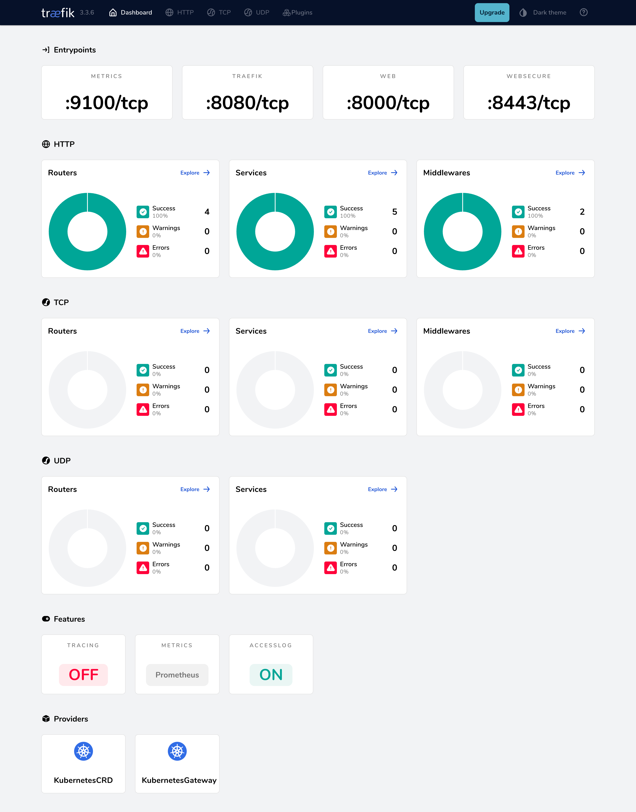
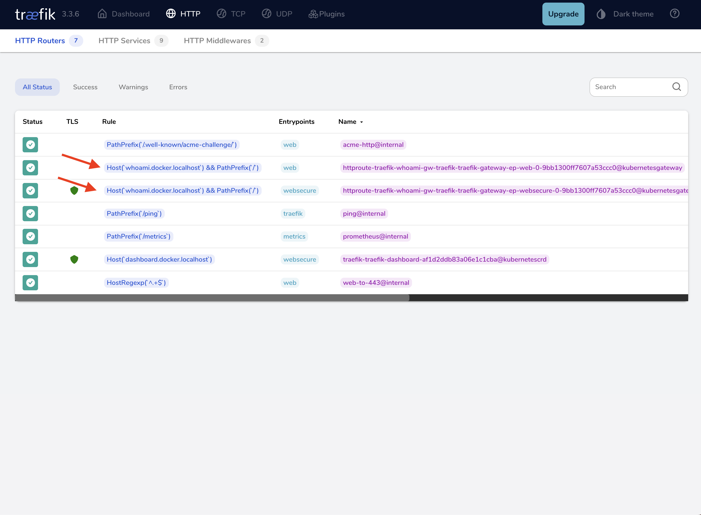

This guide provides an in-depth walkthrough for installing and configuring Traefik Proxy within a Kubernetes cluster using the official Helm chart. In this guide, we'll cover the following:

- Configure standard HTTP (`web`) and HTTPS (`websecure`) entry points, 
- Implement automatic redirection from HTTP to HTTPS
- Secure the Traefik Dashboard using Basic Authentication.
- Deploy a demo application to test the setup
- Explore some other key configuration options

## Prerequisites

- A Kubernetes cluster
- Helm v3, 
- Kubectl 

## Create the Cluster

If you do not have a Kubernetes cluster already, you can spin up one with K3d:

```bash
k3d cluster create traefik \
  --port 80:80@loadbalancer \
  --port 443:443@loadbalancer \
  --port 8000:8000@loadbalancer \
  --k3s-arg "--disable=traefik@server:0"
```

Ports `80` and `443` reach Traefik from the host, while port `8000` remains free for later demos. The built-in Traefik shipped with k3s is disabled to avoid conflicts.

Check the context:

```bash
kubectl cluster-info --context k3d-traefik
```

You should see something like this:

```bash
Kubernetes control plane is running at https://0.0.0.0:56049
CoreDNS is running at https://0.0.0.0:56049/api/v1/namespaces/kube-system/services/kube-dns:dns/proxy
Metrics-server is running at https://0.0.0.0:56049/api/v1/namespaces/kube-system/services/https:metrics-server:https/proxy

To further debug and diagnose cluster problems, use 'kubectl cluster-info dump'.
```

## Add the chart repo and namespace

Using Helm streamlines Kubernetes application deployment. Helm packages applications into "charts," which are collections of template files describing Kubernetes resources. We use the official Traefik Helm chart for a managed and customizable installation.

```bash
helm repo add traefik https://traefik.github.io/charts
helm repo update
kubectl create namespace traefik
```

The first command registers the `traefik` repository alias pointing to the official chart location. The second command refreshes your local cache to ensure you have the latest list of charts and versions available from all configured repositories.

## Create a Local Self‑Signed TLS Secret

Traefik's Gateway listeners require a certificate whenever a listener uses `protocol: HTTPS`.  

For local development create a throw‑away self‑signed certificate and
store it in a Kubernetes Secret named **local‑selfsigned‑tls**.  
The Gateway references this secret to terminate TLS on the `websecure` listener.

```bash
# 1) Generate a self‑signed certificate valid for *.docker.localhost
openssl req -x509 -nodes -days 365 -newkey rsa:2048 \
  -keyout tls.key -out tls.crt \
  -subj "/CN=*.docker.localhost"

# 2) Create the TLS secret in the traefik namespace
kubectl create secret tls local-selfsigned-tls \
  --cert=tls.crt --key=tls.key \
  --namespace traefik
```

### Why Do We Need To Do This

The Gateway's HTTPS listener references this secret via `certificateRefs`.
Without it, the helm chart validation fails and the HTTP→HTTPS redirect chain breaks.

!!! info "Production tip"
    The self-signed certificate above is **only for local development**. For production, either store a certificate issued by your organization's CA in a Secret or let an automated issuer such as cert-manager or Traefik's ACME (Let's Encrypt) generate certificates on demand. Update the `certificateRefs` in the `websecure` listener—or use `traefik.io/tls.certresolver`—so clients receive a trusted certificate and no longer see browser warnings.

## Prepare Helm Chart Configuration Values

Create a `values.yaml` file with the following content:

```yaml

# Configure Network Ports and EntryPoints
# EntryPoints are the network listeners for incoming traffic.
ports:
  # Defines the HTTP entry point named 'web'
  web:
    port: 80
    nodePort: 30000
    # Instructs this entry point to redirect all traffic to the 'websecure' entry point
    redirections:
      entryPoint:
        to: websecure
        scheme: https
        permanent: true

  # Defines the HTTPS entry point named 'websecure'
  websecure:
    port: 443
    nodePort: 30001

# Enables the dashboard in Secure Mode
api:
  dashboard: true
  insecure: false

ingressRoute:
  dashboard:
    enabled: true
    matchRule: Host(`dashboard.docker.localhost`)
    entryPoints:
      - websecure
    middlewares:
      - name: dashboard-auth

# Creates a BasiAuth Middleware and Secret for the Dashboard Security
extraObjects:
  - apiVersion: v1
    kind: Secret
    metadata:
      name: dashboard-auth-secret
    type: kubernetes.io/basic-auth
    stringData:
      username: admin
      password: "P@ssw0rd"      # Replace with an Actual Password
  - apiVersion: traefik.io/v1alpha1
    kind: Middleware
    metadata:
      name: dashboard-auth
    spec:
      basicAuth:
        secret: dashboard-auth-secret

# We will route with Gateway API instead.
ingressClass:
  enabled: false

# Enable Gateway API Provider & Disables the KubernetesIngress provider
# Providers tell Traefik where to find routing configuration.
providers:
  kubernetesIngress:
     enabled: false
  kubernetesGateway:
     enabled: true

## Gateway Listeners
gateway:
  listeners:
    web:           # HTTP listener that matches entryPoint `web`
      port: 80
      protocol: HTTP
      namespacePolicy: All

    websecure:         # HTTPS listener that matches entryPoint `websecure`
      port: 443
      protocol: HTTPS  # TLS terminates inside Traefik
      namespacePolicy: All
      mode: Terminate
      certificateRefs:    
        - kind: Secret
          name: local-selfsigned-tls  # the Secret we created before the installation
          group: ""

# Enable Observability
logs:
  general:
    level: INFO
  # This enables access logs, outputting them to Traefik's standard output by default. The [Access Logs Documentation](https://doc.traefik.io/traefik/observability/access-logs/) covers formatting, filtering, and output options.
  access:
    enabled: true

# Enables Prometheus for Metrics
metrics:
  prometheus:
    enabled: true
```

## Install the Traefik Using the Helm Values

Now, apply the configuration using the Helm client.

```bash
# Install the chart into the 'traefik' namespace
helm install traefik traefik/traefik \
  --namespace traefik \
  --values values.yaml
```

**Command Breakdown:**

- `helm install traefik`: Instructs Helm to install a new release named `traefik`.
- `traefik/traefik`: Specifies the chart to use (`traefik` chart from the `traefik` repository added earlier).
- `--namespace traefik`: Specifies the Kubernetes namespace to install into. Using a dedicated namespace is recommended practice.
- `--values values.yaml`: Applies the custom configuration from your `values.yaml` file.

## Accessing the Dashboard

Now that Traefik is deployed, you can access its dashboard at [https://dashboard.docker.localhost/](https://dashboard.docker.localhost/). When you access this link, your browser will prompt for the username and password. Ensure you use the credentials set in the `values.yaml` file to log in. Upon successful login, the dashboard will be displayed as shown below:



## Deploy a Demo Application

To test the setup, deploy the [Traefik whoami](https://github.com/traefik/whoami) application in the Kubernetes cluster. Create a file named `whoami.yaml` and paste the following:

```yaml
apiVersion: apps/v1
kind: Deployment
metadata:
  name: whoami
  namespace: traefik
spec:
  replicas: 2
  selector:
    matchLabels:
      app: whoami
  template:
    metadata:
      labels:
        app: whoami
    spec:
      containers:
        - name: whoami
          image: traefik/whoami
          ports:
            - containerPort: 80
---
apiVersion: v1
kind: Service
metadata:
  name: whoami
  namespace: traefik
spec:
  selector:
    app: whoami
  ports:
    - port: 80
```

Apply the manifest:

```bash
kubectl apply -f whoami.yaml
```

After deploying the application, you can expose the application by creating a [Gateway API HTTPRoute](https://gateway-api.sigs.k8s.io/api-types/httproute/). To do this, create a file named `whoami-route.yaml` and paste the following:

```yaml
apiVersion: gateway.networking.k8s.io/v1
kind: HTTPRoute
metadata:
  name: whoami
  namespace: traefik
spec:
  parentRefs:
    - name: traefik-gateway # Name of the Gateway that Traefik creates when you enable the Gateway API provider
  hostnames:
    - "whoami.docker.localhost"
  rules:
    - matches:
        - path:
            type: PathPrefix
            value: /
      backendRefs:
        - name: whoami
          port: 80
```

Apply the manifest:

```bash
kubectl apply -f whoami-route.yaml
```

After you apply the manifest, navigate to the Routes in the Traefik Dashboard; you’ll see that the [https://whoami.docker.localhost](https://whoami.docker.localhost) route has been created.



You can test the application using curl:

```bash
curl -k https://whoami.docker.localhost/
```

```bash
Hostname: whoami-76c9859cfc-k7jzs
IP: 127.0.0.1
IP: ::1
IP: 10.42.0.59
IP: fe80::50d7:a2ff:fed5:2530
RemoteAddr: 10.42.0.60:54148
GET / HTTP/1.1
Host: whoami.docker.localhost
User-Agent: curl/8.7.1
Accept: */*
Accept-Encoding: gzip
X-Forwarded-For: 10.42.0.1
X-Forwarded-Host: whoami.docker.localhost
X-Forwarded-Port: 443
X-Forwarded-Proto: https
X-Forwarded-Server: traefik-644b7c67d9-f2tn9
X-Real-Ip: 10.42.0.1
```

You can also open a browser and navigate to [https://whoami.docker.localhost](https://whoami.docker.localhost) to see a JSON dump from the service.


## Other Key Configuration Areas

The above setup provides a secure base, but Traefik offers much more. Here's a brief overview of other essential configurations, with minimal examples using Helm `values.yaml` overrides. 

These examples illustrate how to enable features; consult the main documentation for detailed options.

### TLS Certificate Management (Let's Encrypt)

On the `websecure` entry point TLS is enabled by default. However, it currently lacks a valid certificate. Traefik can automatically obtain and renew TLS certificates from Let's Encrypt using the ACME protocol.

*Example `values.yaml` addition:*

```yaml
additionalArguments:
  - "--certificatesresolvers.le.acme.email=your-email@example.com"
  - "--certificatesresolvers.le.acme.storage=/data/acme.json"
  - "--certificatesresolvers.le.acme.httpchallenge.entrypoint=web"
  # - "--certificatesresolvers.le.acme.dnschallenge.provider=your-dns-provider" # Requires provider-specific config, adjust if you control your DNS provider

# Enable persistence for ACME data (certificates, account) to ensure it survives pod restarts:
persistence:
  enabled: true
  name: data
  size: 1Gi
  storageClass: ""
```

This enables a certificate resolver named `le`, configures the mandatory email and storage file, and sets up the HTTP challenge (requires port 80 access). Refer to the [HTTPS/TLS Documentation](../reference/install-configuration/tls/certificate-resolvers/overview.md) and [Let's Encrypt Documentation](../reference/install-configuration/tls/certificate-resolvers/acme.md) for full details, including DNS challenge configuration.

!!!info "Let's Encrypt in Production"
    Let's Encrypt can only issue certificates for hostnames that point to a public IP address reachable on ports 80 (HTTP‑01) or via your DNS provider's API (DNS‑01). Replace the `*.docker.localhost` examples with a real domain you control, create the DNS records, and keep ports 80/443 open to your cluster so the validation can succeed.

### Gateway API & ACME

Traefik’s built‑in ACME/Let’s Encrypt integration works for IngressRoute and Ingress resources, but it does not issue certificates for Gateway API listeners.
If you’re using the Gateway API, install [cert‑manager](https://cert-manager.io/docs/) (or another certificate controller) and reference the secret it creates in `gateway.listeners.websecure.certificateRefs`.

### Metrics (Prometheus)

Traefik can expose detailed metrics in Prometheus format, essential for monitoring its performance and the traffic it handles.

*Example `values.yaml` addition:*

```yaml
# Enable metrics endpoint
metrics:
  prometheus:
    # The entry point metrics will be available on (usually internal/admin)
    entryPoint: metrics
    # Add standard Prometheus metrics
    addRoutersLabels: true
    addServicesLabels: true
    # ... other options available
```

This enables the Prometheus endpoint on a dedicated `metrics` entry point (port 9100). See the [Metrics Documentation](../reference/install-configuration/observability/metrics.md) for configuration details and available metrics.

### Tracing (OTel)

Distributed tracing helps understand request latency and flow through your system, including Traefik itself.

*Example `values.yaml` addition:*

```yaml
additionalArguments:
  - "--tracing.otel=true"
  - "--tracing.otel.grpcendpoint=otel-collector.observability:4317" # Adjust endpoint as needed
  - "--tracing.otel.httpendpoint=otel-collector.observability:4318" # Adjust endpoint as needed
```

This enables OTel tracing and specifies the collector endpoint. Consult the [Tracing Documentation](../reference/install-configuration/observability/tracing.md) for details on OTel tracing.
    
## Conclusion

This setup establishes Traefik with secure dashboard access and HTTPS redirection, along with pointers to enable observability & TLS.

{!traefik-for-business-applications.md!}
