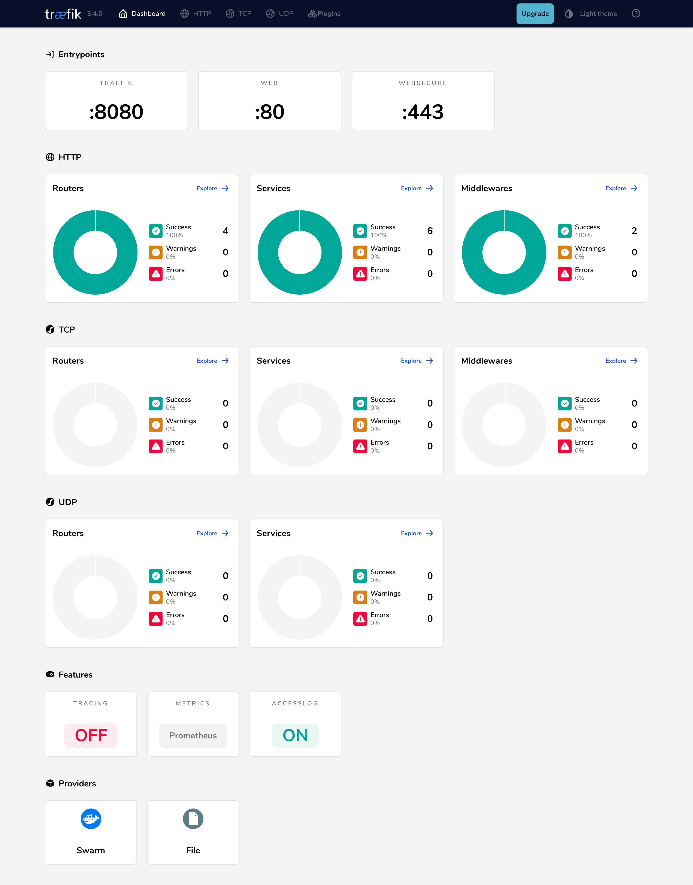

This guide provides an in‑depth walkthrough for installing and configuring Traefik Proxy as a **Swarm service** using `docker stack deploy`. It follows the same structure as the standalone‑Docker tutorial and covers:

- Enable the [Swarm provider](../reference/install-configuration/providers/swarm.md)
- Expose **web** (HTTP :80) and **websecure** (HTTPS :443) entrypoints  
- Redirect all HTTP traffic to HTTPS  
- Secure the Traefik dashboard with **basic‑auth**  
- Terminate TLS with a self‑signed certificate for `*.swarm.localhost`  
- Deploy the **whoami** demo service  
- Enable access‑logs and Prometheus metrics

## Prerequisites  

- Docker Engine with **Swarm mode** initialised (`docker swarm init`)  
- Docker Compose
- `openssl`  
- `htpasswd`  

## Create a self‑signed certificate

Before Traefik can serve HTTPS locally it needs a certificate. In production you’d use one from a trusted CA, but for a multi‑node dev swarm a quick self‑signed cert is enough:

```bash
mkdir -p certs
openssl req -x509 -nodes -days 365 -newkey rsa:2048 \
  -keyout certs/local.key -out certs/local.crt \
  -subj "/CN=*.swarm.localhost"
```

## Create the Traefik Dashboard Credentials

Generate a hashed username / password pair that Traefik’s middleware will validate:

```bash
htpasswd -nb admin "P@ssw0rd" | sed -e 's/\$/\$\$/g'
```

Copy the full output (e.g., `admin:$$apr1$$…`) — we’ll paste it into the middleware label.

## Create a docker‑compose‑swarm.yaml

!!! note
    Swarm uses `docker stack deploy`. The compose file can be named anything; we’ll use `docker‑compose‑swarm.yaml`.

First, create a folder named **dynamic** and add **tls.yaml** for dynamic TLS configuration:

```yaml
# dynamic/tls.yaml
tls:
  certificates:
    - certFile: /certs/local.crt
      keyFile:  /certs/local.key
```

In the same directory, create `docker‑compose‑swarm.yaml`:

```yaml
services:
  traefik:
    image: traefik:v3.4
    
    networks:
    # Connect to the 'traefik_proxy' overlay network for inter-container communication across nodes
      - traefik_proxy

    ports:
        # Expose Traefik's entry points to the Swarm
        # Swarm requires the long syntax for ports.
      - target: 80 # Container port (Traefik web entry point)
        published: 80 # Host port exposed on the nodes
        protocol: tcp
        # 'host' mode binds directly to the node's IP where the task runs.
        # 'ingress' mode uses Swarm's Routing Mesh (load balances across nodes).
        # Choose based on your load balancing strategy. 'host' is often simpler if using an external LB.
        mode: host
      - target: 443 # Container port ( Traefik websecure entry point)
        published: 443 # Host port
        protocol: tcp
        mode: host

    volumes:
      # Mount the Docker socket for the Swarm provider
      # This MUST be run from a manager node to access the Swarm API via the socket.
      - /var/run/docker.sock:/var/run/docker.sock:ro   # Swarm API socket
      - ./certs:/certs:ro
      - ./dynamic:/dynamic:ro

    # Traefik Static configuration via command-line arguments
    command:
      # HTTP EntryPoint
      - "--entrypoints.web.address=:80"

      # Configure HTTP to HTTPS Redirection
      - "--entrypoints.web.http.redirections.entrypoint.to=websecure"
      - "--entrypoints.web.http.redirections.entrypoint.scheme=https"
      - "--entrypoints.web.http.redirections.entrypoint.permanent=true"

      # HTTPS EntryPoint
      - "--entrypoints.websecure.address=:443"
      - "--entrypoints.websecure.http.tls=true"

      # Attach dynamic TLS file
      - "--providers.file.filename=/dynamic/tls.yaml"

      # Providers

      # Enable the Docker Swarm provider (instead of Docker provider)
      - "--providers.swarm.endpoint=unix:///var/run/docker.sock"

      # Watch for Swarm service changes (requires socket access)
      - "--providers.swarm.watch=true"

      # Recommended: Don't expose services by default; require explicit labels
      - "--providers.swarm.exposedbydefault=false"

      # Specify the default network for Traefik to connect to services
      - "--providers.swarm.network=traefik_traefik_proxy"

      # API & Dashboard
      - "--api.dashboard=true" # Enable the dashboard
      - "--api.insecure=false" # Explicitly disable insecure API mod

      # Observability
      - "--log.level=INFO" # Set the Log Level e.g INFO, DEBUG
      - "--accesslog=true" # Enable Access Logs
      - "--metrics.prometheus=true"  # Enable Prometheus

    deploy:
      mode: replicated
      replicas: 1
      placement:

      # Placement constraints restrict where Traefik tasks can run.
      # Running on manager nodes is common for accessing the Swarm API via the socket.
        constraints:
          - node.role == manager

      # Traefik Dynamic configuration via labels
      # In Swarm, labels on the service definition configure Traefik routing for that service.
      labels:
        - "traefik.enable=true"

        # Dashboard router
        - "traefik.http.routers.dashboard.rule=Host(`dashboard.swarm.localhost`)"
        - "traefik.http.routers.dashboard.entrypoints=websecure"
        - "traefik.http.routers.dashboard.service=api@internal"
        - "traefik.http.routers.dashboard.tls=true"

        # Basic‑auth middleware
        - "traefik.http.middlewares.dashboard-auth.basicauth.users=<PASTE_HASH_HERE>"
        - "traefik.http.routers.dashboard.middlewares=dashboard-auth@swarm"

        # Service hint
        - "traefik.http.services.traefik.loadbalancer.server.port=8080"
  
  # Deploy the Whoami application
  whoami:
    image: traefik/whoami
    networks:
      - traefik_proxy
    deploy:
      labels:
        # Enable Service discovery for Traefik
        - "traefik.enable=true"
        # Define the WHoami router rule
        - "traefik.http.routers.whoami.rule=Host(`whoami.swarm.localhost`)"
        # Expose Whoami on the HTTPS entrypoint
        - "traefik.http.routers.whoami.entrypoints=websecure"
        # Enable TLS
        - "traefik.http.routers.whoami.tls=true"
        # Expose the whoami port number to Traefik
        - traefik.http.services.whoami.loadbalancer.server.port=80

# Define the overlay network for Swarm
networks:
  traefik_proxy:
    driver: overlay
    attachable: true
```

!!! info
    - Replace `<PASTE_HASH_HERE>` with the escaped hash from the previous step.
    - The password hash is stored directly in a service label. This is fine for local development, but anyone with access to the Docker API can view it using `docker service inspect`. For production, use a more secure method to store secrets.

## Launch the stack

Create the overlay network once (if it doesn’t exist) and deploy:

```bash
docker network create --driver overlay --attachable traefik_proxy || true
docker stack deploy -c docker-compose-swarm.yaml traefik
```

Swarm schedules the services on a manager node and binds ports 80/443.

## Access the Dashboard

Open **https://dashboard.swarm.localhost/** in your browser — the dashboard should prompt for the basic‑auth credentials you configured.



## Test the whoami Application

You can test the application using curl:

```bash
curl -k https://whoami.swarm.localhost/
```

```bash
Hostname: whoami-76c9859cfc-k7jzs
IP: 127.0.0.1
IP: ::1
IP: 10.42.0.59
IP: fe80::50d7:a2ff:fed5:2530
RemoteAddr: 10.42.0.60:54148
GET / HTTP/1.1
Host: whoami.swarm.localhost
User-Agent: curl/8.7.1
Accept: */*
Accept-Encoding: gzip
X-Forwarded-For: 10.42.0.1
X-Forwarded-Host: whoami.swarm.localhost
X-Forwarded-Port: 443
X-Forwarded-Proto: https
X-Forwarded-Server: traefik-644b7c67d9-f2tn9
X-Real-Ip: 10.42.0.1
```

Making the same request to the HTTP entrypoint will return the following:

```bash
curl -k http://whoami.swarm.localhost

Moved Permanently
```

Requesting the HTTP endpoint redirects to HTTPS, confirming the setup works.

You can also open a browser and navigate to [https://whoami.swarm.localhost](https://whoami.swarm.localhost) to see a JSON dump from the service:


### Other Key Configuration Areas

Beyond this initial setup, Traefik offers extensive configuration possibilities. Here are brief introductions and minimal examples using Docker Compose `command` arguments or `labels`. Consult the main documentation linked for comprehensive details.

#### TLS Certificate Management (Let’s Encrypt)

To make the `websecure` entry point serve valid HTTPS certificates automatically, enable Let's Encrypt (ACME).

```yaml
command:
  # ...
  - "--certificatesresolvers.le.acme.email=you@example.com"
  - "--certificatesresolvers.le.acme.storage=/letsencrypt/acme.json"
  - "--certificatesresolvers.le.acme.httpchallenge.entrypoint=web"
  - "--entrypoints.websecure.http.tls.certresolver=le"
```

This defines a resolver named `le`, sets the required email and storage path (within the mounted `/letsencrypt` volume), and enables the HTTP challenge. Refer to the [HTTPS/TLS Documentation](../reference/install-configuration/tls/certificate-resolvers/overview.md) and [Let's Encrypt Documentation](../reference/install-configuration/tls/certificate-resolvers/acme.md) for details on challenges and DNS provider configuration.

!!! note

    - Ensure the `/letsencrypt` path is on a **shared volume** or NFS so all nodes can read certificates.
    - Ensure to mount the `/letsencrypt` volume in the `traefik` service in the `docker-compose-swarm.yaml` file.

#### Metrics (Prometheus)

You can expose Traefik's internal metrics for monitoring with Prometheus. We already enabled prometheus in our setup but we can further configure it.
*Example `command` additions:*

```yaml
command:
  # If using a dedicated metrics entry point, define it:
  - "--entrypoints.metrics.address=:8082"

  - "--metrics.prometheus=true"

  # Optionally change the entry point metrics are exposed on (defaults to 'traefik')
  - "--metrics.prometheus.entrypoint=metrics"

  # Add labels to metrics for routers/services (can increase cardinality)
  - "--metrics.prometheus.addrouterslabels=true"
```

This enables the `/metrics` endpoint (typically accessed via the internal API port, often 8080 by default if not secured, or via a dedicated entry point). See the [Metrics Documentation](../reference/install-configuration/observability/metrics.md) for options.

#### Tracing (OTel)

You can enable distributed tracing to follow requests through Traefik.
*Example `command` additions:*

```yaml
command:
  # ...
  - "--tracing.otel=true"
  - "--tracing.otel.grpcendpoint=otel-collector:4317"
```

!!! note
    This option requires a running OTEL collector accessible by Traefik. Consult the [Tracing Documentation](../reference/install-configuration/observability/tracing.md).

#### Access Logs

You can configure Traefik to log incoming requests for debugging and analysis.
*Example `command` additions:*

```yaml
command:
  # ... other command arguments ...
  - "--accesslog=true" # Enable access logs to stdout

  # Optionally change format or output file (requires volume)
  - "--accesslog.format=json"
  - "--accesslog.filepath=/path/to/access.log"

  # Optionally filter logs
  - "--accesslog.filters.statuscodes=400-599"
```

### Conclusion

You now have Traefik running on Docker Swarm with HTTPS, a secured dashboard, automatic HTTP → HTTPS redirects, and foundational observability. Expand this stack with Let’s Encrypt, additional middlewares, or multiple Traefik replicas as your Swarm grows.

{!traefik-for-business-applications.md!}
