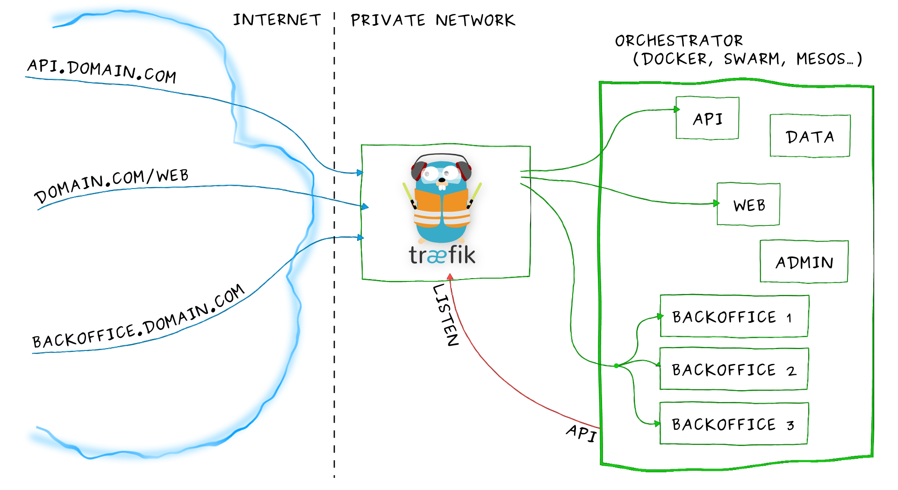

Traefik is a modern HTTP reverse proxy and load balancer that makes deploying microservices easy.
Traefik integrates with your existing infrastructure components ([Docker](https://www.docker.com/), [Swarm mode](https://docs.docker.com/engine/swarm/), [Kubernetes](https://kubernetes.io), [Marathon](https://mesosphere.github.io/marathon/), [Consul](https://www.consul.io/), [Etcd](https://coreos.com/etcd/), [Rancher](https://rancher.com), [Amazon ECS](https://aws.amazon.com/ecs), ...) and configures itself automatically and dynamically.
Pointing Traefik at your orchestrator should be the _only_ configuration step you need.

## Overview

Imagine that you have deployed a bunch of microservices with the help of an orchestrator (like Swarm or Kubernetes) or a service registry (like etcd or consul).
Now you want users to access these microservices, and you need a reverse proxy.

Traditional reverse-proxies require that you configure _each_ route that will connect paths and subdomains to _each_ microservice.
In an environment where you add, remove, kill, upgrade, or scale your services _many_ times a day, the task of keeping the routes up to date becomes tedious.

**This is when Traefik can help you!**

Traefik listens to your service registry/orchestrator API and instantly generates the routes so your microservices are connected to the outside world -- without further intervention from your part.

**Run Traefik and let it do the work for you!**
_(But if you'd rather configure some of your routes manually, Traefik supports that too!)_

## Features

- Continuously updates its configuration (No restarts!)
- Supports multiple load balancing algorithms
- Provides HTTPS to your microservices by leveraging [Let's Encrypt](https://letsencrypt.org) (wildcard certificates support)
- Circuit breakers, retry
- High Availability with cluster mode (beta)
- See the magic through its clean web UI
- Websocket, HTTP/2, GRPC ready
- Provides metrics (Rest, Prometheus, Datadog, Statsd, InfluxDB)
- Keeps access logs (JSON, CLF)
- Fast
- Exposes a Rest API
- Packaged as a single binary file (made with ❤️ with go) and available as a [tiny](https://microbadger.com/images/traefik) [official](https://hub.docker.com/r/_/traefik/) docker image

## Supported Providers

- [Docker](/configuration/backends/docker/) / [Swarm mode](/configuration/backends/docker/#docker-swarm-mode)
- [Kubernetes](/configuration/backends/kubernetes/)
- [Mesos](/configuration/backends/mesos/) / [Marathon](/configuration/backends/marathon/)
- [Rancher](/configuration/backends/rancher/) (API, Metadata)
- [Azure Service Fabric](/configuration/backends/servicefabric/)
- [Consul Catalog](/configuration/backends/consulcatalog/)
- [Consul](/configuration/backends/consul/) / [Etcd](/configuration/backends/etcd/) / [Zookeeper](/configuration/backends/zookeeper/) / [BoltDB](/configuration/backends/boltdb/)
- [Eureka](/configuration/backends/eureka/)
- [Amazon ECS](/configuration/backends/ecs/)
- [Amazon DynamoDB](/configuration/backends/dynamodb/)
- [File](/configuration/backends/file/)
- [Rest](/configuration/backends/rest/)
 
## Security

### Security Advisories

We strongly advise you to join our mailing list to be aware of the latest announcements from our security team. You can subscribe sending a mail to security+subscribe@traefik.io or on [the online viewer](https://groups.google.com/a/traefik.io/forum/#!forum/security).

### CVE

Reported vulnerabilities can be found on 
[cve.mitre.org](https://cve.mitre.org/cgi-bin/cvekey.cgi?keyword=traefik).

### Report a Vulnerability

We want to keep Traefik safe for everyone.
If you've discovered a security vulnerability in Traefik, we appreciate your help in disclosing it to us in a responsible manner, using [this form](https://security.traefik.io).
